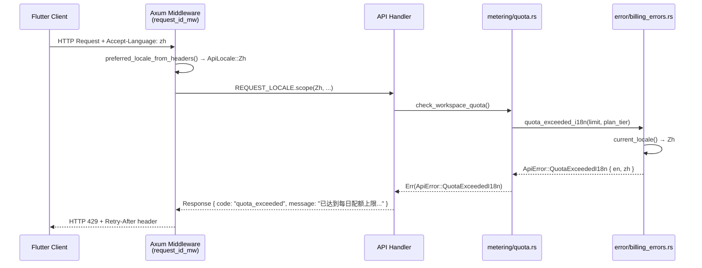
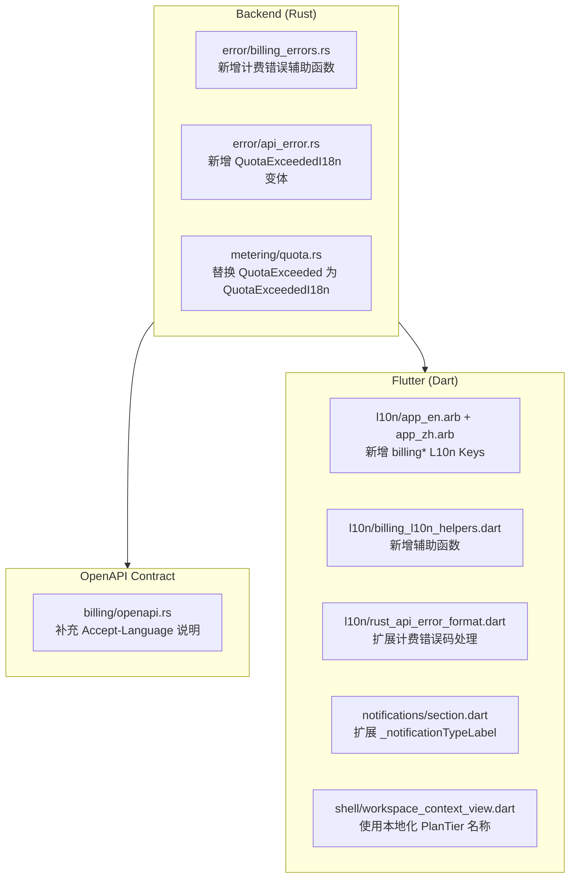

# Design Document: billing-i18n-production

## Overview

本设计文档描述将计费主路径国际化（i18n）覆盖率提升至生产就绪水平的技术方案。功能覆盖三个交付层：

1. **Backend（Rust）**：计费相关错误码（`quota_exceeded`、`subscription_expired`、`payment_failed`、`subscription_past_due`）的 `message` 字段支持中英双语，通过现有 `ApiLocale`/`REQUEST_LOCALE` task-local 机制传播语言偏好。
2. **Flutter**：`l10n` 全覆盖计费主路径，包括订阅状态展示、计费事件通知文案、配额耗尽/升级引导、计费错误态文案、plan_tier 展示名称。
3. **契约（OpenAPI）**：在计费相关端点的错误响应 schema 中补充 `Accept-Language` 说明。

遵循 `full-stack-delivery-covenant.md`：三层在同一里程碑内交付，合并前须通过 `yarn refactor:agent --full` 门禁。

### 设计原则

- **复用优先**：后端复用已有 `ApiLocale`/`REQUEST_LOCALE`/`current_locale()` 机制，不引入新的全局状态；Flutter 复用已有 `app_en.arb`/`app_zh.arb` l10n 体系。
- **最小侵入**：后端新增 `billing_errors.rs` 辅助模块，不修改 `ApiError` 枚举结构；Flutter 新增辅助函数，不重构现有 widget 树。
- **单文件 ≤800 行**：新增文件控制在 800 行以内，必要时按语义拆分。
- **ARB key 一致性**：所有新增 key 必须同时写入 `app_en.arb` 和 `app_zh.arb`，key 集合保持完全一致。

---

## Architecture

### 整体数据流



### 三层交付架构



---

## Components and Interfaces

### 1. Backend：`error/billing_errors.rs`（新增）

新增专用计费错误辅助模块，遵循 `error/helpers.rs` 的现有模式。

**公开接口：**

```rust
/// 配额耗尽错误（计费语境）。
/// 根据 current_locale() 返回中英文 message；code 固定为 "quota_exceeded"。
/// limit: 每日配额上限；plan_tier: 套餐等级字符串（用于文案）。
pub fn quota_exceeded_billing_i18n(limit: u64, plan_tier: &str) -> ApiError;

/// 订阅已过期错误。
pub fn subscription_expired_i18n() -> ApiError;

/// 付款失败错误。
pub fn payment_failed_i18n() -> ApiError;

/// 订阅逾期未付错误。
pub fn subscription_past_due_i18n() -> ApiError;
```

**实现策略：**

- 所有函数调用 `current_locale()` 读取 task-local `REQUEST_LOCALE`，无 task-local 时默认 `ApiLocale::En`。
- `quota_exceeded_billing_i18n` 返回 `ApiError::QuotaExceededI18n { en, zh }`（新增变体，见下节）。
- 其余三个函数返回对应的 `ApiError::*I18n` 变体（复用现有 `BadRequestI18n` 或新增专用变体）。

### 2. Backend：`error/api_error.rs` 扩展

在 `ApiError` 枚举中新增 `QuotaExceededI18n` 变体，保持 `retry_after_ms` 和 `Retry-After` header 逻辑不变：

```rust
/// HTTP 429 — 计费语境配额耗尽，支持中英双语 message。
/// code 固定为 "quota_exceeded"，retry_after_ms 和 Retry-After 行为与 QuotaExceeded 相同。
QuotaExceededI18n {
    en: String,
    zh: String,
},
```

`IntoResponse` 实现中，`QuotaExceededI18n` 的处理逻辑：
- `is_quota` 检测扩展为同时匹配 `QuotaExceeded(_)` 和 `QuotaExceededI18n { .. }`。
- message 根据 `current_locale()` 选择 `en` 或 `zh`。
- `code` 固定为 `"quota_exceeded"`，`retry_after_ms` 和 `Retry-After` 逻辑与 `QuotaExceeded` 完全相同。

### 3. Backend：`metering/quota.rs` 修改

将两处 `ApiError::QuotaExceeded(format!(...))` 替换为 `quota_exceeded_billing_i18n(limit, plan_tier)`。

`plan_tier` 从调用上下文传入（`check_workspace_quota` 函数签名扩展，或从 DB 查询结果中读取）。

### 4. Flutter：ARB 新增 L10n Keys

在 `app_en.arb` 和 `app_zh.arb` 中同时新增以下 key（`billing*` 前缀，语义分组）：

**订阅状态（Requirement 2）：**

| Key | English | 中文 |
|-----|---------|------|
| `billingSubscriptionStatusActive` | Active | 已激活 |
| `billingSubscriptionStatusPastDue` | Past due | 逾期未付 |
| `billingSubscriptionStatusCanceled` | Canceled | 已取消 |
| `billingSubscriptionStatusTrialing` | Trial | 试用中 |
| `billingSubscriptionStatusPaused` | Paused | 已暂停 |
| `billingSubscriptionStatusUnpaid` | Unpaid | 未付款 |
| `billingSubscriptionStatusUnknown` | Unknown status | 未知状态 |

**计费通知类型（Requirement 3）：**

| Key | English | 中文 |
|-----|---------|------|
| `billingNotificationSubscriptionActivated` | Subscription activated | 订阅已激活 |
| `billingNotificationSubscriptionPastDue` | Subscription past due | 订阅逾期未付 |
| `billingNotificationSubscriptionCanceled` | Subscription canceled | 订阅已取消 |
| `billingNotificationPaymentFailed` | Payment failed | 付款失败 |
| `billingNotificationSubscriptionExpired` | Subscription expired | 订阅已过期 |
| `billingNotificationSubscriptionTrialing` | Subscription trial started | 订阅试用已开始 |
| `billingNotificationUnknown` | Billing event | 计费事件 |

**配额耗尽/升级引导（Requirement 4）：**

| Key | English | 中文 |
|-----|---------|------|
| `billingQuotaExceededTitle` | Daily quota reached | 每日配额已用尽 |
| `billingQuotaExceededFree` | You've reached the daily limit for the {plan} plan. Upgrade to continue. | 您已达到 {plan} 套餐的每日限额，升级以继续使用。 |
| `billingQuotaExceededPro` | You've reached the daily limit for the {plan} plan. Contact support or wait for the quota to reset. | 您已达到 {plan} 套餐的每日限额，请联系支持或等待配额重置。 |
| `billingQuotaResetHint` | Quota resets daily at midnight UTC. | 配额每日 UTC 零点重置。 |
| `billingUpgradePlan` | Upgrade Plan | 升级套餐 |

**计费错误态（Requirement 5）：**

| Key | English | 中文 |
|-----|---------|------|
| `billingErrorPaymentFailed` | Payment failed. Please update your payment method to continue. | 付款失败，请更新支付方式以继续使用。 |
| `billingErrorSubscriptionExpired` | Your subscription has expired. Please renew to continue. | 您的订阅已过期，请续订以继续使用。 |
| `billingErrorSubscriptionPastDue` | Your subscription payment is past due. Please update your payment method. | 您的订阅付款已逾期，请更新支付方式。 |

**套餐展示名称（Requirement 6）：**

| Key | English | 中文 |
|-----|---------|------|
| `billingPlanTierFree` | Free | 免费版 |
| `billingPlanTierPro` | Pro | 专业版 |
| `billingPlanTierEnterprise` | Enterprise | 企业版 |
| `billingPlanTierUnknown` | Unknown plan | 未知套餐 |

### 5. Flutter：`l10n/billing_l10n_helpers.dart`（新增）

新增辅助函数文件，集中管理计费 l10n 映射逻辑：

```dart
/// 订阅状态本地化展示名称。
String subscriptionStatusLabel(AppLocalizations l10n, String? status);

/// 订阅状态对应的视觉颜色（past_due → warningColor，canceled → secondaryColor，其余 → null）。
Color? subscriptionStatusColor(BuildContext context, String? status);

/// 套餐等级本地化展示名称。
String planTierDisplayName(AppLocalizations l10n, String? planTier);

/// 计费通知类型本地化标签。
String billingNotificationTypeLabel(AppLocalizations l10n, String notificationType);

/// 配额耗尽本地化文案（根据 planTier 区分 free/pro/其他）。
String quotaExceededMessage(AppLocalizations l10n, String? planTier);
```

### 6. Flutter：`l10n/rust_api_error_format.dart` 扩展

在 `formatRustApiExceptionForDisplay` 中，在现有 `quota_exceeded` 处理之前，新增计费错误码分支：

```dart
// 计费错误码优先处理
if (details.code == 'subscription_expired') {
  return l10n.billingErrorSubscriptionExpired;
}
if (details.code == 'payment_failed') {
  return l10n.billingErrorPaymentFailed;
}
if (details.code == 'subscription_past_due') {
  return l10n.billingErrorSubscriptionPastDue;
}
// 已有 quota_exceeded 处理保持不变，但使用 billingQuotaExceededTitle 作为 fallback
```

### 7. Flutter：`notifications/section.dart` 扩展

在 `_notificationTypeLabel` 的 `switch` 中新增计费通知类型分支，并将 `default` 分支从返回原始字符串改为返回通用文案：

```dart
case 'billing_subscription_activated':
  return l10n.billingNotificationSubscriptionActivated;
case 'billing_subscription_past_due':
  return l10n.billingNotificationSubscriptionPastDue;
// ... 其余计费通知类型
default:
  // 对未知类型，若以 'billing_' 开头则返回通用计费事件文案
  if (notificationType.startsWith('billing_')) {
    return l10n.billingNotificationUnknown;
  }
  return notificationType; // 非计费类型保持原有行为
```

### 8. Flutter：`shell/workspace_context_view.dart` 修改

将 `workspaceBillingPlan(workspacePlanTier ?? l10n.workspaceBillingUnknownTier)` 中的 `workspacePlanTier` 替换为 `planTierDisplayName(l10n, workspacePlanTier)`，使 `{tier}` 占位符填充本地化展示名称。

### 9. OpenAPI：`billing/openapi.rs` 和 `billing/mod.rs` 扩展

在 `post_billing_webhook` 和相关端点的 `#[utoipa::path]` 宏中补充：
- `params` 中添加 `Accept-Language` header 参数说明。
- 429 响应的 `description` 中注明 `message` 随 `Accept-Language` 变化，`code` 和 `retry_after_ms` 不变。

---

## Data Models

### Backend 新增变体

```rust
// error/api_error.rs 新增
pub enum ApiError {
    // ... 现有变体 ...

    /// HTTP 429 — 计费语境配额耗尽，支持中英双语 message。
    /// code = "quota_exceeded"，retry_after_ms 和 Retry-After 行为与 QuotaExceeded 相同。
    QuotaExceededI18n {
        en: String,
        zh: String,
    },

    /// HTTP 402/403 — 订阅已过期，支持中英双语 message。
    /// code = "subscription_expired"
    SubscriptionExpiredI18n {
        en: String,
        zh: String,
    },

    /// HTTP 402/403 — 付款失败，支持中英双语 message。
    /// code = "payment_failed"
    PaymentFailedI18n {
        en: String,
        zh: String,
    },

    /// HTTP 402/403 — 订阅逾期未付，支持中英双语 message。
    /// code = "subscription_past_due"
    SubscriptionPastDueI18n {
        en: String,
        zh: String,
    },
}
```

**设计决策**：新增专用变体而非复用 `BadRequestI18n`，原因是：
1. 每个计费错误码有独立的 HTTP 状态码语义（429 vs 402/403）。
2. `QuotaExceededI18n` 需要保留 `retry_after_ms` 和 `Retry-After` header 逻辑，与其他变体不同。
3. 独立变体使 `IntoResponse` 的 match 分支清晰，便于后续扩展。

### Flutter ARB 数据模型

ARB 文件中新增 key 遵循以下命名约定：
- 前缀：`billing`（与现有 `billingAudit*`、`billingSnap*` 等保持一致）
- 语义分组：`billingSubscriptionStatus*`、`billingNotification*`、`billingPlanTier*`、`billingError*`、`billingQuota*`
- 带参数的 key 使用 `{param}` 占位符，并在 `@key` 中声明 `placeholders`

---

## Correctness Properties

*A property is a characteristic or behavior that should hold true across all valid executions of a system — essentially, a formal statement about what the system should do. Properties serve as the bridge between human-readable specifications and machine-verifiable correctness guarantees.*

### Property 1: 计费错误双语响应不变量

*For any* 计费错误码（`quota_exceeded`、`subscription_expired`、`payment_failed`、`subscription_past_due`）和任意语言偏好（`En`/`Zh`），错误响应的 `code` 字段值不随语言变化，`message` 字段随语言变化，`retry_after_ms` 和 `Retry-After` header（仅 `quota_exceeded`）不随语言变化。

**Validates: Requirements 1.1, 1.2, 1.3, 1.4, 1.5, 1.6, 1.7**

### Property 2: Accept-Language 未知语言标签回落英文

*For any* 不包含 `zh` 系或 `en` 系语言标签的 `Accept-Language` 字符串（包括空字符串、随机字符串、无效格式），`preferred_locale_from_headers` 返回 `ApiLocale::En`。

**Validates: Requirements 1.8**

### Property 3: 未知枚举值回落通用文案

*For any* 不在已知枚举范围内的字符串（`SubscriptionStatus`、`PlanTier`、`BillingErrorCode`），对应的 Flutter 辅助函数（`subscriptionStatusLabel`、`planTierDisplayName`、`formatRustApiExceptionForDisplay`）返回通用占位文案，而非原始字符串。

**Validates: Requirements 2.3, 5.5, 6.3**

### Property 4: 计费通知类型标签本地化

*For any* 已知计费通知类型（`billing_subscription_activated`、`billing_subscription_past_due`、`billing_subscription_canceled`、`billing_payment_failed`、`billing_subscription_expired`、`billing_subscription_trialing`），`billingNotificationTypeLabel` 返回的字符串不等于原始 `notificationType` 字符串（即已被本地化）。

**Validates: Requirements 3.2, 3.3**

### Property 5: 套餐感知配额耗尽文案

*For any* `PlanTier` 取值，`quotaExceededMessage` 返回的文案包含该套餐的本地化展示名称，且 `free` 套餐文案与 `pro` 套餐文案不同（引导内容有差异）。

**Validates: Requirements 4.2, 4.4, 4.5**

### Property 6: 计费错误码 Flutter 本地化

*For any* 已知 `BillingErrorCode`（`payment_failed`、`subscription_expired`、`subscription_past_due`），`formatRustApiExceptionForDisplay` 返回的字符串不等于原始 `code` 字符串，且在中英文两种 locale 下返回不同的文案。

**Validates: Requirements 5.2, 5.3, 5.4**

### Property 7: PlanTier 展示名称本地化

*For any* 已知 `PlanTier`（`free`、`pro`、`enterprise`），`planTierDisplayName` 在中英文两种 locale 下返回不同的字符串，且均不等于原始 `plan_tier` 字符串。

**Validates: Requirements 6.1, 6.2, 6.4**

### Property 8: ARB key 集合一致性不变量

*For any* 时刻，`app_en.arb` 和 `app_zh.arb` 的 key 集合完全相同（无缺失、无多余）。

**Validates: Requirements 8.4**

---

## Error Handling

### Backend 错误处理

| 场景 | 错误变体 | HTTP 状态码 | code 字段 | 备注 |
|------|---------|------------|-----------|------|
| 配额耗尽（计费语境） | `QuotaExceededI18n` | 429 | `quota_exceeded` | 含 `retry_after_ms` 和 `Retry-After` header |
| 订阅已过期 | `SubscriptionExpiredI18n` | 403 | `subscription_expired` | 无 retry header |
| 付款失败 | `PaymentFailedI18n` | 403 | `payment_failed` | 无 retry header |
| 订阅逾期未付 | `SubscriptionPastDueI18n` | 403 | `subscription_past_due` | 无 retry header |
| Accept-Language 无法识别 | — | — | — | 回落 `ApiLocale::En`，不报错 |

**不变量**：
- `code` 字段永远是机器可读的英文字符串，不随语言变化。
- `retry_after_ms` 和 `Retry-After` 仅在 `quota_exceeded` 类错误中出现，值为距下一个 UTC 零点的秒数。
- `REQUEST_LOCALE` 无 task-local 时（如单元测试直接构造错误），默认回落 `ApiLocale::En`。

### Flutter 错误处理

| 场景 | 处理策略 |
|------|---------|
| 已知 BillingErrorCode | 使用对应 L10n_Key |
| 未知 BillingErrorCode | 回落 `l10n.rustApiClientUnknownError` |
| 已知 SubscriptionStatus | 使用对应 L10n_Key |
| 未知 SubscriptionStatus | 返回 `l10n.billingSubscriptionStatusUnknown` |
| 已知 PlanTier | 使用对应 L10n_Key |
| 未知 PlanTier | 返回 `l10n.billingPlanTierUnknown` |
| l10n 文件缺失/损坏 | Flutter l10n 框架自动回落英文（`lookupAppLocalizations(Locale('en'))`） |

---

## Testing Strategy

### 单元测试（Backend）

在 `error/billing_errors.rs` 中新增测试模块，覆盖：

1. **中英文路径测试**：对每个计费错误辅助函数，在 `REQUEST_LOCALE.scope(ApiLocale::En)` 和 `REQUEST_LOCALE.scope(ApiLocale::Zh)` 下分别验证 `message` 字段内容。
2. **不变量测试**：验证 `code` 字段不随语言变化，`retry_after_ms` 和 `Retry-After` 在 `QuotaExceededI18n` 中与语言无关。
3. **无 task-local 回落测试**：直接构造错误（不设置 `REQUEST_LOCALE`），验证回落英文。

### 属性测试（Backend，使用 proptest）

```rust
// Feature: billing-i18n-production, Property 1: 计费错误双语响应不变量
// For any 计费错误码和任意语言偏好，code 不变，message 随语言变化
#[test]
fn prop_billing_error_code_invariant_across_locales(
    locale_is_zh in proptest::bool::ANY,
    limit in 1u64..=1000u64,
    plan_tier in "[a-z]{3,10}",
) { ... }

// Feature: billing-i18n-production, Property 2: Accept-Language 未知语言标签回落英文
// For any 不含 zh/en 的 Accept-Language 字符串，返回 ApiLocale::En
#[test]
fn prop_unknown_accept_language_falls_back_to_en(
    lang_tag in "[a-z]{2,8}(-[A-Z]{2})?",
) { ... }
```

### 属性测试（Flutter，使用 dart_test + fast_check 或 glados）

```dart
// Feature: billing-i18n-production, Property 3: 未知枚举值回落通用文案
// For any 非枚举字符串，辅助函数返回通用文案而非原始字符串
test('prop_unknown_status_falls_back_to_generic', () { ... });

// Feature: billing-i18n-production, Property 8: ARB key 集合一致性不变量
// app_en.arb 和 app_zh.arb key 集合完全相同
test('arb_key_sets_are_identical', () { ... });
```

### 集成测试

- `cargo run --bin export-openapi` 验证 OpenAPI 导出无解析错误（Requirement 7.4）。
- `yarn refactor:agent --full` 门禁：`flutter analyze`、`flutter test`、`cargo clippy`、`cargo test`（Requirement 8.2）。

### 测试配置

- 属性测试最少运行 **100 次迭代**（proptest 默认 256 次，Flutter 侧使用 glados 或手写生成器）。
- 每个属性测试注释中标注：`Feature: billing-i18n-production, Property N: <property_text>`。
- 单元测试聚焦具体示例和边界条件；属性测试覆盖通用输入空间。
