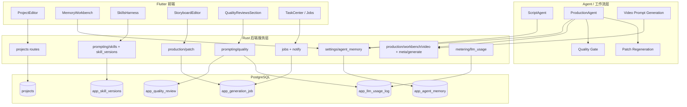

# 设计文档：drama-platform-completion

## 概述

本功能的目标不是单点补洞，而是把 Toonflow（OpenFlow）AI 短剧平台推进到“功能闭环 + 流程可控 + 质量优先 + 成本可分析”的完善状态。设计遵循三层推进顺序：

1. 先补齐平台功能闭环：项目风格配置、记忆工作台、技能版本历史、局部返工、质量评审筛选、阶段记忆自动写入、StyleBible 自动初始化、技能变更通知。
2. 再优化业务流程：高成本阶段前质量预检、返工归因、任务中心重试反馈、质量评审驱动下一步动作。
3. 最后强化质量与成本控制：人物一致性、情绪表达、反 AI 痕迹、记忆预算、观察笔记治理、token-质量 ROI 分析。

平台技术栈：Rust 后端（Axum + SQLx + Tokio）+ Flutter 前端。Agent 编排通过 Harness WebSocket 协议运行。项目当前尚未上线，因此本设计默认可以直接修改现有行为，不为旧实现额外保留兼容层。


## 架构

本功能横跨现有前端工作台、后端业务模块、记忆模块、任务中心、质量评审和计量埋点，不引入新的顶层服务，而是在现有架构上增加可组合的增强能力。



### 关键设计决策

1. **功能先闭环，再做深优化**：所有设计先保证用户能走通完整流程，再在高成本节点加质量门和成本治理，而不是一开始就把复杂优化塞进所有路径。
2. **质量优先于 token 节省**：token 优化只允许减少低价值上下文、低价值重试和低信号记忆，不允许删掉关键人物锚点、风格硬约束和失败归因。
3. **记忆不是全量日志，而是分层工作记忆**：自动化记忆只沉淀 StyleBible、StageSummary、DeltaMemory、角色级风格记忆和必要系统通知，不把所有对话长期化。
4. **观察笔记必须治理，不可裸注入**：历史 bad case、失败原因、返工备注不能原样堆进提示词，必须经过相关性过滤、去冲突、去低信号、预算裁剪。
5. **ROI 可度量**：任何记忆预算提升、返工策略改变、自动负向约束增加，都必须能在 `app_llm_usage_log` 和质量评审结果中回看收益。


## 组件与接口

### 1. 项目风格配置闭环

**涉及模块**：`backend/src/projects/`、`frontend/lib/project_editor/`

**目标**：让项目级画风技能包和故事风格包成为平台正式配置项，而非隐含约定。

**接口与行为**：

- `PATCH /api/v1/projects/{id}/style-config`
- `GET /api/v1/skills/summary` 或等价风格包摘要接口

**设计要点**：

1. 项目模型正式承载 `art_style_pack` 和 `story_style_pack`。
2. 前端项目编辑器提供显式选择、清空、错误保留和已选展示。
3. 后续所有 Agent 执行上下文从项目配置自动加载技能包，不再依赖手工临时传值。


### 2. 记忆工作台与分层成本视图

**涉及模块**：`backend/src/settings/agent_memory/`、`frontend/lib/agent_workspaces/`

**目标**：让用户看得见哪些记忆存在、花了多少成本、哪些层正在被频繁注入。

**接口与行为**：

- `POST /api/v1/agents/memory/query`
- `POST /api/v1/agents/memory/append`
- `GET /api/v1/agents/memory/cost-overview`

**设计要点**：

1. 记忆条目按 `style_bible`、`stage_summary`、`delta_memory`、`message` 分组展示。
2. 成本概览除条目数外，增加近 30 次平均注入字数和命中层级数。
3. 前端允许按层过滤，并显示最近一次被注入时间，帮助识别低价值长期记忆。


### 3. 阶段摘要与 StyleBible 自动化记忆

**涉及模块**：`backend/src/settings/agent_memory/`、Harness 任务完成钩子、资产提取流程

**目标**：把高复用、跨阶段有价值的信息自动沉淀为项目工作记忆，减少后续全量补读。

**设计要点**：

1. **StageSummary**：
   - 阶段完成或失败后异步写入。
   - 同一项目 + Agent 类型 + 阶段采用 upsert 语义。
   - 内容限制在 320 字内，并附带 `scope_signature`。
2. **StyleBible**：
   - 项目创建后自动写入空模板。
   - 首次资产提取后优先填充角色外观、核心气质、情绪基线、禁忌项。
   - 若已有人工维护内容，则不自动覆盖。


### 4. 技能文件版本管理与变更通知

**涉及模块**：`backend/src/prompting/skills/`、`backend/src/prompting/skill_versions/`、前端 `SkillsHarness`

**目标**：让技能文件变更可追踪、可回滚、可通知受影响项目。

**新增表**：`app_skill_versions`

**接口与行为**：

- `GET /api/v1/skill-versions?path=...`
- `POST /api/v1/skill-versions/rollback`
- `PUT /api/v1/skills/content`
- `POST /api/v1/skills/content`

**设计要点**：

1. 每次写入技能文件后记录 SHA256 哈希。
2. 回滚操作同时记录 `rollback_of` 和操作日志。
3. 对进行中项目按风格包路径或核心技能路径匹配，发送系统通知或写入消息记忆。


### 5. 局部返工与问题归因

**涉及模块**：`backend/src/production/patch/`、`frontend/lib/storyboard_editor/`

**目标**：把“重新生成一次”变成“最小范围修复 + 明确失败归因”的可控流程。

**接口与行为**：

- `POST /api/v1/production/patch`

**返工粒度**：

- `episode`
- `scene`
- `storyboard_item`
- `video_prompt`
- `derive_asset`

**设计要点**：

1. 先做最小修复范围解析，防止用户误把局部返工当全量重跑。
2. `low/high` 模型层级分别服务格式修复和内容质量修复。
3. 同一对象连续 2 次失败后进入 `AttributionMode`，输出归因摘要与升级建议。
4. 返工结果中补充节省 token 估算值，为 ROI 分析提供输入。


### 6. 高成本阶段前质量预检

**涉及模块**：`backend/src/production/`、`backend/src/prompting/quality/`

**目标**：在进入 `storyboard_panel`、`video_prompt`、视频生成前拦住明显坏输入。

**设计要点**：

1. 先用规则校验：人物设定、情绪曲线、分镜节奏、视觉连续性、台词机械感。
2. 规则不足时，再补轻量模型评估。
3. 结果分为严重阻断和轻微可继续两类：
   - 严重问题：阻断并给最小返工建议。
   - 轻微问题：写入 `delta_memory` 继续下游。


### 7. 视频提示词内控：角色记忆、观察笔记、预算控制

**涉及模块**：`backend/src/production/workbench/meta/generate/`

**目标**：保证视频提示词既“有用”又“不过量”，并让生成结果更自然、不像 AI 拼出来的。

#### 7.1 角色级风格记忆

**设计要点**：

1. 在现有项目级与剧本级视频风格记忆之外，引入角色级风格记忆：
   - `script_role_video_style_memory`
   - `project_role_video_style_memory`
2. 基于当前分镜主体别名匹配角色记忆。
3. 多角色场景按主主体排序，只取最相关角色记忆，避免堆叠。

#### 7.2 记忆预算分层

**设计要点**：

1. 预算层级分为：
   - `lean`：低风险、信息充分、可压缩场景
   - `expanded`：高风险、缺参考、情绪脆弱或连续性敏感场景
2. 风险评分由以下因素共同决定：
   - 是否缺参考图
   - 是否缺角色锚点
   - 是否缺场景锚点
   - 是否存在有效连续性压力
   - 是否为高情绪转折镜头
3. 诊断信息输出：
   - `memory_budget_tier`
   - 是否强制压缩
   - 记忆来源桶计数

#### 7.3 观察笔记治理

**目标**：让历史失败经验变成“高信号修复约束”，而不是噪音。

**设计要点**：

1. 观察笔记来源：
   - 历史失败视频记忆
   - bad case 质量评审
   - 被拒绝的提示词观察项
   - 最近返工失败归因
2. 过滤步骤：
   - 与当前镜头主体/动作/台词/光影/连续性做相关性匹配
   - 删除泛化、无动作性的低信号备注
   - 检查与当前风格或角色表演记忆是否冲突
   - 在压缩模式下保留更具体、更短、更有风险针对性的约束
3. 自动负向约束诊断信息：
   - `negative_budget_tier`
   - `auto_negative_source`
   - `observation_note_chars`

#### 7.4 质量尾部约束

**目标**：把“自然表演、自然动作、稳定连续性、不要多余镜头变化”变成统一尾部约束，而不是每次随意拼。

**设计要点**：

1. 对低风险镜头输出极简尾部约束。
2. 对高情绪或台词脆弱镜头显式保留 `Natural performance`。
3. 若连续性和动作已被前文明确，则尾部不重复啰嗦。


### 8. 质量评审增强与坏例治理

**涉及模块**：`backend/src/prompting/quality/`、`frontend/lib/quality_reviews/`

**目标**：让评审数据不只是列表，而是能反向驱动修复策略和成本优化。

**设计要点**：

1. `app_quality_review` 扩展 `stage`、`grade`、技能版本信息。
2. 评审记录支持坏例标记、问题类型归类和下一步动作建议。
3. 视频提示词与视频生成模块可读取最近 bad case 和低分评审作为观察笔记来源。
4. 后续可在本 spec 内扩展阶段通过率、坏例分布、技能版本回归对比。


### 9. token 用量与质量 ROI 分析

**涉及模块**：`backend/src/metering/llm_usage.rs`、`backend/src/prompting/quality/`

**目标**：让“花了多少 token”与“结果质量到底有没有变好”形成可分析闭环。

**设计要点**：

1. `app_llm_usage_log` 记录每次模型调用的 token、耗时、调用类型、模型名、成功状态和附加元信息。
2. 质量评审完成后，通过明确 `job_id` 把评审结果回链到用量记录。
3. 分析视图至少支持：
   - 按阶段 / 调用类型 / 模型聚合平均 token 消耗
   - 按阶段 / 调用类型 / 模型聚合平均质量得分
   - 标记高 token 低得分区间
   - 对比不同记忆预算层级下的质量收益
4. 禁止跨用户模糊时间匹配，始终用显式任务边界保证隔离性。


### 10. 任务中心完善

**涉及模块**：`backend/src/jobs/`、`backend/src/state/notify_hub`、`frontend/lib/jobs/`、`frontend/lib/task_center/`

**目标**：让用户在长时生成流程中能清楚看到状态、失败原因、可重试性和配额反馈。

**接口与行为**：

- `GET /api/v1/jobs`
- `GET /api/v1/jobs/{id}`
- `POST /api/v1/jobs/{id}/retry`
- `POST /api/v1/jobs/{id}/cancel`
- WebSocket `generation.job.updated`

**设计要点**：

1. 任务列表展示状态、更新时间、失败原因、重试按钮、取消按钮。
2. 失败任务允许重试，成功重试后即时回到 `queued`。
3. 429/配额错误明确透出 `Retry-After` 和 `retry_after_ms`，前端转成可理解的等待提示。
4. 区分“直接重试可能成功”和“必须修上游输入再重试”的失败类型。


## 数据模型

### app_agent_memory（现有表，补充语义）

```sql
ALTER TABLE app_agent_memory
    ADD COLUMN memory_tier TEXT NOT NULL DEFAULT 'message'
        CHECK (memory_tier IN ('style_bible', 'stage_summary', 'delta_memory', 'message')),
    ADD COLUMN scope_signature JSONB;
```

**补充语义约束**：

- `style_bible`：项目级稳定约束
- `stage_summary`：阶段结论，不重复累积
- `delta_memory`：局部连续性补丁或失败归因补丁
- `message`：低优先级系统通知或人工备注

### 角色级视频风格记忆（存储于现有 `app_agent_memory`，通过 `name` 区分）

```json
{
  "subject": "林晚",
  "aliases": ["晚晚", "林小姐"],
  "performance_style": "说话前轻微停顿，情绪压住后再释放",
  "voice_tendency": "低声克制，不抢快节奏",
  "camera_preference": "中近景更适合承接微表情",
  "must_avoid": ["夸张甩头", "机械直给情绪词"],
  "scope": "project_or_script"
}
```

### StyleBible 结构（补充 emotion_baseline）

```json
{
  "characters": [
    {
      "name": "角色名",
      "fixed_appearance": "固定外观锚点",
      "default_temperament": "默认气质",
      "emotion_expression": "情绪表达习惯",
      "body_habits": ["动作习惯1", "动作习惯2"]
    }
  ],
  "visual_taboos": ["视觉禁忌1"],
  "narrative_taboos": ["叙事禁忌1"],
  "world_constraints": ["世界观约束1"],
  "platform_rhythm": "平台节奏约束",
  "core_relationships": "核心关系",
  "emotion_baseline": "项目整体情绪基线"
}
```

### DeltaMemory 结构（补充归因来源）

```json
{
  "before": "变化前状态",
  "after": "变化后状态",
  "scope": "ep3_scene2_shot5",
  "expires_after": "scene_end",
  "reason_category": "emotion_mismatch"
}
```

### app_skill_versions（新增表）

```sql
CREATE TABLE app_skill_versions (
    id          UUID PRIMARY KEY DEFAULT gen_random_uuid(),
    file_path   TEXT NOT NULL,
    changed_at  TIMESTAMPTZ NOT NULL DEFAULT now(),
    summary     TEXT CHECK (char_length(summary) <= 100),
    hash_before TEXT,
    hash_after  TEXT NOT NULL,
    changed_by  UUID REFERENCES auth.users(id),
    rollback_of UUID REFERENCES app_skill_versions(id)
);
CREATE INDEX ON app_skill_versions (file_path, changed_at DESC);
```

### app_quality_review（现有表，补充使用方式）

```sql
ALTER TABLE app_quality_review
    ADD COLUMN stage TEXT
        CHECK (stage IN ('story_skeleton','adaptation_strategy','director_planning',
                         'storyboard_table','storyboard_panel','video_prompt')),
    ADD COLUMN grade TEXT CHECK (grade IN ('A','B','C','D')),
    ADD COLUMN skill_file_path TEXT,
    ADD COLUMN skill_version_hash TEXT;
```

**补充使用方式**：

- `is_bad_case`
- `bad_case_category`
- `overall_score`
- `dialogue_naturalness`
- `character_consistency`
- `visual_quality`

这些字段将被视频提示词构建和 ROI 分析模块读取。

### app_llm_usage_log（现有表，补充分析语义）

现有埋点记录继续复用，补充以下分析语义：

- `job_id`：质量回链主键
- `call_type`：区分脚本、分镜、视频提示词、返工、质量评审等调用
- `meta`：记录记忆预算层级、自动负向约束来源、返工模式、是否命中高风险镜头
- `quality_review_id` / `overall_score`：后续关联质量结果


## 正确性属性

---

### 属性 1：记忆隔离性

*对于任意*两个不同 `user_id` 或不同 `project_id` 的记忆查询，其结果集不得相交。

**验证：需求 12.1、需求 17.6**

---

### 属性 2：阶段摘要唯一性

*对于任意*同一项目、同一 Agent 类型、同一阶段的 `stage_summary`，系统内同时最多存在 1 条有效摘要。

**验证：需求 6.4**

---

### 属性 3：StyleBible 非覆盖原则

*对于任意*内容非空的 `style_bible` 记忆条目，自动初始化流程不得覆盖其已有非空内容。

**验证：需求 7.5**

---

### 属性 4：局部返工对象上限约束

*对于任意*局部返工请求，其 `ids` 数量必须满足当前粒度上限，否则请求必须被拒绝或要求提升粒度。

**验证：需求 4.2、需求 13.4**

---

### 属性 5：连续失败进入归因模式

*对于任意*同范围对象的连续 2 次返工失败，第 3 次调度前必须进入 `AttributionMode`。

**验证：需求 13.1**

---

### 属性 6：高成本阶段预检阻断

*对于任意*被预检判定为严重问题的上游结果，不得直接进入 `storyboard_panel`、`video_prompt` 或视频生成阶段。

**验证：需求 9.3**

---

### 属性 7：角色级记忆优先级

*对于任意*能识别主体角色的分镜，若存在主体匹配的角色级风格记忆，则该记忆优先级必须高于项目级通用风格摘要。

**验证：需求 15.2**

---

### 属性 8：低风险镜头 lean 预算约束

*对于任意*低风险、参考充分、主体稳定的镜头，其 `memory_budget_tier` 必须解析为 `lean`。

**验证：需求 15.3**

---

### 属性 9：高风险镜头 expanded 预算约束

*对于任意*缺参考图、情绪脆弱或连续性高风险镜头，其 `memory_budget_tier` 不得为 `lean`。

**验证：需求 15.4**

---

### 属性 10：低信号观察笔记淘汰

*对于任意*仅包含泛化提醒且不提供具体修复方向的观察笔记候选，在压缩后的注入结果中不得保留。

**验证：需求 16.2**

---

### 属性 11：观察笔记冲突过滤

*对于任意*与当前风格约束或角色表演记忆明确冲突的观察笔记片段，该冲突片段不得进入最终提示词。

**验证：需求 16.3**

---

### 属性 12：自动负向约束可追踪

*对于任意*由系统自动生成的负向约束，诊断结果中必须存在 `auto_negative_source`。

**验证：需求 16.5、需求 16.7**

---

### 属性 13：token-质量关联显式性

*对于任意*成功回链的质量评审记录，其对应的 token 用量记录必须通过显式 `job_id` 或等价明确关联键完成，禁止模糊时间匹配。

**验证：需求 17.2、需求 17.6**

---

### 属性 14：429 等待信息完整性

*对于任意* `quota_exceeded` 响应，HTTP 头中必须存在 `Retry-After`，JSON 响应体中必须存在 `retry_after_ms`。

**验证：需求 18.5**

---

### 属性 15：失败任务重试资格

*对于任意*状态不为 `failed` 的任务，不得允许执行重试操作。

**验证：需求 18.3**


## 错误处理

### 记忆系统错误

| 场景 | 处理策略 |
|------|----------|
| 记忆检索无结果 | 返回空结果并允许 Agent 请求必要上下文，不基于猜测补写记忆 |
| 跨用户/跨项目记忆访问尝试 | 返回 `403 Forbidden`，记录安全审计日志 |
| StyleBible 自动填充超过字数上限 | 截断次要角色或低优先级字段，主流程不中断 |
| 阶段摘要异步写入失败 | 记录 `WARN`，不阻塞主任务完成 |

### 观察笔记治理错误

| 场景 | 处理策略 |
|------|----------|
| 候选观察笔记全部被过滤 | 返回空观察笔记结果，不回退到无差别全量注入 |
| 冲突检测失败 | 记录 `WARN`，降级为只保留最高置信度单条观察笔记 |
| 压缩结果为空但镜头风险高 | 允许回退到单条最具体候选，而不是直接无约束生成 |

### ROI / 计量错误

| 场景 | 处理策略 |
|------|----------|
| `app_llm_usage_log` 写入失败 | 记录 `WARN`，不影响主调用结果 |
| 质量评审无法回链到 job | 保留评审结果，标记未关联，不做模糊补链 |
| ROI 聚合查询缺字段 | 返回局部结果并附诊断说明，不返回伪精确统计 |

### 任务中心错误

| 场景 | 处理策略 |
|------|----------|
| 非 `failed` 任务点击重试 | 返回 `409 Conflict` 或等价错误 |
| `queued/running` 任务取消失败 | 在界面保留原状态并展示错误信息 |
| 429 配额限制 | 同时返回 `Retry-After` 和 `retry_after_ms`，前端展示明确等待时长 |
| WS 推送暂时断开 | 前端回退到轮询详情接口，避免任务状态黑箱 |


## 测试策略

### 双轨测试方法

本功能采用单元测试与属性测试双轨策略：

- **单元测试**：验证具体 API、边界条件、错误条件、格式诊断输出。
- **属性测试**：验证跨所有输入的稳定约束，尤其是记忆隔离、预算层级、观察笔记治理、重试资格。

### 属性测试配置

使用 Rust `proptest`。每个属性测试最少运行 100 次迭代。

注释格式：

```rust
// Feature: drama-platform-completion, Property {N}: {property_text}
```

### 属性测试实现计划

| 属性 | 测试模块 | 生成器策略 |
|------|----------|-----------|
| 属性 1（记忆隔离性） | `settings/agent_memory/tests` | 生成不同用户/项目记忆，检查结果集不相交 |
| 属性 2（阶段摘要唯一性） | `settings/agent_memory/tests` | 生成同阶段重复写入，检查最终只保留 1 条有效记录 |
| 属性 3（StyleBible 非覆盖） | `settings/agent_memory/tests` | 生成已有非空 StyleBible，再触发自动初始化，检查不被覆盖 |
| 属性 4（局部返工对象上限） | `production/patch/tests` | 生成不同 scope 和 ID 数量，验证超过上限时报错 |
| 属性 5（连续失败进入归因模式） | `production/patch/tests` | 生成失败历史，检查第 3 次前进入归因模式 |
| 属性 6（高成本阶段预检阻断） | `production/quality_gate/tests` | 生成严重问题输入，验证不会进入后续高成本阶段 |
| 属性 7（角色级记忆优先级） | `production/workbench/meta/generate/tests` | 生成角色级与项目级并存记忆，检查主体角色记忆优先 |
| 属性 8（低风险镜头 lean 预算） | `production/workbench/meta/generate/tests` | 生成低风险镜头上下文，检查预算层级为 lean |
| 属性 9（高风险镜头 expanded 预算） | `production/workbench/meta/generate/tests` | 生成高风险镜头上下文，检查预算层级不为 lean |
| 属性 10（低信号观察笔记淘汰） | `production/workbench/meta/generate/tests` | 生成泛化观察笔记，检查被过滤 |
| 属性 11（观察笔记冲突过滤） | `production/workbench/meta/generate/tests` | 生成冲突风格记忆与观察笔记，检查冲突片段不进入结果 |
| 属性 12（自动负向约束可追踪） | `production/workbench/meta/generate/tests` | 生成自动负向约束，检查存在来源标签 |
| 属性 13（token-质量关联显式性） | `metering/tests` | 生成 job 级调用与评审，检查只按显式 job 关联 |
| 属性 14（429 等待信息完整性） | `error/tests` | 生成 quota exceeded 响应，检查 header 与 body 字段同时存在 |
| 属性 15（失败任务重试资格） | `jobs/tests` | 生成不同状态任务，检查只有 failed 可重试 |

### 单元测试重点

- `PATCH /api/v1/projects/{id}/style-config` 保存与清空路径
- `GET /api/v1/agents/memory/cost-overview` 返回结构和统计字段
- `POST /api/v1/skill-versions/rollback` 回滚与错误路径
- `POST /api/v1/production/patch` 归因模式响应
- 视频提示词诊断输出中的 `memoryBudgetTier`、`negativeBudgetTier`、`autoNegativeSource`
- `link_quality_review_to_job_usage` 的显式关联行为
- `POST /api/v1/jobs/{id}/retry` 仅失败任务可重试
- 429 配额错误体和任务中心前端提示逻辑

### 工程可维护性测试

- 新增后端模块保持职责聚合，避免单文件明显膨胀
- 设计中新增的记忆预算、观察笔记治理、ROI 分析优先复用现有模块，不平行再造同类逻辑
