# 设计文档：drama-quality-benchmark-ops

## 概述

本功能不是再给生成链路多塞一层提示词，而是把平台已经具备的质量评审、记忆预算、观察治理和 ROI 埋点，组织成一套**可持续优化的实验运营系统**。目标是回答三个长期问题：

1. 某次技能/提示词/记忆/模型改动，是否真的让短剧质量更稳定地提升了？
2. 这次提升是否值得它额外增加的 token 成本？
3. 哪些经验应该进入长期基线、bad case 样本池和默认约束，哪些应该被淘汰？

该设计默认复用现有模块，而不是新造一条孤立系统。重点建设：

1. 基线样本池
2. 实验运行与变体快照
3. 自动评测与人工复核
4. 观察资产治理
5. 记忆预算与 ROI 证据
6. 放行与灰度策略

## 架构

```mermaid
graph TD
    subgraph "Flutter 前端"
        BW["BenchmarkWorkbench"]
        EQ["ExperimentQueueView"]
        RQ["ReviewQueueView"]
        GT["GateDecisionPanel"]
    end

    subgraph "Rust 后端"
        BR["benchmark registry"]
        ER["experiment runs"]
        JR["judge rubric service"]
        RG["review queue"]
        OG["observation governance"]
        PG["promotion gate"]
        QA["quality aggregates"]
        MB["memory budget profiles"]
    end

    subgraph "Existing Runtime Data"
        QR["app_quality_review"]
        LU["app_llm_usage_log"]
        AM["app_agent_memory"]
        SV["app_skill_versions"]
        JOB["app_generation_job"]
    end

    subgraph "PostgreSQL New Tables"
        BC["app_benchmark_case"]
        EX["app_experiment_run"]
        VX["app_experiment_variant"]
        RS["app_experiment_result"]
        RV["app_review_queue"]
        OA["app_observation_asset"]
        GD["app_promotion_gate_decision"]
    end

    BW --> BR
    BW --> ER
    EQ --> ER
    RQ --> RG
    GT --> PG

    BR --> BC
    ER --> EX
    ER --> VX
    ER --> RS
    RG --> RV
    OG --> OA
    PG --> GD

    ER --> JR
    JR --> QA
    JR --> LU
    JR --> QR
    OG --> QR
    OG --> AM
    PG --> MB
    PG --> SV
    PG --> JOB
```



### 关键设计决策

1. **复用现有诊断，不另起炉灶**：实验评测尽量直接读取现有 `app_quality_review`、`app_llm_usage_log`、记忆预算诊断和观察治理结果。
2. **实验先快照，再运行**：技能版本、提示词版本、记忆预算档、观察治理策略都要在实验开始时固化，防止运行中被修改。
3. **低成本优先，但不牺牲关键守卫**：通过阶段回放、样本分层和中间产物复用控成本，但高权重回归样本不允许跳过。
4. **自动评分与人工复核共存**：自动评分负责大盘效率，人工复核负责高风险与低置信场景。
5. **观察资产有生命周期**：观察项不是越多越好，必须支持升降级、归档和证伪淘汰。

## 组件与接口

### 1. 基线样本注册表

**涉及模块**：新增 `backend/src/prompting/benchmark/registry/`

**新增表**：`app_benchmark_case`

**核心字段**：

- `case_type`: `golden` | `bad_case` | `regression_guard`
- `project_id`
- `script_id`
- `stage`
- `issue_tags`
- `weight`
- `source_kind`: `quality_review` | `job_failure` | `patch_attribution` | `manual`
- `source_ref`
- `last_verified_at`

**接口**：

- `GET /api/v1/benchmark/cases`
- `POST /api/v1/benchmark/cases`
- `PATCH /api/v1/benchmark/cases/{id}`
- `POST /api/v1/benchmark/cases/promote-from-review`

**设计要点**：

1. 支持从现有质量评审和返工归因直接升样本。
2. 支持同一业务对象下的重复样本提示。
3. 支持样本权重，用于放行门判断。

### 2. 实验运行与变体快照

**涉及模块**：新增 `backend/src/prompting/benchmark/experiments/`

**新增表**：

- `app_experiment_run`
- `app_experiment_variant`
- `app_experiment_result`

**接口**：

- `GET /api/v1/benchmark/experiments`
- `POST /api/v1/benchmark/experiments`
- `POST /api/v1/benchmark/experiments/{id}/start`
- `GET /api/v1/benchmark/experiments/{id}`
- `POST /api/v1/benchmark/experiments/{id}/cancel`

**设计要点**：

1. 变体必须固化技能版本 hash、提示词模板 hash、记忆预算档、观察治理策略版本、模型路由配置。
2. 支持 `smoke/core/full` 三档样本集。
3. 支持阶段级回放，不强制全链路重跑。

### 3. 统一评测量表与结果模型

**涉及模块**：新增 `backend/src/prompting/benchmark/judge/`

**核心结构**：

- `RubricDimensionScore`
- `RubricIssue`
- `ExperimentScoreSummary`
- `AutoJudgeConfidence`

**接口**：

- `POST /api/v1/benchmark/score-preview`
- `GET /api/v1/benchmark/rubrics`

**设计要点**：

1. 自动评测优先使用已有结构化质量信息和诊断字段。
2. 当自动判断置信不足时，生成 review queue item。
3. 同一量表同时供自动评测与人工复核使用。

### 4. 人工复核队列

**涉及模块**：新增 `backend/src/prompting/benchmark/review_queue/`

**新增表**：`app_review_queue`

**接口**：

- `GET /api/v1/benchmark/review-queue`
- `POST /api/v1/benchmark/review-queue/{id}/submit`
- `POST /api/v1/benchmark/review-queue/{id}/skip`

**设计要点**：

1. 支持质量复核和 ROI 复核两类任务。
2. 支持复核结果回写实验结果与放行门。
3. 避免为同一结果重复建单。

### 5. 观察资产治理

**涉及模块**：新增 `backend/src/prompting/benchmark/observation_assets/`

**新增表**：`app_observation_asset`

**设计要点**：

1. 与现有 `auto_negative_source`、`observation_note_chars` 等诊断信息做弱耦合映射。
2. 支持状态：
   - `candidate`
   - `active`
   - `archived`
   - `rejected`
3. 支持命中计数、证伪计数、最近命中时间和优先级。

### 6. 记忆预算档与 ROI 证据

**涉及模块**：新增 `backend/src/prompting/benchmark/memory_profiles/`

**核心结构**：

- `MemoryBudgetProfileSnapshot`
- `RoiEvidenceSummary`
- `VariantCostDelta`

**接口**：

- `GET /api/v1/benchmark/memory-profiles`
- `GET /api/v1/benchmark/experiments/{id}/roi`

**设计要点**：

1. 预算档只是“策略快照”，不替代现有运行时预算逻辑。
2. ROI 对比必须绑定同一批样本和同一阶段范围。
3. 输出“高 token 低收益”“高 token 高价值守卫”两类不同结论。

### 7. 放行门与灰度决策

**涉及模块**：新增 `backend/src/prompting/benchmark/promotion_gate/`

**新增表**：`app_promotion_gate_decision`

**接口**：

- `GET /api/v1/benchmark/experiments/{id}/gate`
- `POST /api/v1/benchmark/experiments/{id}/gate/decide`

**设计要点**：

1. 默认阻断严重回归。
2. 支持 `approved_limited`，为后续项目级灰度铺路。
3. 决策必须保留理由与责任人。

## 数据模型

### app_benchmark_case

```sql
CREATE TABLE app_benchmark_case (
    id UUID PRIMARY KEY DEFAULT gen_random_uuid(),
    owner_user_id UUID NOT NULL REFERENCES auth.users(id),
    project_id INTEGER NOT NULL,
    script_id INTEGER,
    stage TEXT NOT NULL,
    case_type TEXT NOT NULL CHECK (case_type IN ('golden', 'bad_case', 'regression_guard')),
    issue_tags JSONB NOT NULL DEFAULT '[]'::jsonb,
    weight INTEGER NOT NULL DEFAULT 1,
    source_kind TEXT NOT NULL,
    source_ref TEXT,
    summary TEXT NOT NULL,
    created_at TIMESTAMPTZ NOT NULL DEFAULT now(),
    updated_at TIMESTAMPTZ NOT NULL DEFAULT now(),
    last_verified_at TIMESTAMPTZ
);
```

### app_experiment_run

```sql
CREATE TABLE app_experiment_run (
    id UUID PRIMARY KEY DEFAULT gen_random_uuid(),
    owner_user_id UUID NOT NULL REFERENCES auth.users(id),
    name TEXT NOT NULL,
    status TEXT NOT NULL CHECK (status IN ('draft', 'queued', 'running', 'completed', 'failed', 'cancelled')),
    sample_tier TEXT NOT NULL CHECK (sample_tier IN ('smoke', 'core', 'full')),
    stage_scope JSONB NOT NULL DEFAULT '[]'::jsonb,
    baseline_variant_id UUID,
    created_at TIMESTAMPTZ NOT NULL DEFAULT now(),
    started_at TIMESTAMPTZ,
    completed_at TIMESTAMPTZ
);
```

### app_experiment_variant

```sql
CREATE TABLE app_experiment_variant (
    id UUID PRIMARY KEY DEFAULT gen_random_uuid(),
    experiment_run_id UUID NOT NULL REFERENCES app_experiment_run(id) ON DELETE CASCADE,
    label TEXT NOT NULL,
    is_baseline BOOLEAN NOT NULL DEFAULT FALSE,
    skill_snapshot JSONB NOT NULL,
    prompt_snapshot JSONB NOT NULL,
    memory_budget_snapshot JSONB NOT NULL,
    observation_policy_snapshot JSONB NOT NULL,
    model_route_snapshot JSONB NOT NULL,
    notes TEXT
);
```

### app_experiment_result

```sql
CREATE TABLE app_experiment_result (
    id UUID PRIMARY KEY DEFAULT gen_random_uuid(),
    experiment_run_id UUID NOT NULL REFERENCES app_experiment_run(id) ON DELETE CASCADE,
    variant_id UUID NOT NULL REFERENCES app_experiment_variant(id) ON DELETE CASCADE,
    benchmark_case_id UUID NOT NULL REFERENCES app_benchmark_case(id) ON DELETE CASCADE,
    status TEXT NOT NULL CHECK (status IN ('queued', 'running', 'completed', 'failed', 'skipped')),
    score_summary JSONB,
    roi_summary JSONB,
    quality_review_id UUID,
    llm_usage_refs JSONB NOT NULL DEFAULT '[]'::jsonb,
    requires_human_review BOOLEAN NOT NULL DEFAULT FALSE,
    created_at TIMESTAMPTZ NOT NULL DEFAULT now(),
    updated_at TIMESTAMPTZ NOT NULL DEFAULT now()
);
```

### app_review_queue

```sql
CREATE TABLE app_review_queue (
    id UUID PRIMARY KEY DEFAULT gen_random_uuid(),
    owner_user_id UUID NOT NULL REFERENCES auth.users(id),
    experiment_run_id UUID REFERENCES app_experiment_run(id) ON DELETE CASCADE,
    experiment_result_id UUID REFERENCES app_experiment_result(id) ON DELETE CASCADE,
    review_type TEXT NOT NULL CHECK (review_type IN ('quality', 'roi')),
    status TEXT NOT NULL CHECK (status IN ('pending', 'submitted', 'skipped')),
    priority INTEGER NOT NULL DEFAULT 0,
    prompt TEXT NOT NULL,
    rubric_snapshot JSONB NOT NULL,
    submitted_score JSONB,
    submitted_at TIMESTAMPTZ
);
```

### app_observation_asset

```sql
CREATE TABLE app_observation_asset (
    id UUID PRIMARY KEY DEFAULT gen_random_uuid(),
    owner_user_id UUID NOT NULL REFERENCES auth.users(id),
    project_id INTEGER,
    scope_kind TEXT NOT NULL,
    issue_type TEXT NOT NULL,
    source_kind TEXT NOT NULL,
    source_ref TEXT,
    signal_strength INTEGER NOT NULL DEFAULT 1,
    hit_count INTEGER NOT NULL DEFAULT 0,
    falsified_count INTEGER NOT NULL DEFAULT 0,
    status TEXT NOT NULL CHECK (status IN ('candidate', 'active', 'archived', 'rejected')),
    normalized_note TEXT NOT NULL,
    created_at TIMESTAMPTZ NOT NULL DEFAULT now(),
    last_hit_at TIMESTAMPTZ
);
```

### app_promotion_gate_decision

```sql
CREATE TABLE app_promotion_gate_decision (
    id UUID PRIMARY KEY DEFAULT gen_random_uuid(),
    experiment_run_id UUID NOT NULL REFERENCES app_experiment_run(id) ON DELETE CASCADE,
    variant_id UUID NOT NULL REFERENCES app_experiment_variant(id) ON DELETE CASCADE,
    decision TEXT NOT NULL CHECK (decision IN ('blocked', 'needs_review', 'approved', 'approved_limited')),
    rationale JSONB NOT NULL,
    decided_by UUID REFERENCES auth.users(id),
    decided_at TIMESTAMPTZ NOT NULL DEFAULT now()
);
```

## 流程设计

### 流程 1：从坏例到基线样本

1. 质量评审或返工归因发现高价值问题。
2. 用户或系统将对象提升为 `bad_case` 或 `regression_guard`。
3. 样本写入 `app_benchmark_case`。
4. 同时将相关观察资产进入 `candidate` 状态。

### 流程 2：从变更到实验

1. 运营者选择要验证的技能/提示词/记忆/模型变更。
2. 系统固化为一个或多个实验变体快照。
3. 运营者选择 `smoke/core/full` 样本集和阶段范围。
4. 系统入队实验运行。

### 流程 3：从实验到放行

1. 系统执行实验，回收质量与 ROI 结果。
2. 自动评测输出分值和低置信标记。
3. 关键结果进入人工复核队列。
4. 放行门综合判断后输出 `blocked/needs_review/approved/approved_limited`。
5. 审批通过的变体可提升为新基线。

## 失败处理

### 实验失败

1. 变体快照缺失或依赖不可解析：阻断启动。
2. 中间阶段结果缺失：允许标记该样本结果为 `failed`，但不污染其他样本。
3. 自动评测数据不足：转人工复核，不伪造总分。

### 治理失败

1. 观察资产重复冲突无法自动合并：保留原项并标记需人工治理。
2. ROI 数据缺失：显示局部结论，不给强放行建议。

## 测试策略

1. 属性测试：
   - 样本隔离性
   - 变体快照完整性
   - 高权重守卫阻断性
   - 观察资产去重稳定性
   - ROI 对比同样本约束
2. 单元测试：
   - 放行门决策逻辑
   - 评测量表权重汇总
   - ReviewQueue 去重
3. 契约测试：
   - BenchmarkCase CRUD
   - ExperimentRun 创建与启动
   - Gate 决策提交

## 与现有模块的关系

1. 复用 `backend/src/prompting/quality/` 的聚合结果，不复制质量统计。
2. 复用 `backend/src/settings/agent_memory/` 的记忆预算诊断，不替代运行时记忆选择。
3. 复用 `backend/src/production/workbench/` 现有阶段产物，不额外创建平行生成器。
4. 复用已有技能版本追踪和任务体系，让实验运行挂到现有 job/usage 观测上。
