# Design Document: Frontend UI/UX Improvements

## Overview

This feature provides a comprehensive UI/UX audit and improvement system for the Toonflow Flutter desktop application. The system systematically identifies and fixes visual hierarchy issues, spacing inconsistencies, typography problems, color system misuse, interactive element deficiencies, empty state handling gaps, responsiveness issues, and component inconsistencies. The design leverages the existing `tools/ui_audit/` static analysis infrastructure and extends it with automated fix generation, priority-based remediation workflows, and continuous monitoring capabilities.

The audit system operates in three modes: **detection** (identify issues), **remediation** (generate and apply fixes), and **monitoring** (track improvements over time). It integrates with the existing design system (`frontend/lib/design_system/`) to ensure all fixes align with established tokens, typography scales, and spacing systems.

## Architecture

```mermaid
graph TD
    A[UI/UX Audit System] --> B[Detection Layer]
    A --> C[Remediation Layer]
    A --> D[Monitoring Layer]
    
    B --> B1[Static Analyzers]
    B --> B2[Runtime Inspectors]
    B --> B3[Issue Classifier]
    
    B1 --> B1a[Spacing Analyzer]
    B1 --> B1b[Typography Analyzer]
    B1 --> B1c[Color System Analyzer]
    B1 --> B1d[Visual Hierarchy Analyzer]
    B1 --> B1e[Component Consistency Analyzer]
    B1 --> B1f[Accessibility Analyzer]
    B1 --> B1g[Empty State Analyzer]
    B1 --> B1h[Responsive Analyzer]
    
    B2 --> B2a[Touch Target Inspector]
    B2 --> B2b[Interaction State Inspector]
    B2 --> B2c[Layout Breakpoint Inspector]
    
    B3 --> B3a[Severity Classifier]
    B3 --> B3b[Category Tagger]
    B3 --> B3c[Priority Scorer]
    
    C --> C1[Fix Generator]
    C --> C2[Fix Applicator]
    C --> C3[Fix Validator]
    
    C1 --> C1a[Spacing Fix Templates]
    C1 --> C1b[Typography Fix Templates]
    C1 --> C1c[Color Fix Templates]
    C1 --> C1d[Interactive Fix Templates]
    
    C2 --> C2a[AST Transformer]
    C2 --> C2b[Code Rewriter]
    C2 --> C2c[Batch Processor]
    
    C3 --> C3a[Syntax Validator]
    C3 --> C3b[Design System Validator]
    C3 --> C3c[Visual Regression Checker]
    
    D --> D1[Metrics Tracker]
    D --> D2[Trend Analyzer]
    D --> D3[Report Generator]
    
    D1 --> D1a[Issue Count Metrics]
    D1 --> D1b[Coverage Metrics]
    D1 --> D1c[Fix Success Rate]
    
    D2 --> D2a[Historical Comparison]
    D2 --> D2b[Regression Detection]
    D2 --> D2c[Improvement Scoring]
    
    D3 --> D3a[Dashboard Generator]
    D3 --> D3b[PR Comment Generator]
    D3 --> D3c[CI Report Generator]
```



## Main Workflow

```mermaid
sequenceDiagram
    participant Dev as Developer
    participant CLI as Audit CLI
    participant Det as Detection Layer
    participant Rem as Remediation Layer
    participant Val as Validator
    participant Mon as Monitoring Layer
    
    Dev->>CLI: Run audit (full/incremental/category)
    CLI->>Det: Scan codebase
    Det->>Det: Run static analyzers
    Det->>Det: Run runtime inspectors (if enabled)
    Det->>Det: Classify issues by severity/priority
    Det-->>CLI: Return findings report
    
    CLI->>Dev: Display findings summary
    Dev->>CLI: Request auto-fix (priority: critical/high)
    
    CLI->>Rem: Generate fixes for selected issues
    Rem->>Rem: Match issue patterns to fix templates
    Rem->>Rem: Generate code transformations
    Rem-->>CLI: Return fix proposals
    
    CLI->>Dev: Show fix preview (diff)
    Dev->>CLI: Approve fixes
    
    CLI->>Rem: Apply fixes
    Rem->>Val: Validate each fix
    Val->>Val: Check syntax correctness
    Val->>Val: Verify design system compliance
    Val-->>Rem: Validation results
    
    Rem-->>CLI: Fix application results
    CLI->>Mon: Record fix metrics
    Mon->>Mon: Update issue counts
    Mon->>Mon: Track improvement trends
    Mon-->>CLI: Updated metrics
    
    CLI->>Dev: Display fix summary + next steps


## Correctness Properties

*A property is a characteristic or behavior that should hold true across all valid executions of a system—essentially, a formal statement about what the system should do. Properties serve as the bridge between human-readable specifications and machine-verifiable correctness guarantees.*

### Property 1: Complete Issue Detection

*For any* codebase with known UI/UX issues, when the Audit System scans it, all issues SHALL be identified and reported.

**Validates: Requirements 1.1, 1.2**

### Property 2: Accurate Issue Classification

*For any* detected issue, the Issue Classifier SHALL assign a severity level (critical/high/medium/low), category, and priority score that correctly reflects the issue's impact and characteristics.

**Validates: Requirements 1.4, 18.1**

### Property 3: Complete Issue Reports

*For any* detected issue, the generated report SHALL contain the issue location, description, severity, category, and recommended fix.

**Validates: Requirements 1.5**

### Property 4: Hardcoded Spacing Detection

*For any* code containing hardcoded spacing values (not using StudioSpacing constants), the Static Analyzer SHALL identify all such instances.

**Validates: Requirements 2.1**

### Property 5: Closest Spacing Constant Recommendation

*For any* detected hardcoded spacing value, the recommended StudioSpacing constant SHALL be the one with the smallest absolute difference from the hardcoded value.

**Validates: Requirements 2.2**

### Property 6: Spacing Inconsistency Detection

*For any* layout with adjacent elements using different spacing values for similar relationships, the Static Analyzer SHALL detect the inconsistency.

**Validates: Requirements 2.3**

### Property 7: Hardcoded Typography Detection

*For any* code containing hardcoded font sizes or styles (not using StudioTypography), the Static Analyzer SHALL identify all such instances.

**Validates: Requirements 3.1**

### Property 8: Typography Scale Compliance

*For any* font size that does not match the design system's typography scale, the Static Analyzer SHALL detect the deviation.

**Validates: Requirements 3.2**

### Property 9: Visual Hierarchy Validation

*For any* text combination where the font size difference between heading and body text is below the minimum threshold for clear hierarchy, the Static Analyzer SHALL identify the issue.

**Validates: Requirements 3.3**

### Property 10: Hardcoded Color Detection

*For any* code containing hardcoded color values (not using StudioTokens colors), the Static Analyzer SHALL identify all such instances.

**Validates: Requirements 4.1**

### Property 11: Color Contrast Validation

*For any* text and background color combination with a contrast ratio below WCAG AA standards, the Static Analyzer SHALL detect the insufficient contrast.

**Validates: Requirements 4.2, 15.2**

### Property 12: Semantic Color Usage Validation

*For any* color usage that violates semantic conventions (e.g., using primary color for error states), the Static Analyzer SHALL identify the misuse.

**Validates: Requirements 4.3**

### Property 13: Touch Target Size Validation

*For any* interactive element with dimensions smaller than 44x44 logical pixels, the Runtime Inspector SHALL detect the insufficient touch target size.

**Validates: Requirements 5.1**

### Property 14: Interaction State Completeness

*For any* interactive element missing hover, pressed, or disabled states, the Static Analyzer SHALL detect the missing states.

**Validates: Requirements 5.2**

### Property 15: Visual Feedback Detection

*For any* clickable element lacking visual feedback mechanisms (ripple effects, state changes), the Static Analyzer SHALL identify the deficiency.

**Validates: Requirements 5.3**

### Property 16: Empty State Detection

*For any* list or data display component without empty state handling, the Static Analyzer SHALL identify the missing empty state.

**Validates: Requirements 6.1**

### Property 17: Empty State Completeness

*For any* empty state implementation missing icons, titles, or action buttons, the Static Analyzer SHALL detect the incomplete implementation.

**Validates: Requirements 6.2**

### Property 18: Hardcoded Dimension Detection

*For any* layout using hardcoded width or height values that may cause responsive issues, the Static Analyzer SHALL identify the potential problem.

**Validates: Requirements 7.2**

### Property 19: Breakpoint Handling Detection

*For any* complex layout without breakpoint handling for different window sizes, the Static Analyzer SHALL identify the missing responsive support.

**Validates: Requirements 7.3**

### Property 20: Component Consistency Detection

*For any* codebase where similar functionality is implemented using different components, the Static Analyzer SHALL identify the inconsistency.

**Validates: Requirements 8.1**

### Property 21: Component Property Consistency

*For any* set of components of the same type using inconsistent property values (e.g., different border radii for buttons), the Static Analyzer SHALL detect the inconsistency.

**Validates: Requirements 8.2**

### Property 22: Design System Component Usage

*For any* custom implementation that duplicates functionality available in the design system, the Static Analyzer SHALL identify that a standard component should be used instead.

**Validates: Requirements 8.3**

### Property 23: Fix Generation Completeness

*For any* selected issue with a matching fix template, the Fix Generator SHALL produce a code transformation that addresses the issue.

**Validates: Requirements 9.1, 9.2**

### Property 24: Fix Design System Compliance

*For any* generated fix, all values used SHALL be from the design system (StudioTokens, StudioTypography, StudioSpacing).

**Validates: Requirements 9.3, 14.2**

### Property 25: Fix Preview Generation

*For any* generated fix, the system SHALL produce a code diff preview showing the changes to be applied.

**Validates: Requirements 9.5**

### Property 26: Fix Syntax Validation

*For any* applied fix, the Validator SHALL verify that the resulting code is syntactically correct.

**Validates: Requirements 10.2**

### Property 27: Fix Design System Reference Validation

*For any* applied fix, the Validator SHALL verify that all referenced design system constants exist and are used correctly.

**Validates: Requirements 10.3, 14.3**

### Property 28: Fix Rollback on Validation Failure

*For any* fix that fails validation, the Fix Applicator SHALL rollback the changes and report the error without affecting other fixes.

**Validates: Requirements 10.4**

### Property 29: Fix Summary Report Generation

*For any* completed fix application session, the system SHALL generate a summary report containing the number of successful and failed fixes.

**Validates: Requirements 10.5, 17.5**

### Property 30: Metrics Recording Completeness

*For any* completed audit or fix session, the Metrics Tracker SHALL record issue counts, category distribution, and fix success rates.

**Validates: Requirements 11.1**

### Property 31: Trend Calculation Accuracy

*For any* historical metrics data, the Monitoring Layer SHALL correctly calculate improvement trends over time.

**Validates: Requirements 11.2**

### Property 32: Regression Detection

*For any* new code version compared to a baseline, the Monitoring Layer SHALL identify newly introduced issues that were not present in the baseline.

**Validates: Requirements 11.3, 20.2**

### Property 33: Dashboard Completeness

*For any* generated dashboard, it SHALL contain metrics, trend visualizations, and improvement recommendations.

**Validates: Requirements 11.4**

### Property 34: Incremental Audit Scope

*For any* incremental audit with a specified change set, the system SHALL scan only the changed files and their dependencies.

**Validates: Requirements 12.2**

### Property 35: Mode-Specific Analyzer Execution

*For any* audit mode specification, the system SHALL execute only the analyzers corresponding to that mode.

**Validates: Requirements 12.4**

### Property 36: Priority Filtering Accuracy

*For any* priority filter setting, the system SHALL display only issues matching the specified priority levels.

**Validates: Requirements 12.5, 17.1**

### Property 37: Category Filtering Accuracy

*For any* category filter setting, the system SHALL display only issues matching the specified categories.

**Validates: Requirements 17.2**

### Property 38: Output Format Correctness

*For any* specified output format (text/json/html), the generated report SHALL be valid and parseable in that format.

**Validates: Requirements 13.5, 20.5**

### Property 39: Audit Summary Completeness

*For any* completed audit, the CLI output SHALL include issue counts by severity, category distribution, and total issues found.

**Validates: Requirements 13.6**

### Property 40: Design System Definition Parsing

*For any* valid StudioTokens, StudioTypography, or StudioSpacing definition, the system SHALL correctly parse and load all defined values.

**Validates: Requirements 14.1**

### Property 41: Design System Update Propagation

*For any* change to design system definitions, the Audit System SHALL update its internal rules and templates to reflect the changes.

**Validates: Requirements 14.4**

### Property 42: Semantic Label Detection

*For any* interactive element without semantic labels (accessibility labels), the Static Analyzer SHALL detect the missing labels.

**Validates: Requirements 15.1**

### Property 43: Keyboard Navigation Detection

*For any* interactive element lacking keyboard navigation support, the Static Analyzer SHALL identify the deficiency.

**Validates: Requirements 15.3**

### Property 44: Screen Reader Support Detection

*For any* important information element lacking screen reader support, the Static Analyzer SHALL detect the missing support.

**Validates: Requirements 15.4**

### Property 45: Visual Difference Calculation

*For any* pair of before/after screenshots, the Validator SHALL calculate the visual difference percentage.

**Validates: Requirements 16.2**

### Property 46: Dependency-Ordered Fix Application

*For any* batch of fixes with dependencies, the Fix Applicator SHALL apply them in an order that respects the dependencies.

**Validates: Requirements 17.3**

### Property 47: Batch Processing Error Isolation

*For any* batch fix application where some fixes fail, the Fix Applicator SHALL continue processing remaining fixes without stopping.

**Validates: Requirements 17.4**

### Property 48: Priority Score Calculation

*For any* issue, the calculated priority score SHALL be a function of its severity, impact scope, and fix difficulty.

**Validates: Requirements 18.1**

### Property 49: User Experience Issue Prioritization

*For any* issue that impacts user experience (e.g., touch targets too small), the Issue Classifier SHALL assign high priority.

**Validates: Requirements 18.2**

### Property 50: Accessibility Issue Prioritization

*For any* issue that impacts accessibility, the Issue Classifier SHALL assign high priority.

**Validates: Requirements 18.3**

### Property 51: Aesthetic Issue Prioritization

*For any* purely aesthetic issue (e.g., minor spacing differences), the Issue Classifier SHALL assign low priority.

**Validates: Requirements 18.4**

### Property 52: Priority-Based Sorting

*For any* issue list, when displayed, issues SHALL be sorted in descending order by priority score.

**Validates: Requirements 18.5**

### Property 53: Category Disablement

*For any* disabled category in configuration, the system SHALL not execute analyzers for that category.

**Validates: Requirements 19.3**

### Property 54: File Ignore Configuration

*For any* file or directory path specified in the ignore configuration, the system SHALL not scan those paths.

**Validates: Requirements 19.4**

### Property 55: JSON Output Parseability

*For any* JSON output generated by the system, it SHALL be valid JSON that can be parsed by standard JSON parsers.

**Validates: Requirements 20.5**
