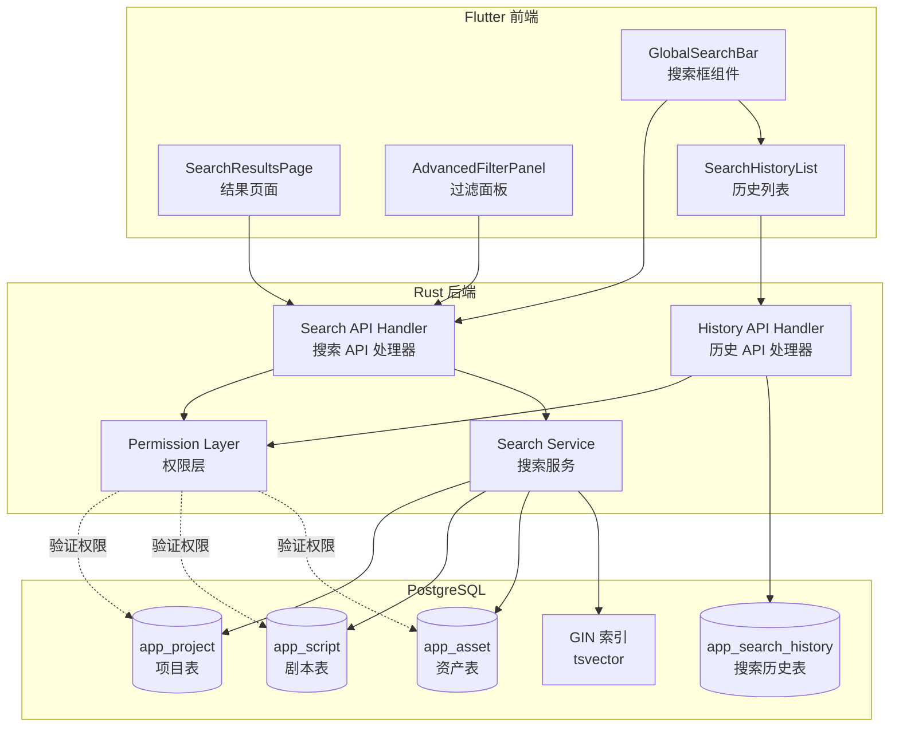

# Design Document: Global Search

## Overview

全局搜索功能为 Toonflow 平台提供跨项目、剧本、资产的统一搜索能力。本设计基于 PostgreSQL 的 tsvector + GIN 索引实现高性能全文搜索，支持中英文分词和权重排序。

### 核心目标

1. **高性能搜索**：利用 PostgreSQL GIN 索引，在 95% 的情况下 1 秒内返回结果
2. **权限隔离**：严格遵循 workspace 级别权限控制，用户只能搜索有权访问的内容
3. **智能排序**：基于字段权重（标题 > 描述 > 其他）和相关性评分排序
4. **用户体验**：提供搜索历史、高级过滤、结果摘要高亮等功能

### 技术栈

- **后端**：Rust + Axum + SQLx + PostgreSQL (tsvector + GIN 索引)
- **前端**：Flutter (桌面 + Web)
- **数据库**：Supabase PostgreSQL
- **API 协议**：REST (`/api/v1/search`)

## Architecture

### 系统架构图



### 数据流

1. **搜索请求流程**：
   ```
   用户输入 → GlobalSearchBar → GET /api/v1/search?q=关键词
   → 权限验证 → 全文搜索查询 → 结果排序 → 返回 JSON
   → SearchResultsPage 渲染
   ```

2. **搜索历史流程**：
   ```
   搜索成功 → 保存到 app_search_history
   → 用户点击搜索框 → GET /api/v1/search/history
   → 显示最近 10 条历史
   ```

3. **权限过滤流程**：
   ```
   JWT 解析 → 获取 user_id → 查询 current_workspace_id
   → 验证 workspace 成员资格 → 仅返回该 workspace 下的结果
   ```

## Components and Interfaces

### 后端组件

#### 1. Search API Handler (`backend/src/search/api.rs`)

```rust
// GET /api/v1/search
pub struct SearchQuery {
    pub q: String,                    // 搜索关键词（必填，2-200 字符）
    pub result_type: Option<Vec<ResultType>>, // 结果类型过滤
    pub page: Option<u32>,            // 页码（默认 1）
    pub page_size: Option<u32>,       // 每页数量（默认 20，最大 100）
    pub time_from: Option<DateTime<Utc>>, // 时间范围起始
    pub time_to: Option<DateTime<Utc>>,   // 时间范围结束
}

pub struct SearchResponse {
    pub results: Vec<SearchResult>,
    pub total: u32,
    pub page: u32,
    pub page_size: u32,
    pub has_more: bool,
}

pub struct SearchResult {
    pub id: Uuid,
    pub result_type: ResultType,      // project | script | asset
    pub title: String,
    pub snippet: String,              // 包含高亮标记的摘要
    pub rank: f32,                    // 相关性评分
    pub created_at: DateTime<Utc>,
    pub updated_at: DateTime<Utc>,
    pub metadata: serde_json::Value,  // 类型特定的额外信息
}

pub enum ResultType {
    Project,
    Script,
    Asset,
}
```

#### 2. Search Service (`backend/src/search/service.rs`)

核心搜索逻辑，负责：
- 构建 PostgreSQL 全文搜索查询
- 应用权限过滤
- 结果排序和分页
- 生成搜索摘要（使用 `ts_headline`）

```rust
pub struct SearchService {
    pool: PgPool,
}

impl SearchService {
    // 执行跨表搜索
    pub async fn search(
        &self,
        user_id: Uuid,
        workspace_id: Uuid,
        query: SearchQuery,
    ) -> Result<SearchResponse, SearchError>;
    
    // 验证用户权限
    async fn verify_workspace_access(
        &self,
        user_id: Uuid,
        workspace_id: Uuid,
    ) -> Result<bool, SearchError>;
    
    // 构建全文搜索查询
    fn build_search_query(&self, keyword: &str) -> String;
    
    // 生成搜索摘要
    fn generate_snippet(&self, content: &str, keyword: &str) -> String;
}
```

#### 3. History API Handler (`backend/src/search/history.rs`)

```rust
// GET /api/v1/search/history
pub struct HistoryResponse {
    pub history: Vec<HistoryEntry>,
}

pub struct HistoryEntry {
    pub id: Uuid,
    pub query: String,
    pub result_count: u32,
    pub searched_at: DateTime<Utc>,
}

// DELETE /api/v1/search/history
// 删除所有历史记录（返回 204 No Content）
```

### 前端组件

#### 1. GlobalSearchBar (`frontend/lib/global_search/global_search_bar.dart`)

主导航栏搜索框组件：
- 输入框（最少 2 字符触发）
- 搜索历史下拉列表
- 快捷键支持（Ctrl/Cmd + K）
- 加载状态指示器

```dart
class GlobalSearchBar extends StatefulWidget {
  const GlobalSearchBar({Key? key}) : super(key: key);
  
  @override
  State<GlobalSearchBar> createState() => _GlobalSearchBarState();
}

class _GlobalSearchBarState extends State<GlobalSearchBar> {
  final TextEditingController _controller = TextEditingController();
  List<HistoryEntry> _history = [];
  bool _isLoading = false;
  
  void _onSearch(String query) {
    // 导航到搜索结果页
    Navigator.pushNamed(
      context,
      '/search',
      arguments: {'query': query},
    );
  }
  
  Future<void> _loadHistory() async {
    // 调用 rust_api 获取搜索历史
  }
}
```

#### 2. SearchResultsPage (`frontend/lib/global_search/search_results_page.dart`)

搜索结果页面：
- 显示搜索关键词和结果总数
- 按类型分组展示结果
- 分页控件
- 高级过滤面板

```dart
class SearchResultsPage extends StatefulWidget {
  final String query;
  
  const SearchResultsPage({Key? key, required this.query}) : super(key: key);
  
  @override
  State<SearchResultsPage> createState() => _SearchResultsPageState();
}

class _SearchResultsPageState extends State<SearchResultsPage> {
  SearchResponse? _response;
  SearchFilters _filters = SearchFilters();
  bool _isLoading = false;
  
  @override
  void initState() {
    super.initState();
    _performSearch();
  }
  
  Future<void> _performSearch() async {
    setState(() => _isLoading = true);
    try {
      final response = await RustApi.search(
        query: widget.query,
        filters: _filters,
      );
      setState(() {
        _response = response;
        _isLoading = false;
      });
    } catch (e) {
      // 错误处理
    }
  }
}
```

#### 3. SearchResultCard (`frontend/lib/global_search/search_result_card.dart`)

单条搜索结果卡片：
- 类型图标
- 标题
- 高亮摘要
- 更新时间
- 点击跳转详情

```dart
class SearchResultCard extends StatelessWidget {
  final SearchResult result;
  
  const SearchResultCard({Key? key, required this.result}) : super(key: key);
  
  @override
  Widget build(BuildContext context) {
    return Card(
      child: ListTile(
        leading: _buildTypeIcon(),
        title: Text(result.title),
        subtitle: _buildHighlightedSnippet(),
        trailing: Text(_formatTime(result.updatedAt)),
        onTap: () => _navigateToDetail(),
      ),
    );
  }
  
  Widget _buildHighlightedSnippet() {
    // 解析 snippet 中的 <mark> 标签并高亮显示
  }
}
```

#### 4. AdvancedFilterPanel (`frontend/lib/global_search/advanced_filter_panel.dart`)

高级过滤面板：
- 结果类型多选（项目/剧本/资产）
- 时间范围选择器
- 应用/清除过滤按钮

```dart
class AdvancedFilterPanel extends StatefulWidget {
  final SearchFilters initialFilters;
  final ValueChanged<SearchFilters> onFiltersChanged;
  
  const AdvancedFilterPanel({
    Key? key,
    required this.initialFilters,
    required this.onFiltersChanged,
  }) : super(key: key);
}

class SearchFilters {
  Set<ResultType> resultTypes = {};
  DateTime? timeFrom;
  DateTime? timeTo;
  
  bool get hasActiveFilters =>
      resultTypes.isNotEmpty || timeFrom != null || timeTo != null;
}
```

### Rust API 绑定层

#### rust_api 接口 (`frontend/rust_api/lib/search.dart`)

```dart
class RustApiSearch {
  // 执行搜索
  static Future<SearchResponse> search({
    required String query,
    List<String>? resultTypes,
    int? page,
    int? pageSize,
    DateTime? timeFrom,
    DateTime? timeTo,
  }) async {
    // 调用 Rust 后端 GET /api/v1/search
  }
  
  // 获取搜索历史
  static Future<List<HistoryEntry>> getHistory() async {
    // 调用 Rust 后端 GET /api/v1/search/history
  }
  
  // 删除搜索历史
  static Future<void> deleteHistory() async {
    // 调用 Rust 后端 DELETE /api/v1/search/history
  }
}
```

## Data Models

### 数据库 Schema

#### 1. 搜索索引列（添加到现有表）

```sql
-- 为 app_project 添加搜索索引
ALTER TABLE public.app_project 
ADD COLUMN IF NOT EXISTS search_vector tsvector
GENERATED ALWAYS AS (
  setweight(to_tsvector('simple', COALESCE(name, '')), 'A') ||
  setweight(to_tsvector('simple', COALESCE(intro, '')), 'B')
) STORED;

CREATE INDEX IF NOT EXISTS idx_app_project_search 
ON public.app_project USING GIN(search_vector);

-- 为 app_script 添加搜索索引
ALTER TABLE public.app_script 
ADD COLUMN IF NOT EXISTS search_vector tsvector
GENERATED ALWAYS AS (
  setweight(to_tsvector('simple', COALESCE(name, '')), 'A') ||
  setweight(to_tsvector('simple', COALESCE(content, '')), 'B')
) STORED;

CREATE INDEX IF NOT EXISTS idx_app_script_search 
ON public.app_script USING GIN(search_vector);

-- 为 app_asset 添加搜索索引
ALTER TABLE public.app_asset 
ADD COLUMN IF NOT EXISTS search_vector tsvector
GENERATED ALWAYS AS (
  setweight(to_tsvector('simple', COALESCE(name, '')), 'A') ||
  setweight(to_tsvector('simple', COALESCE(description, '')), 'B')
) STORED;

CREATE INDEX IF NOT EXISTS idx_app_asset_search 
ON public.app_asset USING GIN(search_vector);
```

**设计说明**：
- 使用 `GENERATED ALWAYS AS ... STORED` 自动维护索引，无需应用层手动更新
- 使用 `simple` 配置（不做词干提取）以支持中英文混合
- 权重设置：`A`（标题/名称）> `B`（描述/内容）
- GIN 索引加速全文搜索查询

#### 2. 搜索历史表

```sql
CREATE TABLE IF NOT EXISTS public.app_search_history (
  id UUID PRIMARY KEY DEFAULT gen_random_uuid(),
  user_id UUID NOT NULL REFERENCES auth.users(id) ON DELETE CASCADE,
  workspace_id UUID NOT NULL REFERENCES public.app_workspace(id) ON DELETE CASCADE,
  query TEXT NOT NULL,
  result_count INTEGER NOT NULL DEFAULT 0,
  searched_at TIMESTAMPTZ NOT NULL DEFAULT NOW(),
  
  -- 索引
  CONSTRAINT app_search_history_query_length CHECK (char_length(query) >= 2 AND char_length(query) <= 200)
);

CREATE INDEX IF NOT EXISTS idx_app_search_history_user 
ON public.app_search_history(user_id, searched_at DESC);

CREATE INDEX IF NOT EXISTS idx_app_search_history_workspace 
ON public.app_search_history(workspace_id, searched_at DESC);

-- RLS 策略
ALTER TABLE public.app_search_history ENABLE ROW LEVEL SECURITY;

DROP POLICY IF EXISTS app_search_history_own ON public.app_search_history;
CREATE POLICY app_search_history_own ON public.app_search_history
FOR ALL TO authenticated
USING (user_id = auth.uid())
WITH CHECK (user_id = auth.uid());

-- 自动清理 90 天前的历史记录
CREATE OR REPLACE FUNCTION public.cleanup_old_search_history()
RETURNS void
LANGUAGE plpgsql
SECURITY DEFINER
AS $$
BEGIN
  DELETE FROM public.app_search_history
  WHERE searched_at < NOW() - INTERVAL '90 days';
END;
$$;

-- 限制每个用户最多保留 50 条历史
CREATE OR REPLACE FUNCTION public.limit_search_history_per_user()
RETURNS TRIGGER
LANGUAGE plpgsql
AS $$
BEGIN
  DELETE FROM public.app_search_history
  WHERE user_id = NEW.user_id
  AND id NOT IN (
    SELECT id FROM public.app_search_history
    WHERE user_id = NEW.user_id
    ORDER BY searched_at DESC
    LIMIT 50
  );
  RETURN NEW;
END;
$$;

CREATE TRIGGER trigger_limit_search_history
AFTER INSERT ON public.app_search_history
FOR EACH ROW
EXECUTE FUNCTION public.limit_search_history_per_user();
```

### 搜索查询示例

#### 基础全文搜索查询

```sql
-- 搜索项目
SELECT 
  id,
  'project' as result_type,
  name as title,
  ts_headline('simple', COALESCE(intro, ''), plainto_tsquery('simple', $1), 
    'MaxWords=50, MinWords=25, StartSel=<mark>, StopSel=</mark>') as snippet,
  ts_rank(search_vector, plainto_tsquery('simple', $1)) as rank,
  created_at,
  updated_at
FROM public.app_project
WHERE 
  search_vector @@ plainto_tsquery('simple', $1)
  AND owner_user_id = $2  -- 权限过滤
ORDER BY rank DESC, updated_at DESC
LIMIT $3 OFFSET $4;
```

#### 跨表联合搜索

```sql
-- 联合搜索项目、剧本、资产
WITH search_results AS (
  -- 项目
  SELECT 
    id, 'project' as result_type, name as title,
    ts_headline('simple', COALESCE(intro, ''), plainto_tsquery('simple', $1)) as snippet,
    ts_rank(search_vector, plainto_tsquery('simple', $1)) as rank,
    created_at, updated_at, '{}'::jsonb as metadata
  FROM public.app_project
  WHERE search_vector @@ plainto_tsquery('simple', $1)
    AND owner_user_id = $2
  
  UNION ALL
  
  -- 剧本
  SELECT 
    s.id, 'script' as result_type, s.name as title,
    ts_headline('simple', COALESCE(s.content, ''), plainto_tsquery('simple', $1)) as snippet,
    ts_rank(s.search_vector, plainto_tsquery('simple', $1)) as rank,
    s.created_at, s.updated_at,
    jsonb_build_object('project_id', p.id, 'project_name', p.name) as metadata
  FROM public.app_script s
  INNER JOIN public.app_project p ON p.id = s.project_id
  WHERE s.search_vector @@ plainto_tsquery('simple', $1)
    AND p.owner_user_id = $2
  
  UNION ALL
  
  -- 资产
  SELECT 
    a.id, 'asset' as result_type, a.name as title,
    ts_headline('simple', COALESCE(a.description, ''), plainto_tsquery('simple', $1)) as snippet,
    ts_rank(a.search_vector, plainto_tsquery('simple', $1)) as rank,
    a.created_at, a.updated_at,
    jsonb_build_object('project_id', p.id, 'project_name', p.name, 'asset_type', a.asset_type) as metadata
  FROM public.app_asset a
  INNER JOIN public.app_project p ON p.id = a.project_id
  WHERE a.search_vector @@ plainto_tsquery('simple', $1)
    AND p.owner_user_id = $2
)
SELECT * FROM search_results
ORDER BY rank DESC, updated_at DESC
LIMIT $3 OFFSET $4;
```

## Correctness Properties

*A property is a characteristic or behavior that should hold true across all valid executions of a system-essentially, a formal statement about what the system should do. Properties serve as the bridge between human-readable specifications and machine-verifiable correctness guarantees.*

在编写 Correctness Properties 之前，我需要先使用 prework 工具分析 requirements 中的 acceptance criteria。

