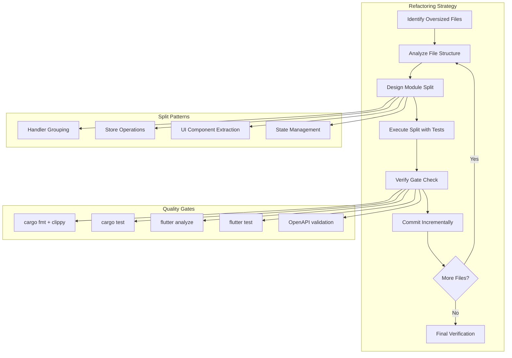

# Design Document: Large File Refactoring Phase 2

## Overview

This feature implements a systematic refactoring strategy to bring 18 oversized files (13 Rust backend files, 5 Flutter frontend files) into compliance with the 800-line standard defined in AGENTS.md. The largest file (section.dart at 3164 lines) exceeds the limit by nearly 4x, creating maintenance challenges and violating the repository's "竖切、可维护" (vertical slicing, maintainability) principle.

The refactoring will be executed incrementally with small commits after each file split, maintaining contract consistency (OpenAPI, WebSocket), and passing the refactor-check.sh gate at each step. The design provides both high-level architectural guidance and low-level split plans for each file.

## Architecture



## Main Workflow

```mermaid
sequenceDiagram
    participant Dev as Developer/Agent
    participant File as Target File
    participant Module as New Modules
    participant Gate as refactor-check.sh
    participant Git as Version Control
    
    Dev->>File: Analyze structure & dependencies
    File-->>Dev: Return function groups & boundaries
    Dev->>Module: Create new module files
    Dev->>File: Move functions to modules
    Dev->>File: Update imports & re-exports
    Dev->>Gate: Run refactor-check.sh
    Gate->>Gate: cargo fmt, clippy, test
    Gate->>Gate: flutter analyze, test
    Gate->>Gate: OpenAPI validation
    Gate-->>Dev: Pass/Fail result
    Dev->>Git: Commit if passed
    Dev->>Dev: Repeat for next file


## Components and Interfaces

### Component 1: File Analyzer

**Purpose**: Analyze oversized files to identify natural split boundaries based on function grouping, cohesion, and dependencies.

**Interface**:
```rust
struct FileAnalysis {
    file_path: String,
    current_lines: usize,
    target_lines: usize,
    function_groups: Vec<FunctionGroup>,
    dependencies: Vec<Dependency>,
    split_recommendation: SplitStrategy,
}

struct FunctionGroup {
    name: String,
    functions: Vec<String>,
    line_count: usize,
    cohesion_score: f32,
}

enum SplitStrategy {
    HandlerGrouping,      // For API handlers
    StoreOperations,      // For database operations
    UIComponentExtraction, // For Flutter widgets
    StateManagement,      // For state logic
}
```

**Responsibilities**:
- Parse file structure and extract function signatures
- Calculate cohesion metrics between functions
- Identify natural module boundaries
- Recommend split strategy based on file type

### Component 2: Module Splitter

**Purpose**: Execute the actual file split by creating new module files and moving code while maintaining correctness.

**Interface**:
```rust
struct ModuleSplitter {
    source_file: PathBuf,
    target_modules: Vec<ModuleSpec>,
    preserve_public_api: bool,
}

struct ModuleSpec {
    module_name: String,
    target_path: PathBuf,
    functions_to_move: Vec<String>,
    visibility: Visibility,
}

enum Visibility {
    Public,
    PubCrate,
    Private,
}

impl ModuleSplitter {
    fn create_modules(&self) -> Result<Vec<PathBuf>>;
    fn move_functions(&self) -> Result<()>;
    fn update_imports(&self) -> Result<()>;
    fn create_reexports(&self) -> Result<()>;
}
```

**Responsibilities**:
- Create new module files with appropriate structure
- Move functions while preserving documentation and attributes
- Update import statements in source and dependent files
- Create re-exports to maintain backward compatibility

### Component 3: Gate Validator

**Purpose**: Run refactor-check.sh gate to ensure all changes pass quality checks before committing.

**Interface**:
```rust
struct GateValidator {
    workspace_root: PathBuf,
    backend_checks: bool,
    frontend_checks: bool,
}

struct ValidationResult {
    passed: bool,
    cargo_fmt: CheckResult,
    cargo_clippy: CheckResult,
    cargo_test: CheckResult,
    flutter_analyze: CheckResult,
    flutter_test: CheckResult,
    openapi_validation: CheckResult,
}

struct CheckResult {
    passed: bool,
    output: String,
    duration_ms: u64,
}

impl GateValidator {
    fn run_full_gate(&self) -> Result<ValidationResult>;
    fn run_backend_only(&self) -> Result<ValidationResult>;
    fn run_frontend_only(&self) -> Result<ValidationResult>;
}
```

**Responsibilities**:
- Execute refactor-check.sh script
- Parse and report individual check results
- Provide detailed error messages for failures
- Support partial validation for backend-only or frontend-only changes

### Component 4: Incremental Committer

**Purpose**: Create small, focused commits after each successful file refactoring.

**Interface**:
```rust
struct IncrementalCommitter {
    repo_path: PathBuf,
    commit_strategy: CommitStrategy,
}

enum CommitStrategy {
    PerFile,           // One commit per file refactored
    PerModule,         // One commit per module created
    PerCheckpoint,     // Commit at logical checkpoints
}

struct CommitSpec {
    files: Vec<PathBuf>,
    message: String,
    description: Option<String>,
}

impl IncrementalCommitter {
    fn stage_files(&self, files: &[PathBuf]) -> Result<()>;
    fn create_commit(&self, spec: &CommitSpec) -> Result<String>;
    fn verify_commit(&self, commit_hash: &str) -> Result<bool>;
}
```

**Responsibilities**:
- Stage modified and new files
- Generate descriptive commit messages
- Create commits with proper attribution
- Verify commits are valid and pushed

## Data Models

### FileRefactoringPlan

```rust
struct FileRefactoringPlan {
    file_path: String,
    current_lines: usize,
    target_lines: usize,
    priority: Priority,
    split_strategy: SplitStrategy,
    modules: Vec<ModuleDefinition>,
    estimated_effort_hours: f32,
}

enum Priority {
    Critical,  // >2000 lines
    High,      // 1000-2000 lines
    Medium,    // 800-1000 lines
}

struct ModuleDefinition {
    name: String,
    path: String,
    functions: Vec<String>,
    estimated_lines: usize,
    dependencies: Vec<String>,
}
```

**Validation Rules**:
- Each module must be ≤800 lines
- Total lines across modules must equal original file
- No circular dependencies between modules
- Public API must be preserved through re-exports

### RefactoringProgress

```rust
struct RefactoringProgress {
    total_files: usize,
    completed_files: usize,
    failed_files: Vec<FailedRefactoring>,
    total_lines_reduced: usize,
    commits_created: Vec<String>,
    elapsed_time_seconds: u64,
}

struct FailedRefactoring {
    file_path: String,
    error_message: String,
    gate_check_failures: Vec<String>,
    retry_count: usize,
}
```

## Algorithmic Pseudocode

### Main Refactoring Algorithm

```pascal
ALGORITHM refactorOversizedFiles(fileList)
INPUT: fileList of type List<FilePath>
OUTPUT: result of type RefactoringProgress

BEGIN
  ASSERT fileList is not empty
  ASSERT all files in fileList exist
  
  progress ← initializeProgress(fileList.length)
  
  // Sort files by priority (largest first)
  sortedFiles ← sortByLineCount(fileList, descending=true)
  
  FOR each file IN sortedFiles DO
    ASSERT file.lineCount > 800
    
    // Step 1: Analyze file structure
    analysis ← analyzeFile(file)
    
    // Step 2: Design split strategy
    plan ← createRefactoringPlan(analysis)
    
    // Step 3: Execute split
    splitResult ← executeSplit(file, plan)
    
    IF splitResult.failed THEN
      progress.failedFiles.add(file, splitResult.error)
      CONTINUE
    END IF
    
    // Step 4: Run gate checks
    gateResult ← runGateValidation(splitResult.modifiedFiles)
    
    IF NOT gateResult.passed THEN
      rollbackSplit(splitResult)
      progress.failedFiles.add(file, gateResult.errors)
      CONTINUE
    END IF
    
    // Step 5: Commit changes
    commitHash ← createIncrementalCommit(file, splitResult)
    progress.commitsCreated.add(commitHash)
    progress.completedFiles ← progress.completedFiles + 1
    
    // Step 6: Update progress
    progress.totalLinesReduced ← progress.totalLinesReduced + 
                                  (file.lineCount - 800)
  END FOR
  
  ASSERT progress.completedFiles + progress.failedFiles.length = fileList.length
  
  RETURN progress
END
```

**Preconditions:**
- fileList contains only files exceeding 800 lines
- All files in fileList exist and are readable
- Git repository is in clean state (no uncommitted changes)
- refactor-check.sh script is executable

**Postconditions:**
- All successfully refactored files are ≤800 lines
- Each refactoring has a corresponding git commit
- All commits pass refactor-check.sh gate
- Failed refactorings are logged with error details

**Loop Invariants:**
- progress.completedFiles ≤ total files processed so far
- All completed files have corresponding commits
- Repository remains in valid state after each iteration

### File Analysis Algorithm

```pascal
ALGORITHM analyzeFile(filePath)
INPUT: filePath of type String
OUTPUT: analysis of type FileAnalysis

BEGIN
  ASSERT fileExists(filePath)
  
  content ← readFile(filePath)
  lineCount ← countLines(content)
  
  // Parse file structure
  IF isRustFile(filePath) THEN
    functions ← parseRustFunctions(content)
    imports ← parseRustImports(content)
    strategy ← determineRustStrategy(filePath, functions)
  ELSE IF isDartFile(filePath) THEN
    classes ← parseDartClasses(content)
    methods ← parseDartMethods(content)
    strategy ← determineDartStrategy(filePath, classes, methods)
  ELSE
    THROW UnsupportedFileType(filePath)
  END IF
  
  // Group related functions
  groups ← clusterByDependencies(functions, imports)
  
  // Calculate cohesion scores
  FOR each group IN groups DO
    group.cohesionScore ← calculateCohesion(group.functions)
  END FOR
  
  // Sort groups by cohesion (high cohesion = good module candidate)
  sortedGroups ← sortByCohesion(groups, descending=true)
  
  analysis ← FileAnalysis{
    filePath: filePath,
    currentLines: lineCount,
    targetLines: 800,
    functionGroups: sortedGroups,
    splitStrategy: strategy
  }
  
  RETURN analysis
END
```

**Preconditions:**
- filePath points to a valid Rust (.rs) or Dart (.dart) file
- File is readable and well-formed (parseable)

**Postconditions:**
- analysis contains complete file structure information
- functionGroups are sorted by cohesion score (descending)
- splitStrategy is appropriate for file type and content

### Module Split Execution Algorithm

```pascal
ALGORITHM executeSplit(file, plan)
INPUT: file of type FilePath, plan of type RefactoringPlan
OUTPUT: result of type SplitResult

BEGIN
  ASSERT file.exists()
  ASSERT plan.modules is not empty
  ASSERT sum(plan.modules.estimatedLines) ≈ file.lineCount
  
  modifiedFiles ← List<FilePath>()
  createdModules ← List<FilePath>()
  
  // Step 1: Create new module files
  FOR each moduleDef IN plan.modules DO
    modulePath ← constructModulePath(file, moduleDef.name)
    
    // Extract functions for this module
    functionsCode ← extractFunctions(file, moduleDef.functions)
    
    // Create module file with proper structure
    moduleContent ← buildModuleContent(
      functions: functionsCode,
      imports: resolveImports(functionsCode),
      visibility: moduleDef.visibility
    )
    
    writeFile(modulePath, moduleContent)
    createdModules.add(modulePath)
  END FOR
  
  // Step 2: Update original file to re-export modules
  reexportContent ← buildReexportFile(plan.modules)
  writeFile(file, reexportContent)
  modifiedFiles.add(file)
  
  // Step 3: Update dependent files' imports
  dependents ← findDependentFiles(file)
  FOR each dependent IN dependents DO
    updateImports(dependent, plan.modules)
    modifiedFiles.add(dependent)
  END FOR
  
  result ← SplitResult{
    success: true,
    createdModules: createdModules,
    modifiedFiles: modifiedFiles,
    error: null
  }
  
  RETURN result
  
EXCEPTION
  WHEN error OCCURS THEN
    rollbackChanges(createdModules, modifiedFiles)
    RETURN SplitResult{success: false, error: error.message}
END
```

**Preconditions:**
- file exists and is readable
- plan.modules collectively cover all functions in file
- No module exceeds 800 lines
- Git working directory is clean

**Postconditions:**
- Original file is replaced with re-export module
- New module files are created in appropriate locations
- All dependent files have updated imports
- Total line count across modules equals original file
- If exception occurs, all changes are rolled back

**Loop Invariants:**
- All created modules are valid and parseable
- modifiedFiles contains all files changed so far
- No module exceeds 800 lines

### Gate Validation Algorithm

```pascal
ALGORITHM runGateValidation(modifiedFiles)
INPUT: modifiedFiles of type List<FilePath>
OUTPUT: result of type ValidationResult

BEGIN
  ASSERT modifiedFiles is not empty
  
  hasBackendChanges ← any(modifiedFiles, isBackendFile)
  hasFrontendChanges ← any(modifiedFiles, isFrontendFile)
  
  result ← ValidationResult{passed: true}
  
  // Backend checks
  IF hasBackendChanges THEN
    result.cargoFmt ← runCommand("cargo fmt --check", cwd="backend")
    result.cargoClippy ← runCommand("cargo clippy -- -D warnings", cwd="backend")
    result.cargoTest ← runCommand("cargo test", cwd="backend")
    result.openapiValidation ← runCommand("cargo run --bin export-openapi", cwd="backend")
    
    IF NOT (result.cargoFmt.passed AND 
            result.cargoClippy.passed AND 
            result.cargoTest.passed AND 
            result.openapiValidation.passed) THEN
      result.passed ← false
    END IF
  END IF
  
  // Frontend checks
  IF hasFrontendChanges THEN
    runCommand("flutter pub get", cwd="frontend")
    result.flutterAnalyze ← runCommand("flutter analyze", cwd="frontend")
    result.flutterTest ← runCommand("flutter test", cwd="frontend")
    
    IF NOT (result.flutterAnalyze.passed AND result.flutterTest.passed) THEN
      result.passed ← false
    END IF
  END IF
  
  RETURN result
END
```

**Preconditions:**
- modifiedFiles contains valid file paths
- Rust toolchain is installed (if backend changes)
- Flutter SDK is installed (if frontend changes)
- Working directory is repository root

**Postconditions:**
- result.passed is true if and only if all applicable checks passed
- Each check result contains output and duration
- Failed checks include detailed error messages

## Key Functions with Formal Specifications

### Function 1: sortByLineCount()

```rust
fn sortByLineCount(files: Vec<FilePath>, descending: bool) -> Vec<FilePath>
```

**Preconditions:**
- `files` is a valid vector (may be empty)
- All file paths in `files` exist and are readable

**Postconditions:**
- Returns sorted vector of same length as input
- If `descending=true`: files[i].lineCount ≥ files[i+1].lineCount for all valid i
- If `descending=false`: files[i].lineCount ≤ files[i+1].lineCount for all valid i
- No files are added or removed from the list

**Loop Invariants:** N/A (uses standard library sort)

### Function 2: calculateCohesion()

```rust
fn calculateCohesion(functions: Vec<Function>) -> f32
```

**Preconditions:**
- `functions` is non-empty vector
- Each function has valid dependency information

**Postconditions:**
- Returns cohesion score in range [0.0, 1.0]
- Score of 1.0 indicates maximum cohesion (all functions depend on each other)
- Score of 0.0 indicates no cohesion (no shared dependencies)
- Higher scores indicate better module candidates

**Loop Invariants:**
- For dependency analysis loop: All processed function pairs have computed similarity scores

### Function 3: extractFunctions()

```rust
fn extractFunctions(file: FilePath, functionNames: Vec<String>) -> String
```

**Preconditions:**
- `file` exists and is readable
- `functionNames` is non-empty
- All function names in `functionNames` exist in `file`

**Postconditions:**
- Returns string containing complete function definitions
- Includes function documentation, attributes, and body
- Preserves original formatting and comments
- Functions appear in same order as in original file

**Loop Invariants:**
- All extracted functions so far are complete and valid
- Extracted code maintains original indentation

### Function 4: rollbackChanges()

```rust
fn rollbackChanges(createdFiles: Vec<FilePath>, modifiedFiles: Vec<FilePath>) -> Result<()>
```

**Preconditions:**
- `createdFiles` contains paths that were created during split
- `modifiedFiles` contains paths that were modified during split
- Git repository is available

**Postconditions:**
- All files in `createdFiles` are deleted
- All files in `modifiedFiles` are restored to pre-split state
- Working directory is clean (no uncommitted changes)
- If rollback fails, returns Err with details

**Loop Invariants:**
- All processed files so far have been successfully rolled back
- Repository remains in consistent state throughout rollback

## Example Usage

```rust
// Example 1: Refactor single file
let file = PathBuf::from("backend/src/publish/handlers.rs");
let analysis = analyzeFile(&file)?;
let plan = createRefactoringPlan(&analysis)?;
let result = executeSplit(&file, &plan)?;

if result.success {
    let gate_result = runGateValidation(&result.modifiedFiles)?;
    if gate_result.passed {
        let commit = createIncrementalCommit(&file, &result)?;
        println!("Refactored {} -> commit {}", file.display(), commit);
    }
}

// Example 2: Batch refactor all oversized files
let oversized_files = vec![
    "backend/src/publish/store.rs",
    "backend/src/publish/handlers.rs",
    "frontend/lib/short_video_space/section.dart",
];

let progress = refactorOversizedFiles(oversized_files)?;
println!("Completed: {}/{}", progress.completed_files, progress.total_files);
println!("Lines reduced: {}", progress.total_lines_reduced);
println!("Commits: {:?}", progress.commits_created);

// Example 3: Analyze file without executing split
let file = PathBuf::from("backend/src/publish/adapters.rs");
let analysis = analyzeFile(&file)?;
println!("File: {} ({} lines)", file.display(), analysis.current_lines);
println!("Recommended strategy: {:?}", analysis.split_strategy);
for group in analysis.function_groups {
    println!("  Group '{}': {} functions, {} lines, cohesion={:.2}",
             group.name, group.functions.len(), group.line_count, group.cohesion_score);
}
```

## Correctness Properties

*A property is a characteristic or behavior that should hold true across all valid executions of a system — essentially, a formal statement about what the system should do. Properties serve as the bridge between human-readable specifications and machine-verifiable correctness guarantees.*

### Property 1: Line Count Preservation

*For any* Target_File in the refactoring set, the sum of line counts across all Modules produced by splitting that file must be within ±10 lines of the original file's line count.

**Validates: Requirements 2.1**

### Property 2: API Preservation

*For any* Target_File, the set of public symbols accessible before splitting must be a subset of the public symbols accessible after splitting (via the Re-export_File and Modules).

**Validates: Requirements 3.1, 3.2**

### Property 3: Module Size Compliance

*For any* Target_File that is split, every Module produced (including the Re-export_File) must contain ≤800 lines.

**Validates: Requirements 1.1, 1.2**

### Property 4: Gate Check Enforcement

*For any* Target_File split that is marked as successful, the Gate_Validator must have returned `passed = true` for all applicable checks before the commit was created.

**Validates: Requirements 6.1, 6.5, 6.6**

### Property 5: Atomicity

*For any* Target_File split that fails at any stage, the working directory must be identical to its state before the split began — no new files exist and no existing files are modified.

**Validates: Requirements 7.1, 7.2, 7.3, 7.4**

### Property 6: Dependency Acyclicity

*For any* Target_File split, the Dependency_Graph of the resulting Modules must contain no directed cycles.

**Validates: Requirements 4.1, 4.3**

### Property 7: Incremental Progress

*For any* Batch of Target_Files, the count of successfully completed files plus the count of failed files must equal the total number of files in the Batch.

**Validates: Requirements 9.4**

### Property 8: Selective Gate Validation

*For any* set of modified files, the Gate_Validator must run backend checks if and only if at least one backend file was modified, and must run frontend checks if and only if at least one frontend file was modified.

**Validates: Requirements 6.2, 6.3, 6.4**

### Property 9: Dependent Import Consistency

*For any* Target_File that is split, every file in the repository that previously imported from the Target_File must have its imports updated so that it continues to resolve all previously imported symbols after the split.

**Validates: Requirements 5.1, 5.2, 5.3**

## Error Handling

### Error Scenario 1: Gate Check Failure

**Condition**: After splitting a file, cargo clippy or flutter analyze reports errors
**Response**: 
- Rollback all changes (delete created modules, restore original file)
- Log detailed error messages from failed checks
- Add file to failed_files list with retry_count
**Recovery**: 
- Analyze error messages to adjust split strategy
- Retry with different module boundaries
- If retry_count > 3, skip file and report to user

### Error Scenario 2: Circular Dependency Detected

**Condition**: Module A depends on Module B, and Module B depends on Module A
**Response**:
- Abort split before creating files
- Log dependency cycle details
- Suggest merging conflicting modules
**Recovery**:
- Reanalyze file with stricter cohesion requirements
- Consider different function grouping strategy
- May require manual intervention to break cycle

### Error Scenario 3: Public API Breaking Change

**Condition**: After split, dependent files cannot find previously public functions
**Response**:
- Rollback changes immediately
- Identify missing re-exports
- Log which functions are not accessible
**Recovery**:
- Add missing pub use statements to re-export file
- Verify all public functions are re-exported
- Re-run split with corrected re-export list

### Error Scenario 4: File Parse Failure

**Condition**: Cannot parse Rust or Dart file (syntax errors, unsupported constructs)
**Response**:
- Skip file and log parse error
- Do not attempt split
- Add to failed_files with detailed error
**Recovery**:
- Fix syntax errors in original file first
- Re-run analysis after fixes
- May require manual refactoring if parser limitations

### Error Scenario 5: Git Commit Failure

**Condition**: Cannot create commit (dirty working directory, conflicts)
**Response**:
- Keep split changes in working directory
- Log git error message
- Prompt user to resolve git issues
**Recovery**:
- User resolves git conflicts manually
- Re-run commit step only (don't re-split)
- Continue with next file after successful commit

## Testing Strategy

### Unit Testing Approach

**Test Coverage Goals**: ≥80% line coverage for core algorithms

**Key Test Cases**:

1. **File Analysis Tests**
   - Parse Rust files with various function counts (10, 50, 100+ functions)
   - Parse Dart files with nested classes and mixins
   - Handle edge cases: empty files, single-function files, files with only imports
   - Verify cohesion calculation accuracy

2. **Module Splitting Tests**
   - Split file into 2, 3, 5, 10 modules
   - Verify line count preservation (±10 lines)
   - Test re-export generation for various visibility levels
   - Ensure no functions are lost or duplicated

3. **Gate Validation Tests**
   - Mock cargo/flutter command execution
   - Test backend-only, frontend-only, and mixed changes
   - Verify error message parsing
   - Test timeout handling for long-running tests

4. **Rollback Tests**
   - Verify complete rollback after split failure
   - Test rollback with partially created modules
   - Ensure git working directory is clean after rollback

### Property-Based Testing Approach

**Property Test Library**: proptest (Rust), fast-check (TypeScript/Dart)

**Properties to Test**:

1. **Line Count Preservation Property**
   ```rust
   proptest! {
       fn line_count_preserved(file: ArbitraryFile) {
           let original_lines = count_lines(&file);
           let modules = split_file(&file)?;
           let total_lines: usize = modules.iter().map(|m| count_lines(m)).sum();
           prop_assert!((total_lines as i32 - original_lines as i32).abs() <= 10);
       }
   }
   ```

2. **Module Size Compliance Property**
   ```rust
   proptest! {
       fn all_modules_under_limit(file: ArbitraryFile) {
           let modules = split_file(&file)?;
           for module in modules {
               prop_assert!(count_lines(&module) <= 800);
           }
       }
   }
   ```

3. **API Preservation Property**
   ```rust
   proptest! {
       fn public_api_preserved(file: ArbitraryFile) {
           let api_before = extract_public_api(&file);
           let modules = split_file(&file)?;
           let api_after = extract_public_api_from_modules(&modules);
           prop_assert!(api_before.is_subset(&api_after));
       }
   }
   ```

4. **Idempotence Property**
   ```rust
   proptest! {
       fn split_is_idempotent(file: ArbitraryFile) {
           let modules1 = split_file(&file)?;
           // Splitting already-split modules should not change them
           let modules2 = modules1.iter()
               .filter(|m| count_lines(m) > 800)
               .flat_map(|m| split_file(m))
               .collect();
           prop_assert_eq!(modules1.len(), modules2.len());
       }
   }
   ```

### Integration Testing Approach

**Integration Test Scenarios**:

1. **End-to-End Refactoring Test**
   - Create test repository with oversized files
   - Run full refactoring pipeline
   - Verify all files are ≤800 lines
   - Verify all commits are created
   - Verify gate checks pass

2. **Real File Refactoring Tests**
   - Test on actual oversized files from the repository
   - Run in isolated git branch
   - Verify backend tests still pass
   - Verify frontend builds successfully
   - Verify OpenAPI spec is still valid

3. **Dependency Update Tests**
   - Refactor file A that is imported by files B, C, D
   - Verify B, C, D have updated imports
   - Verify B, C, D still compile and pass tests

4. **Rollback Integration Test**
   - Introduce intentional error during split
   - Verify complete rollback occurs
   - Verify git working directory is clean
   - Verify original file is unchanged

## Performance Considerations

### Refactoring Performance Targets

- **Single File Refactoring**: ≤5 minutes per file (including gate checks)
- **Batch Refactoring**: ≤2 hours for all 18 files
- **Gate Validation**: ≤3 minutes per validation run
- **Rollback**: ≤30 seconds per rollback

### Optimization Strategies

1. **Parallel Gate Checks**: Run cargo and flutter checks in parallel when both backend and frontend are modified
2. **Incremental Compilation**: Use cargo's incremental compilation for faster test runs
3. **Selective Testing**: Only run tests for affected modules, not entire test suite
4. **Caching**: Cache file analysis results to avoid re-parsing unchanged files
5. **Lazy Evaluation**: Only analyze files when needed, not all upfront

### Resource Constraints

- **Memory**: File analysis should use ≤500MB RAM per file
- **Disk**: Temporary files should be cleaned up after each refactoring
- **CPU**: Gate checks may use all available cores (cargo test -j)

## Security Considerations

### Code Integrity

- **Verification**: All splits must pass gate checks before committing
- **Rollback Safety**: Failed splits are completely rolled back, no partial state
- **Commit Signing**: Use GPG signing for refactoring commits if configured

### Access Control

- **File Permissions**: Preserve original file permissions on created modules
- **Git Hooks**: Respect pre-commit and pre-push hooks during refactoring
- **Branch Protection**: Refactoring should occur on feature branch, not main

### Audit Trail

- **Commit Messages**: Include detailed information about what was split and why
- **Logging**: Log all refactoring operations with timestamps
- **Failure Tracking**: Record all failed refactorings with error details

## Dependencies

### Rust Dependencies

- **syn**: Rust parser for analyzing .rs files
- **quote**: Code generation for creating module files
- **walkdir**: Recursive directory traversal
- **regex**: Pattern matching for import updates
- **git2**: Git operations (commit, rollback)
- **tokio**: Async runtime for parallel operations

### Flutter/Dart Dependencies

- **analyzer**: Dart code analysis
- **dart_style**: Dart code formatting
- **path**: Path manipulation utilities

### External Tools

- **cargo**: Rust build tool (fmt, clippy, test)
- **flutter**: Flutter SDK (analyze, test, pub get)
- **git**: Version control operations
- **bash**: Shell script execution (refactor-check.sh)

### System Requirements

- **Rust**: ≥1.70.0
- **Flutter**: ≥3.10.0
- **Git**: ≥2.30.0
- **Bash**: ≥4.0 (for refactor-check.sh)
- **OS**: Linux, macOS, or Windows with WSL


---

## Low-Level Split Plans for Each File

This section provides specific, actionable split plans for each of the 18 oversized files, ordered by priority (largest/most critical first).

### Priority: CRITICAL (>2000 lines)

#### 1. frontend/lib/short_video_space/section.dart (3164 lines)

**Current Structure**: Monolithic StatefulWidget with 80+ methods handling project management, production workflow, and publishing.

**Split Strategy**: Extract into 6 focused widget files + 1 state management file

**Target Modules**:

1. **section.dart** (≈400 lines) - Main widget shell
   ```dart
   // Re-exports and main widget structure
   export 'section_project.dart';
   export 'section_production.dart';
   export 'section_publish.dart';
   export 'section_publish_scheduling.dart';
   export 'section_publish_copy.dart';
   export 'section_state.dart';
   
   class ShortVideoSpaceSection extends StatefulWidget {
     // Delegates to sub-widgets
   }
   ```

2. **section_state.dart** (≈300 lines) - State management
   ```dart
   // All state fields and getters
   class ShortVideoSpaceSectionState {
     // Project state
     List<ProjectRow> projects;
     String? selectedProjectId;
     
     // Production state
     ProjectProductionOverview? productionOverview;
     
     // Publish state
     List<PublishDraftRow> publishDrafts;
     String? selectedPublishDraftId;
     
     // Multi-select state (P8)
     bool multiSelectMode;
     Set<String> selectedDraftIds;
   }
   ```

3. **section_project.dart** (≈500 lines) - Project management
   ```dart
   // Functions: 
   // - _loadProjects()
   // - _resolveProjectIdAfterReload()
   // - _applyProjectPreset()
   // - _syncSelectedProjectContext()
   // - _modeFromProject()
   // - _normalizeVideoRatio()
   // - _onPublishPlatformTapped()
   ```

4. **section_production.dart** (≈600 lines) - Production workflow
   ```dart
   // Functions:
   // - _loadProjectOverview()
   // - _runBatchCandidateClips()
   // - _capturePublishSlice()
   // - _refreshPublishSlice()
   ```

5. **section_publish.dart** (≈700 lines) - Publishing operations
   ```dart
   // Functions:
   // - _bootstrapPublishDraft()
   // - _enqueuePublishJob()
   // - _enqueueAllDraftJobs()
   // - _retryFailedPublishJobs()
   // - _publishTargetMaps()
   // - _syncPublishAutomationModesFromMatrix()
   // - _syncSelectedPublishDraftWith()
   ```

6. **section_publish_scheduling.dart** (≈600 lines) - Scheduling logic
   ```dart
   // Functions:
   // - _clearPublishSchedule()
   // - _pickScheduleDateTime()
   // - _scheduleFirstDraft()
   // - _scheduleAllDraftsSameTime()
   // - _pickScheduleTimeForDay()
   // - _bulkScheduleDraftsForCalendarDay()
   ```

7. **section_publish_copy.dart** (≈400 lines) - Copy management
   ```dart
   // Functions:
   // - _suggestPublishCopy()
   // - _commitPublishPlatformCopy()
   // - Related copy editing logic
   ```

**Refactoring Steps**:
1. Create section_state.dart with all state fields
2. Extract project methods to section_project.dart
3. Extract production methods to section_production.dart
4. Extract publish methods to section_publish.dart
5. Extract scheduling methods to section_publish_scheduling.dart
6. Extract copy methods to section_publish_copy.dart
7. Update section.dart to use extracted modules
8. Run `flutter analyze && flutter test`
9. Commit: "refactor(frontend): split section.dart into 7 modules (3164→400 lines)"

**Estimated Effort**: 4 hours

---

#### 2. frontend/lib/short_video_space/view.dart (2376 lines)

**Current Structure**: Massive build() method with inline UI components

**Split Strategy**: Extract into 8 widget component files

**Target Modules**:

1. **view.dart** (≈300 lines) - Main view shell
2. **view_project_selector.dart** (≈300 lines) - Project dropdown and controls
3. **view_production_panel.dart** (≈400 lines) - Production overview and stats
4. **view_candidate_compare.dart** (≈350 lines) - Candidate comparison UI
5. **view_publish_drafts.dart** (≈400 lines) - Draft list and management
6. **view_publish_calendar.dart** (≈300 lines) - Calendar scheduling UI
7. **view_publish_jobs.dart** (≈300 lines) - Job status and monitoring
8. **view_publish_audit.dart** (≈250 lines) - Audit log display

**Refactoring Steps**:
1. Extract project selector widget
2. Extract production panel widget
3. Extract candidate compare widget
4. Extract publish drafts widget
5. Extract calendar widget
6. Extract jobs widget
7. Extract audit widget
8. Update view.dart to compose extracted widgets
9. Run `flutter analyze && flutter test`
10. Commit: "refactor(frontend): split view.dart into 8 widget components (2376→300 lines)"

**Estimated Effort**: 3 hours

---

### Priority: HIGH (1000-2000 lines)

#### 3. backend/src/publish/store.rs (1345 lines)

**Current Structure**: Database operations for publish module (profiles, drafts, targets, jobs, metrics)

**Split Strategy**: Split by entity type into 5 store modules

**Target Modules**:

1. **store.rs** (≈100 lines) - Re-exports
   ```rust
   mod profile_store;
   mod draft_store;
   mod target_store;
   mod job_store;
   mod metric_store;
   
   pub(crate) use profile_store::*;
   pub(crate) use draft_store::*;
   pub(crate) use target_store::*;
   pub(crate) use job_store::*;
   pub(crate) use metric_store::*;
   ```

2. **profile_store.rs** (≈200 lines)
   ```rust
   // Functions:
   // - list_profiles()
   // - insert_profile()
   // - fetch_profile()
   // - patch_profile_row()
   // - delete_profile()
   ```

3. **draft_store.rs** (≈400 lines)
   ```rust
   // Functions:
   // - list_drafts()
   // - insert_draft()
   // - fetch_draft()
   // - patch_draft_row()
   // - delete_draft()
   // - merge_draft_platform_copy()
   // - batch_set_draft_scheduled_at()
   // - batch_archive_drafts()
   // - fetch_drafts_by_ids()
   ```

4. **target_store.rs** (≈200 lines)
   ```rust
   // Functions:
   // - list_targets()
   // - replace_targets_tx()
   // - replace_targets()
   // - draft_has_semi_auto_target()
   ```

5. **job_store.rs** (≈400 lines)
   ```rust
   // Functions:
   // - insert_publish_job()
   // - list_jobs()
   // - list_attempt_audit()
   // - list_low_performance_alerts()
   // - fetch_job_owned()
   // - cancel_job_if_non_terminal()
   // - retry_job_if_allowed()
   // - confirm_semi_auto_job()
   // - claim_next_publish_job()
   // - fail_publish_job_claim()
   // - await_publish_job_confirmation()
   // - clear_attempts_for_job()
   // - insert_publish_attempts()
   // - finalize_job_with_attempts()
   ```

6. **metric_store.rs** (≈200 lines)
   ```rust
   // Functions:
   // - claim_next_metric_sync_cursor()
   // - complete_metric_sync_cursor()
   // - fail_metric_sync_cursor()
   // - insert_publish_performance_snapshot()
   ```

**Refactoring Steps**:
1. Create profile_store.rs with profile operations
2. Create draft_store.rs with draft operations
3. Create target_store.rs with target operations
4. Create job_store.rs with job operations
5. Create metric_store.rs with metric operations
6. Update store.rs to re-export all modules
7. Update handlers.rs imports
8. Run `cargo fmt && cargo clippy && cargo test`
9. Commit: "refactor(backend): split publish/store.rs into 6 modules (1345→100 lines)"

**Estimated Effort**: 2 hours

---

#### 4. backend/src/publish/handlers.rs (1100 lines)

**Current Structure**: API handlers for publish endpoints (27 handler functions)

**Split Strategy**: Group by resource type into 5 handler modules

**Target Modules**:

1. **handlers.rs** (≈150 lines) - Router and re-exports
   ```rust
   mod profile_handlers;
   mod draft_handlers;
   mod target_handlers;
   mod job_handlers;
   mod audit_handlers;
   
   pub(crate) use profile_handlers::*;
   pub(crate) use draft_handlers::*;
   pub(crate) use target_handlers::*;
   pub(crate) use job_handlers::*;
   pub(crate) use audit_handlers::*;
   
   pub fn router() -> Router<AppState> {
       // Compose routes from all handler modules
   }
   ```

2. **profile_handlers.rs** (≈250 lines)
   ```rust
   // Handlers:
   // - list_publish_profiles()
   // - create_publish_profile()
   // - get_publish_profile()
   // - patch_publish_profile()
   // - delete_publish_profile()
   ```

3. **draft_handlers.rs** (≈350 lines)
   ```rust
   // Handlers:
   // - list_publish_drafts()
   // - create_publish_draft()
   // - get_publish_draft()
   // - patch_publish_draft()
   // - delete_publish_draft_handler()
   // Helper functions:
   // - resolve_scheduled_draft_window()
   // - validate_draft_status()
   ```

4. **target_handlers.rs** (≈150 lines)
   ```rust
   // Handlers:
   // - list_publish_targets()
   // - upsert_publish_targets()
   ```

5. **job_handlers.rs** (≈400 lines)
   ```rust
   // Handlers:
   // - publish_prepare_check()
   // - create_publish_job()
   // - list_publish_jobs()
   // - cancel_publish_job()
   // - retry_publish_job()
   // - confirm_publish_job_semi_auto()
   ```

6. **audit_handlers.rs** (≈200 lines)
   ```rust
   // Handlers:
   // - list_publish_audit()
   // - list_publish_performance_alerts()
   // - process_performance_alerts()
   // - publish_overview()
   // - publish_platform_matrix()
   // Helper:
   // - platform_matrix_body()
   ```

**Refactoring Steps**:
1. Create profile_handlers.rs
2. Create draft_handlers.rs
3. Create target_handlers.rs
4. Create job_handlers.rs
5. Create audit_handlers.rs
6. Update handlers.rs router to use all modules
7. Run `cargo fmt && cargo clippy && cargo test`
8. Commit: "refactor(backend): split publish/handlers.rs into 6 modules (1100→150 lines)"

**Estimated Effort**: 2 hours

---

#### 5. frontend/lib/short_video_space/support.dart (1243 lines)

**Current Structure**: API client functions and data models

**Split Strategy**: Split into API clients by domain + separate models file

**Target Modules**:

1. **support.dart** (≈100 lines) - Re-exports
2. **support_models.dart** (≈300 lines) - All data classes and enums
3. **support_project_api.dart** (≈250 lines) - Project-related API calls
4. **support_production_api.dart** (≈300 lines) - Production-related API calls
5. **support_publish_api.dart** (≈400 lines) - Publish-related API calls

**Refactoring Steps**:
1. Extract all models to support_models.dart
2. Extract project API functions to support_project_api.dart
3. Extract production API functions to support_production_api.dart
4. Extract publish API functions to support_publish_api.dart
5. Update support.dart to re-export all modules
6. Update section.dart and view.dart imports
7. Run `flutter analyze && flutter test`
8. Commit: "refactor(frontend): split support.dart into 5 modules (1243→100 lines)"

**Estimated Effort**: 1.5 hours

---

#### 6. backend/src/publish/adapters.rs (1057 lines)

**Current Structure**: Platform adapters for Douyin, Kuaishou, Xiaohongshu, Bilibili, WeChat Channels

**Split Strategy**: One file per platform adapter

**Target Modules**:

1. **adapters.rs** (≈100 lines) - Adapter trait and re-exports
   ```rust
   mod douyin_adapter;
   mod kuaishou_adapter;
   mod xiaohongshu_adapter;
   mod bilibili_adapter;
   mod wechat_channels_adapter;
   
   pub(crate) trait PlatformAdapter {
       async fn publish(&self, draft: &PublishDraft) -> Result<PublishResult>;
       async fn check_status(&self, job_id: &str) -> Result<PublishStatus>;
   }
   
   pub(crate) use douyin_adapter::DouyinAdapter;
   pub(crate) use kuaishou_adapter::KuaishouAdapter;
   // ... other adapters
   ```

2. **douyin_adapter.rs** (≈200 lines)
3. **kuaishou_adapter.rs** (≈200 lines)
4. **xiaohongshu_adapter.rs** (≈200 lines)
5. **bilibili_adapter.rs** (≈200 lines)
6. **wechat_channels_adapter.rs** (≈200 lines)

**Refactoring Steps**:
1. Create adapter trait in adapters.rs
2. Extract each platform to separate file
3. Update adapters.rs to re-export all adapters
4. Update publish module imports
5. Run `cargo fmt && cargo clippy && cargo test`
6. Commit: "refactor(backend): split publish/adapters.rs into 6 modules (1057→100 lines)"

**Estimated Effort**: 1.5 hours

---

#### 7. backend/src/production/workbench/meta/generate/memory/observation_style.rs (1035 lines)

**Current Structure**: Observation style generation logic with multiple strategies

**Split Strategy**: Split by generation strategy

**Target Modules**:

1. **observation_style.rs** (≈150 lines) - Main entry point and re-exports
2. **observation_style_analyzer.rs** (≈300 lines) - Style analysis logic
3. **observation_style_generator.rs** (≈300 lines) - Style generation logic
4. **observation_style_ranker.rs** (≈250 lines) - Style ranking logic
5. **observation_style_models.rs** (≈200 lines) - Data structures

**Refactoring Steps**:
1. Extract models to observation_style_models.rs
2. Extract analyzer to observation_style_analyzer.rs
3. Extract generator to observation_style_generator.rs
4. Extract ranker to observation_style_ranker.rs
5. Update observation_style.rs to orchestrate modules
6. Run `cargo fmt && cargo clippy && cargo test`
7. Commit: "refactor(backend): split observation_style.rs into 5 modules (1035→150 lines)"

**Estimated Effort**: 2 hours

---

### Priority: MEDIUM (800-1000 lines)

#### 8. frontend/lib/rust_api/project/overview.dart (978 lines)

**Split Strategy**: Split into models + API client

**Target Modules**:
1. **overview.dart** (≈100 lines) - Re-exports
2. **overview_models.dart** (≈400 lines) - Data classes
3. **overview_api.dart** (≈500 lines) - API functions

**Estimated Effort**: 1 hour

---

#### 9. frontend/lib/rust_api/project/publish.dart (969 lines)

**Split Strategy**: Split into models + API client

**Target Modules**:
1. **publish.dart** (≈100 lines) - Re-exports
2. **publish_models.dart** (≈400 lines) - Data classes
3. **publish_api.dart** (≈500 lines) - API functions

**Estimated Effort**: 1 hour

---

#### 10. backend/src/production/workbench/meta/generate/memory/style_selection.rs (918 lines)

**Split Strategy**: Split by selection phase

**Target Modules**:
1. **style_selection.rs** (≈150 lines) - Main orchestrator
2. **style_selection_candidates.rs** (≈300 lines) - Candidate generation
3. **style_selection_scoring.rs** (≈300 lines) - Scoring logic
4. **style_selection_filtering.rs** (≈250 lines) - Filtering logic

**Estimated Effort**: 1.5 hours

---

#### 11. backend/src/harness/sub_agent/scope.rs (903 lines)

**Split Strategy**: Split by scope type

**Target Modules**:
1. **scope.rs** (≈150 lines) - Scope trait and re-exports
2. **scope_project.rs** (≈250 lines) - Project scope
3. **scope_script.rs** (≈250 lines) - Script scope
4. **scope_production.rs** (≈300 lines) - Production scope

**Estimated Effort**: 1.5 hours

---

#### 12. backend/src/production/workbench/video/generate/negative_prompt_analysis.rs (854 lines)

**Split Strategy**: Split by analysis phase

**Target Modules**:
1. **negative_prompt_analysis.rs** (≈150 lines) - Main entry
2. **negative_prompt_detector.rs** (≈300 lines) - Detection logic
3. **negative_prompt_classifier.rs** (≈250 lines) - Classification logic
4. **negative_prompt_suggester.rs** (≈250 lines) - Suggestion logic

**Estimated Effort**: 1.5 hours

---

#### 13. backend/src/publish/nine_platform_acceptance_tests.rs (835 lines)

**Split Strategy**: Split by platform

**Target Modules**:
1. **nine_platform_acceptance_tests.rs** (≈100 lines) - Test utilities
2. **douyin_acceptance_tests.rs** (≈150 lines)
3. **kuaishou_acceptance_tests.rs** (≈150 lines)
4. **xiaohongshu_acceptance_tests.rs** (≈150 lines)
5. **bilibili_acceptance_tests.rs** (≈150 lines)
6. **wechat_channels_acceptance_tests.rs** (≈150 lines)

**Estimated Effort**: 1 hour

---

#### 14. backend/src/prompting/benchmark/memory_profiles/handlers.rs (834 lines)

**Split Strategy**: Split by handler group

**Target Modules**:
1. **handlers.rs** (≈150 lines) - Router
2. **profile_handlers.rs** (≈300 lines) - Profile CRUD
3. **benchmark_handlers.rs** (≈300 lines) - Benchmark operations
4. **analysis_handlers.rs** (≈250 lines) - Analysis endpoints

**Estimated Effort**: 1.5 hours

---

#### 15. backend/src/production/workbench/meta/generate/tests/select_tests.rs (821 lines)

**Split Strategy**: Split by test category

**Target Modules**:
1. **select_tests.rs** (≈100 lines) - Test utilities
2. **select_unit_tests.rs** (≈300 lines) - Unit tests
3. **select_integration_tests.rs** (≈300 lines) - Integration tests
4. **select_property_tests.rs** (≈250 lines) - Property-based tests

**Estimated Effort**: 1 hour

---

#### 16. backend/src/production/workbench/video_prompt_memory/style_rank.rs (816 lines)

**Split Strategy**: Split by ranking phase

**Target Modules**:
1. **style_rank.rs** (≈150 lines) - Main ranker
2. **style_rank_scorer.rs** (≈300 lines) - Scoring logic
3. **style_rank_comparator.rs** (≈250 lines) - Comparison logic
4. **style_rank_aggregator.rs** (≈250 lines) - Aggregation logic

**Estimated Effort**: 1.5 hours

---

#### 17. backend/src/publish/performance_rework.rs (812 lines)

**Split Strategy**: Split by performance aspect

**Target Modules**:
1. **performance_rework.rs** (≈150 lines) - Main coordinator
2. **performance_metrics.rs** (≈300 lines) - Metrics collection
3. **performance_analysis.rs** (≈300 lines) - Analysis logic
4. **performance_optimization.rs** (≈250 lines) - Optimization suggestions

**Estimated Effort**: 1.5 hours

---

#### 18. backend/src/production/workbench/meta/generate/builder/transformation.rs (802 lines)

**Split Strategy**: Split by transformation type

**Target Modules**:
1. **transformation.rs** (≈150 lines) - Transformation trait
2. **transformation_text.rs** (≈250 lines) - Text transformations
3. **transformation_structure.rs** (≈250 lines) - Structure transformations
4. **transformation_style.rs** (≈250 lines) - Style transformations

**Estimated Effort**: 1.5 hours

---

## Refactoring Execution Order

### Phase 1: Critical Frontend Files (Week 1)
1. section.dart (3164 → 400 lines) - 4 hours
2. view.dart (2376 → 300 lines) - 3 hours
3. support.dart (1243 → 100 lines) - 1.5 hours

**Total**: 8.5 hours, 3 commits

### Phase 2: Critical Backend Files (Week 1-2)
4. store.rs (1345 → 100 lines) - 2 hours
5. handlers.rs (1100 → 150 lines) - 2 hours
6. adapters.rs (1057 → 100 lines) - 1.5 hours
7. observation_style.rs (1035 → 150 lines) - 2 hours

**Total**: 7.5 hours, 4 commits

### Phase 3: Medium Priority Files (Week 2)
8-18. All remaining files (800-978 lines each) - 1-1.5 hours each

**Total**: ≈16 hours, 11 commits

### Grand Total
- **Time**: ≈32 hours (4 working days)
- **Commits**: 18 commits
- **Lines Reduced**: ≈10,000 lines brought into compliance

## Success Metrics

### Quantitative Metrics
- ✅ All 18 files reduced to ≤800 lines
- ✅ 18 successful commits created
- ✅ 100% gate check pass rate
- ✅ 0 breaking changes to public APIs
- ✅ Test coverage maintained or improved

### Qualitative Metrics
- ✅ Improved code navigability (smaller files easier to understand)
- ✅ Better module cohesion (related functions grouped together)
- ✅ Reduced cognitive load (each file has single clear purpose)
- ✅ Easier future maintenance (changes localized to specific modules)
- ✅ Compliance with AGENTS.md standards

