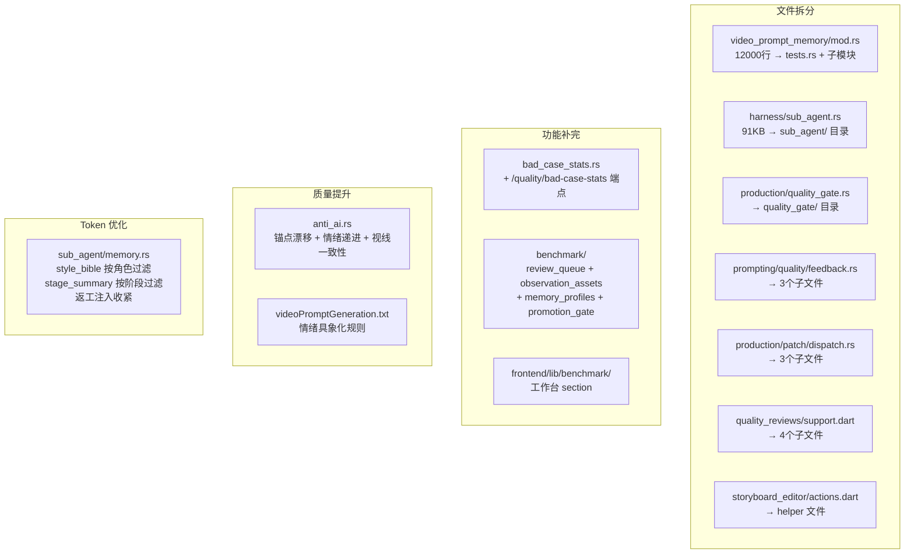

# 设计文档：platform-refactor-quality-boost

## 概述

本 spec 是在前三轮优化（ai-drama-quality-optimization、drama-platform-completion、drama-quality-benchmark-ops）完成后的第四轮推进，聚焦于：代码可维护性（文件拆分）、功能闭环（补完未完成模块）、生成质量（反 AI 痕迹 + 情绪真实感）、成本控制（token 注入收紧）。

## 架构

## 关键设计决策

### 文件拆分策略

**video_prompt_memory/mod.rs**：内部函数耦合度极高，无法按职责完全解耦。采用渐进式拆分：
1. 先提取测试块到 `tests.rs`（-5000行，已完成）
2. 再提取独立性强的子模块（selected/style/budget/anchor）
3. mod.rs 最终作为 barrel + 共享常量/类型

**sub_agent.rs**：按子域分层，各子域之间通过 `use super::` 共享常量和工具函数。

**quality_gate.rs**：`anti_ai.rs` 是独立的检测逻辑，可完全解耦；`rules.rs` 和 `enforce.rs` 共享类型。

### Benchmark 模块设计

四个缺失模块（review_queue/observation_assets/memory_profiles/promotion_gate）复用现有 `app_benchmark_case`、`app_experiment_run`、`app_experiment_result` 表，不新增数据库表（已在 `20260502120000_drama_quality_benchmark_ops.sql` 中定义）。

### 反 AI 痕迹检测

接入已有的 `StyleBibleCharacterAnchor` 结构（`settings/agent_memory/style_bible.rs`），对比当前分镜描述与锚点的 Jaccard 相似度。严重命中时调用 `production/patch/dispatch.rs` 的返工入口。

### Token 优化

在 `sub_agent/memory.rs` 中实现角色名过滤逻辑：从当前分镜的 `video_desc` 字段提取涉及角色名（使用已有的 `selected_memory_subject_aliases` 函数），然后只加载匹配角色的 `style_bible` 段落。

## 测试策略

- **拆分类 Task**：只跑 `cargo check`，不跑测试
- **新功能 Task**：只跑对应单个测试文件/函数
- **属性测试**：只跑新增的那一个属性测试
- **全量测试**：留到 Task 16 统一执行一次
