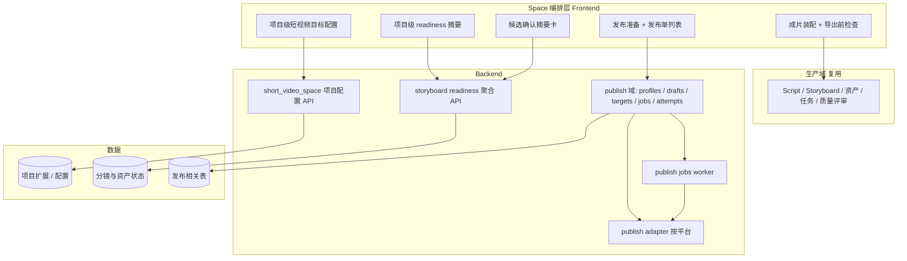

# 设计文档：short-video-space

## 概述

本 spec 将 `space/short-video` 中的产品结论与实施波浪落为可执行设计：在复用 Toonflow 现有生产域的前提下，增加项目级短视频配置、分镜 readiness 与候选确认、成片装配与导出校验、独立发布域与多平台适配，并明确与开源参考项目的边界。

## 架构

## 关键设计决策

### 发布与生成解耦

自动发布、半自动发布、手动导出并存；`publish` 作业挂在 export 完成之后，**不**塞进单次视频生成任务。状态机覆盖校验、上传、平台侧处理、部分失败与重试，便于审计与回跳。

### 配置项目级收口

短视频目标（画幅、市场、平台、时长策略、声线、字幕、BGM、模式等）写入项目级元数据，脚本、分镜、导出、发布统一读取，避免「单次任务参数」与 Space 展示不一致（对齐 MoneyPrinterTurbo 的集中参数价值，但数据模型贴合 Toonflow）。

### Readiness 与候选确认先行

在批量生成与导出前，用可计算的 readiness 与 `pending | linked | ignored` 候选状态替代纯主观判断；聚合接口供 Space 与分镜工作区共用，减少重复逻辑（对齐 Jellyfish 服务层拆分思路，表结构优先沿用现有能力）。

### 成片装配优先于 NLE

先统一读取已选镜头媒体、旁白、字幕、BGM 完成 rough cut 与导出前检查；重型时间线编辑不在本 spec P0/P1 范围。

### 平台适配层

后端按平台的 adapter 负责字段映射、长度与比例时长约束、封面与标签规则、时间格式及错误码归一化；Agent 负责多平台文案差异化建议，adapter 做硬约束校验，避免「只生成文案不校验」导致上传失败。

### 数据演进

Wave 1 配置优先项目扩展字段；发布域（Wave 4+）引入独立表 `publish_*`；分镜与候选若现有模型不足再增量迁移，避免过早拆表阻塞竖切。

## 与现有仓库模块的对应关系

| 能力 | 建议落点（随实现可微调） |
|------|-------------------------|
| 项目短视频配置 | `short_video_space` API + 项目存储扩展 |
| Readiness 聚合 | storyboard 相关 read 层 + 新聚合端点 |
| 成片装配 | production / export 相关域扩展 |
| 发布 | 新 `publish` 路由模块 + worker + OpenAPI 契约 |

## 测试策略

- **配置与只读聚合**：契约测试或最小 API smoke（读写配置、聚合空/部分就绪数据）。
- **发布域**：任务状态迁移单测 + 适配器 mock（不上传真实平台）的集成测试。
- **前端**：关键 Space 面板 widget 测试与导航回跳 smoke。
- **全量**：变更 `backend/` 或 `frontend/` 时按仓库约定执行 `scripts/refactor-check.sh`。

## 安全与合规

- 平台 OAuth/密钥与 refresh token 存存储层，不入日志；发布失败原因对用户可行动、对内部可审计。
- 半自动路径需明确「用户确认」边界，避免误触全平台投递。
