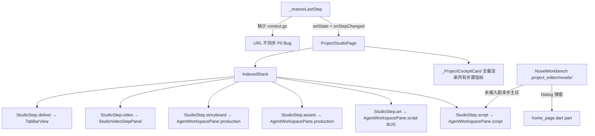
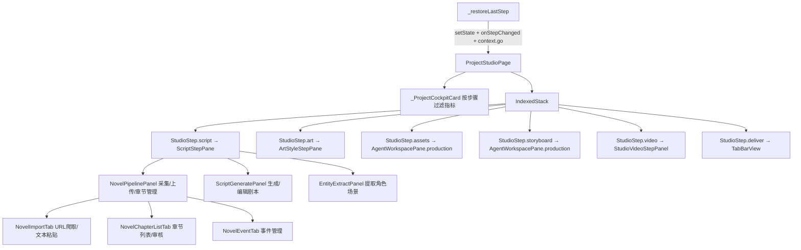
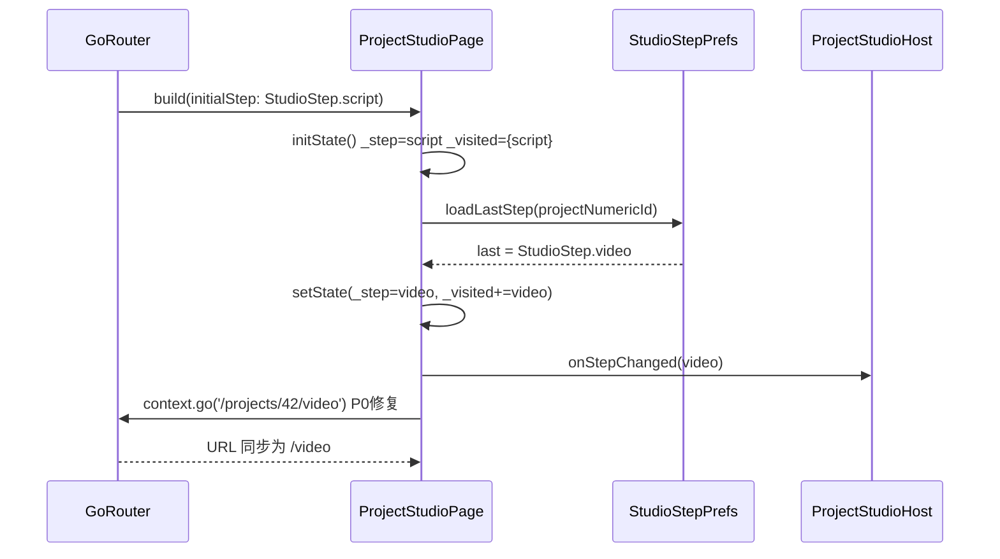
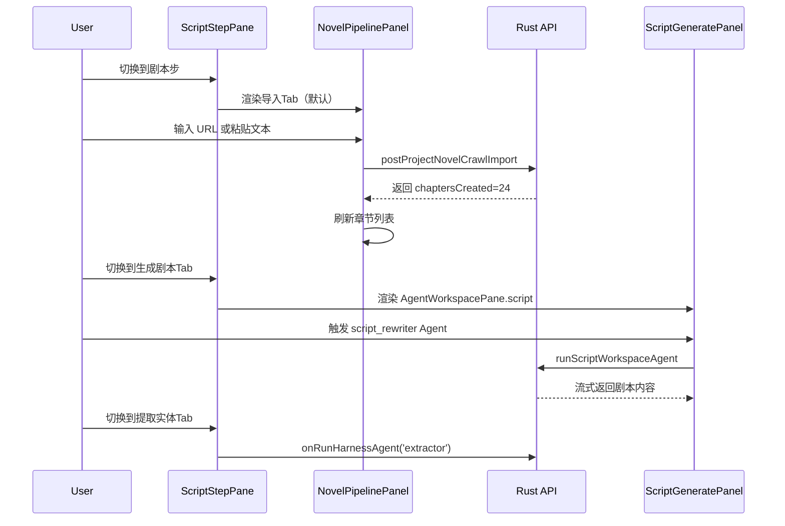

# 设计文档：工作室「剧本步」重设计（studio-script-step-redesign）

## 概述

本功能将项目工作室（Project Studio）的「剧本」步（`StudioStep.script`）从当前的「驾驶舱全链路指标 + Agent 编排」模式，重构为以「小说采集/上传 → 章节/事件管理 → 生成/编辑剧本 → 提取角色场景」为核心的完整产线主区。同时修复 `_restoreLastStep` 的 P0 路由同步 Bug，解决驾驶舱（`_ProjectCockpitCard`）在剧本步渲染中后期无关内容的归属混乱问题，并将美术步（`StudioStep.art`）的主区从 `AgentWorkspacePane.script` 改为画风/风格包 UI。

本次重设计遵循「竖切可维护」原则：不改变现有 API 契约，不引入新的后端接口，仅在 Flutter 前端层面重新组织 UI 分发逻辑和组件归属。所有改动集中在 `frontend/lib/project_studio/` 和 `frontend/lib/shell/build_sections_product.dart` 两个区域，并将小说工作台从 `home_page.dart` 的 `part` 扩展中解耦为独立的 `ScriptStepPane` Widget。

## 实现状态（2026-05，与代码对齐）

原设计中的 **`ScriptStepPane` 三 Tab**（`NovelPipelinePanel` / `ScriptGeneratePanel` / `EntityExtractPanel`）**未按 Tab 拆分落地**。当前实现为：

| 设计项 | 实际组件 / 行为 |
|--------|-----------------|
| 剧本步主区 | [`ProjectStudioScriptStepPanel`](../../../frontend/lib/project_studio/script_step_panel.dart)：宽屏左轨为 **小说 / 剧本 / 提取** 三 Tab；窄屏仍为「内容 + Agent」双 Tab |
| 小说采集 | [`StudioScriptNovelInlineImport`](../../../frontend/lib/project_studio/novel_inline_import_section.dart) 内嵌于内容轨；完整能力在 **Advanced workbench** 对话框（`openNovelWorkbenchDialog`） |
| 爬取鉴权 | [`StudioNovelCrawlAuthSection`](../../../frontend/lib/project_studio/novel_crawl_auth_section.dart) |
| 美术步 | [`ProjectStudioArtStepPanel`](../../../frontend/lib/project_studio/art_step_panel.dart)：内联编辑画风/故事风格包 + 遗留 `artStyle` 文本，`PATCH …/style-config` 与 `PATCH …/projects/{id}` 保存；目录来自 `visual-manual` / `query-director-manual`；后端 [`style_pack_paths`](../../../backend/src/projects/style_pack_paths.rs) 校验路径 |
| 交付 / 质检 | `StudioStep.deliver` 内 **组装 / 发布 / 质检** 三 Tab，嵌入 `ShortVideoSpaceEmbedScope`；`StudioStep.quality` 为 **交付质检 Tab 的 URL 别名**（`/projects/:id/quality`），不在六步 SOP 条中 |
| 路由同步 | `_restoreLastStep` / `_selectStep` 已 `context.go` 同步 `stepSlug` |

**后续若要做三 Tab**：可在 `ProjectStudioScriptStepPanel` 内容轨内将「小说 / 剧本 / 提取」拆为子 Tab，无需重命名路由；本 spec 保留三 Tab 设计作为可选演进，不以之为阻塞项。

---

## 架构

### 当前架构（问题所在）



### 目标架构（重设计后）



---

## 组件与接口

### 组件 1：ScriptStepPane

**用途**：剧本步主区根组件，替换原来的 `_buildAgentWorkspacePane(initialPane: AgentWorkspacePane.script)`。

**位置**：`frontend/lib/project_studio/script_step_pane.dart`（新建）

**接口**：
```dart
class ScriptStepPane extends StatefulWidget {
  const ScriptStepPane({
    super.key,
    required this.projectNumericId,
    required this.projectUuid,
    required this.accessToken,
    required this.onRunHarnessAgent,
    required this.agentPaneBuilder,
  });

  final int projectNumericId;
  final String projectUuid;
  final String accessToken;
  final Future<void> Function(String agentKind) onRunHarnessAgent;
  // 注入 AgentWorkspacePane 构建器，避免 ScriptStepPane 直接依赖 home_page.dart
  final Widget Function() agentPaneBuilder;
}
```

**职责**：
- 持有 `_ScriptStepTab` 枚举状态（`novels` / `generate` / `entities`）
- 通过 `IndexedStack` 懒加载各子面板
- 向 `NovelPipelinePanel` 传递 `projectUuid`、`accessToken`
- 通过 `agentPaneBuilder` 回调注入 Agent 工作区（解耦 home_page.dart 依赖）

---

### 组件 2：NovelPipelinePanel

**用途**：小说采集/上传/章节管理面板，将现有 `openNovelWorkbenchDialog` 的功能从弹窗迁移到主区内联展示。

**位置**：`frontend/lib/project_studio/novel_pipeline_panel.dart`（新建）

**接口**：
```dart
class NovelPipelinePanel extends StatefulWidget {
  const NovelPipelinePanel({
    super.key,
    required this.projectUuid,
    required this.accessToken,
    this.onChaptersChanged,
  });

  final String projectUuid;
  final String accessToken;
  final VoidCallback? onChaptersChanged;
}
```

**职责**：
- 渲染三个子 Tab：「导入」「章节列表」「事件」
- 复用 `project_editor/novels/sections/` 中已有的 section widget 逻辑
- 管理本地 `List<NovelRow>` 状态，支持刷新
- 通过 `fetchProjectNovelsByProjectId` 加载章节列表

---

### 组件 3：ArtStyleStepPane

**用途**：美术步主区，替换原来错误挂载的 `AgentWorkspacePane.script`。

**位置**：`frontend/lib/project_studio/art_style_step_pane.dart`（新建）

**接口**：
```dart
class ArtStyleStepPane extends StatelessWidget {
  const ArtStyleStepPane({
    super.key,
    required this.projectNumericId,
    required this.projectUuid,
    required this.accessToken,
    required this.onRunHarnessAgent,
    this.artStylePack,
    this.storyStylePack,
  });

  final int projectNumericId;
  final String projectUuid;
  final String accessToken;
  final Future<void> Function(String agentKind) onRunHarnessAgent;
  final String? artStylePack;
  final String? storyStylePack;
}
```

**职责**：
- 展示项目当前画风包（`artStylePack`、`storyStylePack`）
- 提供「选择画风包」入口（链接到 Asset Hub 或项目设置）
- 无画风包时显示空状态提示

---

### 组件 4：_ProjectCockpitCard（修改）

**用途**：驾驶舱卡片，扩展过滤逻辑，在美术步和资产步也按内容归属过滤指标。

**修改位置**：`frontend/lib/project_studio/project_studio_page.dart`

**现有问题**：`_filterMetricsForStep` 对非 `script` 步骤直接 `return metrics`（全量），导致美术步、资产步也显示「交付检查路线」「样片路线」等中后期指标。

---

## 数据模型

### _ScriptStepTab（新增枚举）

```dart
enum _ScriptStepTab {
  novels,    // 小说采集/章节管理
  generate,  // 生成/编辑剧本（Agent 工作区）
  entities,  // 提取角色场景
}
```

### NovelPipelinePanel 内部状态

```dart
enum _NovelPipelineTab { import, chapters, events }

// 内部 State 持有：
// List<NovelRow> _chapters
// List<NovelEventRow> _events
// bool _loading
// String? _errorMessage
// _NovelPipelineTab _activeTab
```

### StudioReadinessSnapshot（不变）

现有模型已足够，无需新增字段。剧本步所需的小说数据通过 `NovelPipelinePanel` 自行加载，不走快照。

---

## 主算法/工作流

### 序列图：剧本步初始化与路由同步（P0 修复）



### 序列图：小说导入到生成剧本完整产线



---

## 关键函数与形式规格

### 函数 1：_restoreLastStep（修复 P0）

```dart
Future<void> _restoreLastStep() async {
  final last = await StudioStepPrefs.loadLastStep(
    widget.host.projectNumericId,
  );
  if (!mounted || last == _step) return;
  setState(() {
    _step = last;
    _visited.add(last);
  });
  widget.host.onStepChanged(last);
  _syncRouteToStep(last); // 补上这一行，_syncRouteToStep 已存在于第 68-73 行
}
```

**前置条件**：
- `widget.host.projectNumericId` 为有效正整数
- `mounted == true`（异步返回后检查）

**后置条件**：
- `_step == last`（SharedPreferences 中存储的步骤）
- URL 路径 == `/projects/{id}/{last.slug}`
- `_visited.contains(last) == true`

**根因**：原代码第 56-66 行调用了 `widget.host.onStepChanged(last)` 但遗漏了 `_syncRouteToStep(last)`，而 `_syncRouteToStep` 方法已在同文件第 68-73 行定义。

---

### 函数 2：_buildProjectStudioStepBody（修改）

```dart
Widget _buildProjectStudioStepBody(
  BuildContext context,
  AppLocalizations l10n,
  StudioStep step,
  int projectNumericId,
) {
  switch (step) {
    case StudioStep.script:
      return ScriptStepPane(
        projectNumericId: projectNumericId,
        projectUuid: effectiveProjectUuid,
        accessToken: token,
        onRunHarnessAgent: _runStudioAgent,
        agentPaneBuilder: () => _buildAgentWorkspacePane(
          initialPane: AgentWorkspacePane.script,
          sectionTitle: l10n.productAgentScriptWorkspaceTitle,
          sectionDescription: l10n.productAgentScriptWorkspaceSubtitle,
        ),
      );
    case StudioStep.art:
      return ArtStyleStepPane(
        projectNumericId: projectNumericId,
        projectUuid: effectiveProjectUuid,
        accessToken: token,
        onRunHarnessAgent: _runStudioAgent,
      );
    case StudioStep.assets:
    case StudioStep.storyboard:
      return _buildAgentWorkspacePane(
        initialPane: AgentWorkspacePane.production,
        sectionTitle: l10n.productAgentProductionWorkspaceTitle,
        sectionDescription: l10n.productAgentProductionWorkspaceSubtitle,
      );
    // video, deliver, quality 不变
  }
}
```

**前置条件**：`step` 为有效枚举值，`effectiveProjectUuid` 非空

**后置条件**：
- `StudioStep.script` → 返回 `ScriptStepPane`（包含小说产线）
- `StudioStep.art` → 返回 `ArtStyleStepPane`（不再是 script Agent）

---

### 函数 3：_filterMetricsForStep（扩展）

```dart
List<ProjectHomeMetric> _filterMetricsForStep(
  List<ProjectHomeMetric> metrics,
  StudioStep step,
) {
  switch (step) {
    case StudioStep.script:
      final filtered = metrics.where(_isScriptMetric).toList();
      return filtered.isNotEmpty ? filtered : metrics;
    case StudioStep.art:
      final filtered = metrics.where(_isArtMetric).toList();
      return filtered.isNotEmpty ? filtered : metrics;
    case StudioStep.assets:
      final filtered = metrics.where(_isAssetsOrCharacterMetric).toList();
      return filtered.isNotEmpty ? filtered : metrics;
    case StudioStep.storyboard:
    case StudioStep.video:
    case StudioStep.deliver:
    case StudioStep.quality:
      return metrics; // 中后期步骤显示全量
  }
}

bool _isArtMetric(ProjectHomeMetric metric) {
  const artKeywords = {'art', 'style', 'visual', 'pack', 'image', '画风', '风格'};
  final text = '${metric.key} ${metric.label} ${metric.detail}'.toLowerCase();
  return artKeywords.any(text.contains);
}

bool _isAssetsOrCharacterMetric(ProjectHomeMetric metric) {
  const assetKeywords = {'asset', 'character', 'role', 'voice', 'anchor', '角色', '资产'};
  final text = '${metric.key} ${metric.label} ${metric.detail}'.toLowerCase();
  return assetKeywords.any(text.contains);
}
```

**前置条件**：`metrics` 为有效列表（可为空），`step` 为有效枚举值

**后置条件**：
- 返回列表是原始 `metrics` 的子集
- 若过滤结果为空，回退到原始 `metrics`（防止驾驶舱空白）
- 剧本步不返回含「交付检查路线」「样片路线」「坏例/分镜指标」的 metric

**循环不变量**：`where` 遍历中，已处理的 metric 均已按关键词判断归属

---

### 函数 4：ScriptStepPane.build（新增）

```dart
@override
Widget build(BuildContext context) {
  final l10n = AppLocalizations.of(context)!;
  return Column(
    crossAxisAlignment: CrossAxisAlignment.stretch,
    children: [
      _ScriptStepTabBar(
        current: _activeTab,
        tabs: [
          (tab: _ScriptStepTab.novels, label: l10n.scriptStepTabNovels),
          (tab: _ScriptStepTab.generate, label: l10n.scriptStepTabGenerate),
          (tab: _ScriptStepTab.entities, label: l10n.scriptStepTabEntities),
        ],
        onSelect: (tab) => setState(() => _activeTab = tab),
      ),
      Expanded(
        child: IndexedStack(
          index: _ScriptStepTab.values.indexOf(_activeTab),
          children: [
            NovelPipelinePanel(
              projectUuid: widget.projectUuid,
              accessToken: widget.accessToken,
            ),
            widget.agentPaneBuilder(),
            _EntityExtractHint(onRunAgent: () =>
                widget.onRunHarnessAgent('extractor')),
          ],
        ),
      ),
    ],
  );
}
```

**前置条件**：`widget.projectUuid` 非空，`widget.agentPaneBuilder` 非 null

**后置条件**：
- 返回包含三个 Tab 的 Column Widget
- `IndexedStack` 保证非活跃 Tab 保留状态（不重建）

---

## 示例用法

### 示例 1：剧本步路由恢复（P0 修复后）

```dart
// 用户上次停在「成片」步，关闭后重新打开项目
// 修复前：URL = /script，主区显示成片内容
// 修复后：
await _restoreLastStep();
// _step = StudioStep.video
// URL = /projects/42/video
// IndexedStack 显示 StudioVideoStepPanel
```

### 示例 2：小说 URL 爬取到章节入库

```dart
// 用户在 NovelPipelinePanel 的「导入」Tab 输入 URL
final result = await postProjectNovelCrawlImport(
  accessToken,
  projectUuid,
  'https://example.com/novel/chapter-list',
  intakeStatus: 'admitted',
);
// result.chaptersCreated = 24
// 章节列表 Tab 自动刷新，显示 24 章
```

### 示例 3：驾驶舱指标过滤（剧本步）

```dart
// 后端返回的 metrics 包含：
// [novel_count, script_count, storyboard_count, delivery_check, sample_route]
// 剧本步过滤后只显示：
// [novel_count, script_count]  含 script/novel 关键词
// 「交付检查路线」「样片路线」不再出现在剧本步
```

### 示例 4：美术步正确挂载

```dart
// 修复前：StudioStep.art → AgentWorkspacePane.script（剧本 Agent）
// 修复后：StudioStep.art → ArtStyleStepPane（画风包 UI）
case StudioStep.art:
  return ArtStyleStepPane(
    projectNumericId: projectNumericId,
    projectUuid: effectiveProjectUuid,
    accessToken: token,
    onRunHarnessAgent: _runStudioAgent,
  );
```

---

## 正确性属性

- **路由一致性**：对任意 `StudioStep s`，`_restoreLastStep` 完成后，`GoRouterState.of(context).uri.path` 必须等于 `/projects/{id}/{s.slug}`。
- **内容归属**：对任意 `step ∈ {script, art, assets}`，`_filterMetricsForStep(metrics, step)` 返回的列表不包含 `targetStep ∈ {storyboard, video, deliver, quality}` 的 metric（除非过滤结果为空时的回退）。
- **产线完整性**：`ScriptStepPane` 的三个 Tab 均可独立渲染，不依赖彼此的加载状态。
- **状态保留**：`IndexedStack` 保证切换 Tab 时 `NovelPipelinePanel` 的已加载章节列表不丢失。
- **美术步隔离**：`StudioStep.art` 的 `buildStepBody` 返回值类型为 `ArtStyleStepPane`，不再是 `AgentWorkspacesSection`。

---

## 错误处理

### 场景 1：_restoreLastStep 异步返回时 Widget 已卸载

**条件**：用户快速切换项目，`mounted == false`
**响应**：`if (!mounted || last == _step) return;` 提前返回，不调用 `setState` 或 `context.go`
**恢复**：无需恢复，Widget 已销毁

### 场景 2：NovelPipelinePanel 加载章节失败

**条件**：网络错误或 API 返回 4xx/5xx
**响应**：显示 `StudioApiErrorCallout`，提供「重试」按钮
**恢复**：用户点击重试，重新调用 `fetchProjectNovelsByProjectId`

### 场景 3：_filterMetricsForStep 过滤结果为空

**条件**：后端返回的 metrics 全部不含剧本关键词（如全新项目）
**响应**：回退到 `return metrics`（全量显示），防止驾驶舱空白
**恢复**：自动回退，无需用户操作

### 场景 4：ArtStyleStepPane 项目无画风包

**条件**：`artStylePack == null && storyStylePack == null`
**响应**：显示空状态提示「尚未设置画风包」，提供「前往设置」按钮
**恢复**：跳转到项目设置或 Asset Hub

---

## 测试策略

### 单元测试

- `_filterMetricsForStep`：对每个 `StudioStep` 枚举值，验证过滤结果的关键词归属
- `_isArtMetric` / `_isAssetsOrCharacterMetric`：边界关键词测试
- `StudioStep.fromSlug`：空字符串、未知 slug 的回退行为

### 属性测试（Property-Based Testing）

**测试库**：`package:test`（Flutter 标准）

- **属性**：对任意 `metrics` 列表和 `step ∈ {script, art, assets}`，`_filterMetricsForStep` 的返回值是原列表的子集（`∀ m ∈ result: m ∈ metrics`）
- **属性**：若 `metrics` 非空，`_filterMetricsForStep` 的返回值非空（回退保证）

### 集成测试

- `_restoreLastStep` 修复验证：mock `StudioStepPrefs.loadLastStep` 返回 `StudioStep.video`，验证 `GoRouter` 路径变为 `/projects/42/video`
- `ScriptStepPane` Tab 切换：验证 `IndexedStack` 索引与 `_activeTab` 一致
- `_buildProjectStudioStepBody(StudioStep.art)` 返回 `ArtStyleStepPane` 类型

---

## 性能考量

- `NovelPipelinePanel` 使用懒加载：仅在用户首次切换到「剧本」步时触发 `fetchProjectNovelsByProjectId`，不在 `StudioReadinessSnapshot` 加载时预取
- `IndexedStack` 保留已加载 Tab 的状态，避免重复 API 调用
- `_filterMetricsForStep` 为纯函数，无副作用，可在 `build` 中直接调用（metrics 列表通常 < 20 条）
- `ArtStyleStepPane` 为轻量 StatelessWidget，不发起额外 API 请求（画风包信息来自 `ProjectRow`，已在 `ProjectStudioHost` 中持有）

---

## 安全考量

- `accessToken` 通过 `ProjectStudioHost` 向下传递，不存储在 SharedPreferences
- `NovelPipelinePanel` 的爬取 URL 在客户端侧爬取时，使用固定 `User-Agent: OpenFlow/1.0 content-intake crawler`，不携带用户凭证
- 服务端爬取（`postProjectNovelCrawlImport`）通过 Bearer Token 鉴权，与现有 API 契约一致

---

## 依赖

- `package:go_router`：路由同步（`context.go`）
- `package:shared_preferences`：步骤持久化（`StudioStepPrefs`）
- `frontend/lib/project_editor/novels/`：复用现有小说工作台逻辑（actions、sections）
- `frontend/lib/rust_api.dart`：`fetchProjectNovelsByProjectId`、`postProjectNovelCrawlImport`、`createProjectNovelUnderProject`、`fetchNovelWorkbenchFullRows`
- `frontend/lib/design_system/`：`StudioTokens`、`StudioApiErrorCallout`、`StudioEmptyState`

---

## 变更范围汇总

| 文件 | 变更类型 | 说明 |
|------|----------|------|
| `project_studio/project_studio_page.dart` | 修改 | `_restoreLastStep` 补调 `_syncRouteToStep`；`_filterMetricsForStep` 扩展美术/资产步过滤 |
| `shell/build_sections_product.dart` | 修改 | `_buildProjectStudioStepBody` 中 `script` 步改用 `ScriptStepPane`，`art` 步改用 `ArtStyleStepPane` |
| `project_studio/script_step_pane.dart` | 新建 | `ScriptStepPane` + `_ScriptStepTabBar` |
| `project_studio/novel_pipeline_panel.dart` | 新建 | `NovelPipelinePanel`（内联小说产线，复用 novels/ 逻辑） |
| `project_studio/art_style_step_pane.dart` | 新建 | `ArtStyleStepPane`（画风包 UI） |
| `l10n/app_localizations_zh.dart` | 修改 | 新增剧本步 Tab 文案 |
| `l10n/app_localizations_en.dart` | 修改 | 新增剧本步 Tab 文案（英文） |
