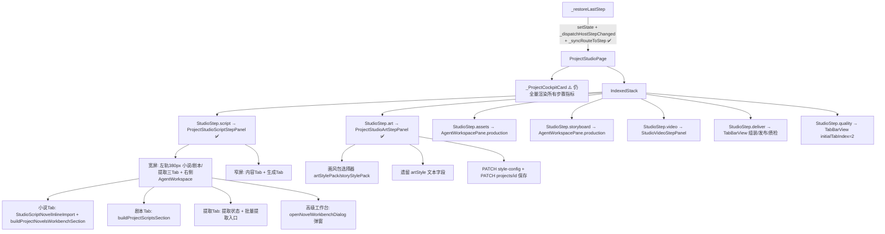
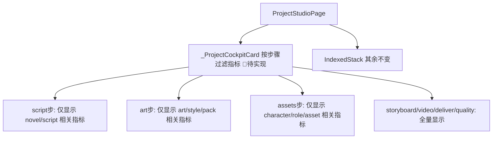
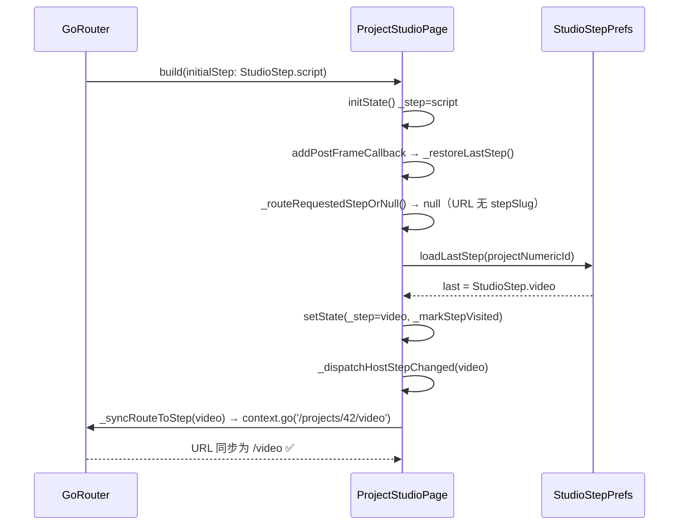
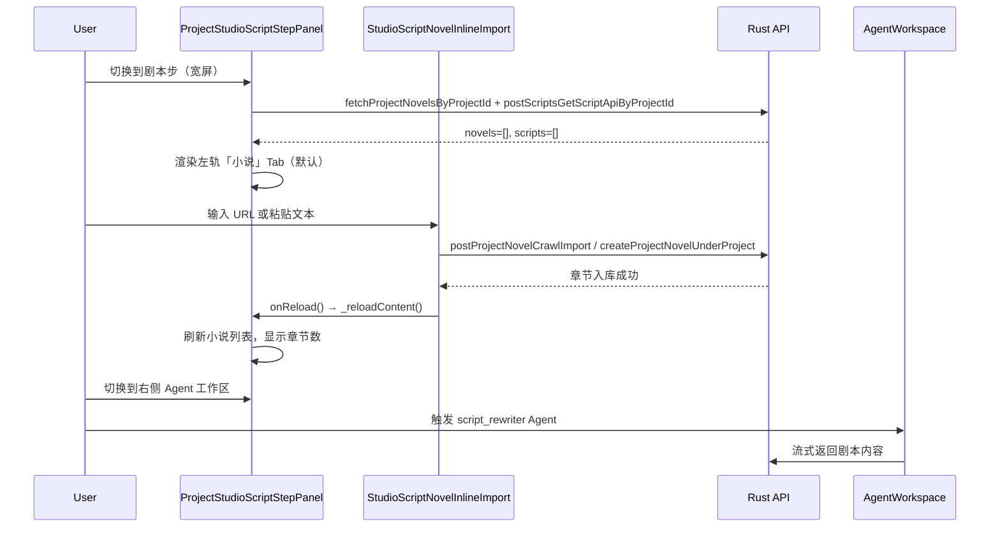
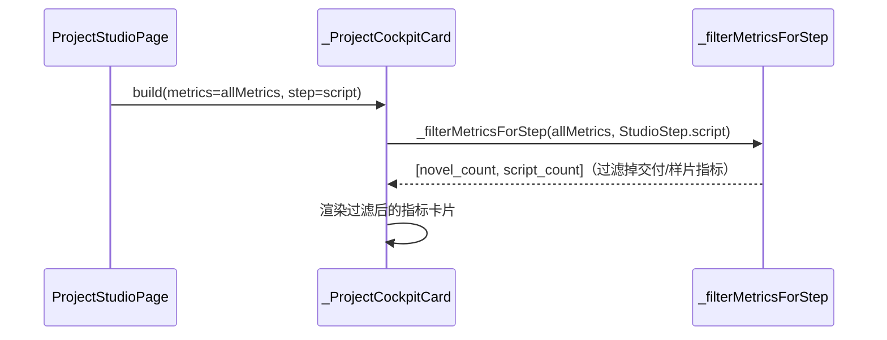

# 设计文档：工作室「剧本步」重设计（studio-script-step-redesign）

> **文档版本**：v2，2026-05-20，与最新代码对齐

## 概述

本功能将项目工作室（Project Studio）的「剧本」步（`StudioStep.script`）重构为以「小说采集/上传 → 章节/事件管理 → 生成/编辑剧本 → 提取角色场景」为核心的完整产线主区。同时解决驾驶舱（`_ProjectCockpitCard`）在剧本步渲染中后期无关内容的归属混乱问题。

本次重设计遵循「竖切可维护」原则：不改变现有 API 契约，不引入新的后端接口，仅在 Flutter 前端层面重新组织 UI 分发逻辑和组件归属。

## 当前实现状态（2026-05，与代码对齐）

以下是代码库中**已落地**的实现，与原始设计的对照：

| 原设计项 | 实际落地状态 | 实际组件 / 文件 |
|----------|-------------|-----------------|
| `ScriptStepPane`（新建） | ✅ **已落地**，名称不同 | `ProjectStudioScriptStepPanel`（`script_step_panel.dart`） |
| 小说 / 剧本 / 提取 三 Tab | ✅ **已落地**（宽屏左轨） | `DefaultTabController(length: 3)` 内含「小说」「剧本」「提取」Tab |
| 窄屏双 Tab | ✅ **已落地** | 「内容」+「生成」双 Tab，`constraints.maxWidth >= 1080` 分支 |
| `NovelPipelinePanel`（新建） | ✅ **已落地**，拆为两个组件 | `StudioScriptNovelInlineImport`（内联导入）+ `openNovelWorkbenchDialog`（高级工作台弹窗） |
| 爬取鉴权 | ✅ **已落地** | `StudioNovelCrawlAuthSection`（`novel_crawl_auth_section.dart`） |
| `ArtStyleStepPane`（新建） | ✅ **已落地**，名称不同 | `ProjectStudioArtStepPanel`（`art_step_panel.dart`）：内联编辑画风/故事风格包 |
| 美术步挂错 `AgentWorkspacePane.script` | ✅ **已修复** | `StudioStep.art` → `ProjectStudioArtStepPanel` |
| `_restoreLastStep` P0 路由同步 | ✅ **已修复** | `_restoreLastStep` 调用 `_syncRouteToStep`；`_selectStep` 调用 `context.go` |
| `quality` 步 URL 别名 | ✅ **已落地** | `/projects/:id/quality` → `_buildProjectStudioDeliverStepBody(initialTabIndex: 2)` |
| `_filterMetricsForStep` 驾驶舱过滤 | ✅ **已落地** | `_CockpitStepFilter._filterMetrics`：`script` 步现在走通用 `_isRelevantForStep` 过滤，不再全量返回 |

**所有项均已落地**，本 spec 实现完成。

---

## 架构

### 已落地架构（当前代码实际状态）



### 目标架构（待实现：驾驶舱按步过滤）



---

## 组件与接口

### 组件 1：ProjectStudioScriptStepPanel（已落地）

**位置**：`frontend/lib/project_studio/script_step_panel.dart`

**实际接口**：
```dart
class ProjectStudioScriptStepPanel extends StatefulWidget {
  const ProjectStudioScriptStepPanel({
    super.key,
    required this.accessToken,
    required this.project,          // ProjectRow（含 id/numericId/artStylePack 等）
    required this.agentWorkspace,   // 注入的 AgentWorkspace Widget
    required this.onOpenNovelWorkbench,    // 打开高级小说工作台弹窗
    required this.onOpenScriptsWorkbench,  // 打开剧本工作台弹窗
    required this.onOpenPlanWorkbench,     // 打开计划工作台弹窗
    required this.onOpenBatchAddScripts,   // 批量新建剧本
    required this.onOpenScriptEditor,      // 打开剧本编辑器
    this.onScriptSelected,          // 剧本选中回调
    this.onContentChanged,          // 内容变更通知
    this.openNovelWorkbenchOnMount, // 挂载时自动打开小说工作台
  });
}
```

**布局逻辑**：
- `constraints.maxWidth >= 1080`（宽屏）：左轨 380px（小说/剧本/提取三 Tab）+ 右侧 Agent 工作区
- 窄屏：「内容」+「生成」双 Tab

**数据加载**：`_reloadContent()` 并发加载 `fetchProjectNovelsByProjectId` + `postScriptsGetScriptApiByProjectId` + `fetchProjectStatsByProjectId`

---

### 组件 2：ProjectStudioArtStepPanel（已落地）

**位置**：`frontend/lib/project_studio/art_step_panel.dart`

**职责**：
- 内联编辑 `artStylePack`、`storyStylePack`（从 `buildStylePackCatalogFromResponses` 获取目录）
- 遗留 `artStyle` 文本字段
- 保存：`PATCH .../style-config` + `PATCH .../projects/{id}`
- 测试覆盖：`art_step_panel_test`、`studio_step_art_test`、golden `studio_step_art.png`、`project_studio_art_scope_test`

---

### 组件 3：_ProjectCockpitCard 驾驶舱过滤（待实现）

**修改位置**：`frontend/lib/project_studio/project_studio_page.dart`（或 `project_studio_cockpit_panel.dart`）

**问题**：驾驶舱当前对所有步骤全量渲染指标，剧本步顶部会出现「交付检查路线」「样片路线」「坏例/分镜指标」等中后期信息。

**待实现方法**：`_filterMetricsForStep(List<ProjectHomeMetric> metrics, StudioStep step)`

---

## 数据模型

### ProjectStudioScriptStepPanel 内部状态（已落地）

```dart
// State 持有：
final List<ListNovelsResponse?> _novelsRef;   // 小说列表（单元素包装）
final List<bool> _novelsLoading;
final List<bool> _novelsBusy;
final List<ScriptBrief> _scriptList;          // 剧本列表
final List<bool> _saving;
final List<bool> _scriptTaskBusy;
final List<String?> _scriptTaskLine;
final List<ProjectStats?> _statsRef;          // 项目统计

bool _loading;
String? _loadError;
int? _selectedScriptId;
bool _pendingNovelWorkbenchOpen;
```

### StudioStep 路由映射（已落地）

```dart
// _uriForStudioStep 的实际映射：
StudioStep.script    → /projects/{id}/script
StudioStep.art       → /projects/{id}/art
StudioStep.assets    → /projects/{id}/assets
StudioStep.storyboard → /projects/{id}/storyboard
StudioStep.video     → /projects/{id}/video
StudioStep.deliver   → /projects/{id}/deliver
StudioStep.quality   → /projects/{id}/deliver?tab=quality  // URL 别名
```

---

## 主算法/工作流

### 序列图：路由同步（已落地）



### 序列图：小说导入到生成剧本（已落地）



### 序列图：驾驶舱指标过滤（待实现）



---

## 关键函数与形式规格

### 函数 1：_restoreLastStep（已落地，含防重复派发）

```dart
// 实际代码（project_studio_page.dart）
Future<void> _restoreLastStep() async {
  final routeStep = _routeRequestedStepOrNull();
  if (routeStep != null) return; // 路由已指定步骤，不覆盖
  final last = await StudioStepPrefs.loadLastStep(
    widget.host.projectNumericId,
  );
  if (!mounted || last == _step) return;
  setState(() {
    _step = last;
    _markStepVisited(last);
  });
  _dispatchHostStepChanged(last); // 防重复派发（_lastDispatchedHostStep 去重）
  _syncRouteToStep(last);         // context.go 同步 URL ✅
}
```

**前置条件**：`widget.host.projectNumericId` 为有效正整数，`mounted == true`

**后置条件**：
- `_step == last`
- URL 路径 == `/projects/{id}/{last.slug}`（quality 步为 `/deliver?tab=quality`）
- `_visited.contains(last) == true`

---

### 函数 2：_filterMetricsForStep（待实现）

```dart
// 待添加到 project_studio_page.dart 或 project_studio_cockpit_panel.dart
List<ProjectHomeMetric> _filterMetricsForStep(
  List<ProjectHomeMetric> metrics,
  StudioStep step,
) {
  switch (step) {
    case StudioStep.script:
      final filtered = metrics.where(_isScriptMetric).toList();
      return filtered.isNotEmpty ? filtered : metrics;
    case StudioStep.art:
      final filtered = metrics.where(_isArtMetric).toList();
      return filtered.isNotEmpty ? filtered : metrics;
    case StudioStep.assets:
      final filtered = metrics.where(_isAssetsOrCharacterMetric).toList();
      return filtered.isNotEmpty ? filtered : metrics;
    case StudioStep.storyboard:
    case StudioStep.video:
    case StudioStep.deliver:
    case StudioStep.quality:
      return metrics; // 中后期步骤显示全量
  }
}

bool _isScriptMetric(ProjectHomeMetric metric) {
  const keys = {'novel', 'script', '小说', '剧本', 'chapter', '章节'};
  final text = '${metric.key} ${metric.label} ${metric.detail}'.toLowerCase();
  return keys.any(text.contains);
}

bool _isArtMetric(ProjectHomeMetric metric) {
  const keys = {'art', 'style', 'visual', 'pack', 'image', '画风', '风格'};
  final text = '${metric.key} ${metric.label} ${metric.detail}'.toLowerCase();
  return keys.any(text.contains);
}

bool _isAssetsOrCharacterMetric(ProjectHomeMetric metric) {
  const keys = {'asset', 'character', 'role', 'voice', 'anchor', '角色', '资产'};
  final text = '${metric.key} ${metric.label} ${metric.detail}'.toLowerCase();
  return keys.any(text.contains);
}
```

**前置条件**：`metrics` 为有效列表（可为空），`step` 为有效枚举值

**后置条件**：
- 返回列表是原始 `metrics` 的子集
- 若过滤结果为空，回退到原始 `metrics`（防止驾驶舱空白）
- `script` 步不返回含「交付检查路线」「样片路线」「坏例/分镜指标」的 metric

---

### 函数 3：_buildProjectStudioScriptStepBody（已落地）

```dart
// 实际代码（build_sections_product.dart）
Widget _buildProjectStudioScriptStepBody(
  BuildContext context,
  int projectNumericId,
) {
  final token = _effectiveAccessToken;
  final project = _studioProjectRowForNumericId(projectNumericId);
  if (token == null || token.isEmpty || project == null || project.id.isEmpty) {
    return Center(child: Text(l10n.studioScriptStepScopeMissing));
  }
  return ProjectStudioScriptStepPanel(
    accessToken: token,
    project: project,
    openNovelWorkbenchOnMount: _pendingStudioNovelWorkbench,
    agentWorkspace: _buildAgentWorkspacePane(
      initialPane: AgentWorkspacePane.script,
      sectionTitle: l10n.productAgentScriptWorkspaceTitle,
      sectionDescription: l10n.productAgentScriptWorkspaceSubtitle,
    ),
    onOpenNovelWorkbench: (novelsRef, novelsBusy, reload) =>
        _studioScriptOpenNovelWorkbench(project, novelsRef, novelsBusy, reload),
    onOpenScriptsWorkbench: (...) => _studioScriptOpenScriptsWorkbench(...),
    onOpenPlanWorkbench: () => _openProjectScriptPlanWorkbenchDialog(...),
    onOpenBatchAddScripts: () async { ... },
    onOpenScriptEditor: (script) async { ... },
  );
}
```

---

## 示例用法

### 示例 1：路由恢复（已落地）

```dart
// 用户上次停在「视频」步，重新打开项目
// URL 初始为 /projects/42/script（路由未指定 stepSlug）
await _restoreLastStep();
// _routeRequestedStepOrNull() → null
// StudioStepPrefs.loadLastStep → StudioStep.video
// _step = StudioStep.video
// URL = /projects/42/video ✅
```

### 示例 2：小说 URL 爬取到章节入库（已落地）

```dart
// 用户在 StudioScriptNovelInlineImport 输入 URL
// → postProjectNovelCrawlImport(token, projectUuid, url)
// → 成功后 onReload() → _reloadContent()
// → 小说 Tab 刷新，显示新章节数
```

### 示例 3：驾驶舱指标过滤（待实现）

```dart
// 后端返回 metrics = [novel_count, script_count, storyboard_count, delivery_check, sample_route]
// 剧本步调用 _filterMetricsForStep(metrics, StudioStep.script)
// → 过滤后 = [novel_count, script_count]
// 「交付检查路线」「样片路线」不再出现在剧本步顶部 ✅
```

### 示例 4：美术步正确挂载（已落地）

```dart
// build_sections_product.dart switch 分支：
case StudioStep.art:
  return _buildProjectStudioArtStepBody(context, projectNumericId);
// → ProjectStudioArtStepPanel（画风包 UI）✅
// 不再是 AgentWorkspacePane.script
```

---

## 正确性属性

- **路由一致性**（已落地）：对任意 `StudioStep s`，`_restoreLastStep` 完成后，`GoRouterState.of(context).uri` 必须等于 `_uriForStudioStep(s)`（`quality` 步为 `/deliver?tab=quality`）。
- **防重复派发**（已落地）：`_dispatchHostStepChanged` 通过 `_lastDispatchedHostStep` 去重，避免路由重建时重复触发 `onStepChanged`。
- **内容归属**（待实现）：对任意 `step ∈ {script, art, assets}`，`_filterMetricsForStep(metrics, step)` 返回的列表不包含中后期（storyboard/video/deliver/quality）的 metric（除非过滤结果为空时的回退）。
- **产线完整性**（已落地）：`ProjectStudioScriptStepPanel` 的三个内容 Tab（小说/剧本/提取）均可独立渲染，不依赖彼此的加载状态。
- **美术步隔离**（已落地）：`StudioStep.art` 的 `buildStepBody` 返回 `ProjectStudioArtStepPanel`，不再是 `AgentWorkspacesSection`。

---

## 错误处理

### 场景 1：_restoreLastStep 异步返回时 Widget 已卸载

**条件**：用户快速切换项目，`mounted == false`
**响应**：`if (!mounted || last == _step) return;` 提前返回
**状态**：已落地 ✅

### 场景 2：ProjectStudioScriptStepPanel 加载内容失败

**条件**：网络错误或 API 返回 4xx/5xx
**响应**：`_loadError` 非空时渲染 `StudioEmptyState`（icon: `cloud_off_outlined`），提供「重试」按钮（`studioScriptStepRetry`）
**状态**：已落地 ✅

### 场景 3：_filterMetricsForStep 过滤结果为空

**条件**：后端返回的 metrics 全部不含对应步骤关键词（如全新项目）
**响应**：回退到 `return metrics`（全量显示），防止驾驶舱空白
**状态**：待实现，设计已包含回退逻辑

### 场景 4：ProjectStudioArtStepPanel 项目无画风包

**条件**：`project.artStylePack == null && project.storyStylePack == null`
**响应**：显示空状态提示，提供「高级项目设定」入口（`studioArtStepOpenSettings`）
**状态**：已落地 ✅

---

## 测试策略

### 已有测试（勿重复）

- `art_step_panel_test`：`ProjectStudioArtStepPanel` 单元测试
- `studio_step_art_test`：美术步集成测试
- golden `studio_step_art.png`：美术步视觉回归
- `project_studio_art_scope_test`：美术步权限范围测试

### 待补充测试

- `_filterMetricsForStep`：对每个 `StudioStep` 枚举值，验证过滤结果的关键词归属
- `_isScriptMetric` / `_isArtMetric` / `_isAssetsOrCharacterMetric`：边界关键词测试
- **属性测试**：对任意 `metrics` 列表和 `step ∈ {script, art, assets}`，`_filterMetricsForStep` 的返回值是原列表的子集（`∀ m ∈ result: m ∈ metrics`）；若 `metrics` 非空，返回值非空（回退保证）
- `ProjectStudioScriptStepPanel` 宽/窄屏布局切换：验证 `constraints.maxWidth >= 1080` 分支

---

## 性能考量

- `ProjectStudioScriptStepPanel` 使用 `_reloadContent()` 懒加载：仅在用户首次切换到剧本步时触发，不在 `StudioReadinessSnapshot` 加载时预取
- `_filterMetricsForStep` 为纯函数，无副作用，可在 `build` 中直接调用（metrics 列表通常 < 20 条）
- `ProjectStudioArtStepPanel` 画风包目录通过 `visual-manual` / `query-director-manual` 按需加载，不预取

---

## 安全考量

- `accessToken` 通过 `ProjectStudioHost` → `ProjectRow` 向下传递，不存储在 SharedPreferences
- 小说爬取 URL 通过 `postProjectNovelCrawlImport` 服务端爬取，Bearer Token 鉴权，与现有 API 契约一致
- `StudioNovelCrawlAuthSection` 处理爬取鉴权，不在客户端存储第三方凭证

---

## 依赖

- `package:go_router`：路由同步（`context.go`、`GoRouterState`）
- `package:shared_preferences`：步骤持久化（`StudioStepPrefs`）
- `frontend/lib/project_editor/novels/`：`workbench_section_builder.dart`（`buildProjectNovelsWorkbenchSection`）、`sections/`（各 section widget）
- `frontend/lib/project_editor/scripts/section_builder.dart`：`buildProjectScriptsSection`
- `frontend/lib/rust_api.dart`：`fetchProjectNovelsByProjectId`、`postProjectNovelCrawlImport`、`postScriptsGetScriptApiByProjectId`、`fetchProjectStatsByProjectId`
- `frontend/lib/design_system/`：`StudioTokens`、`StudioEmptyState`

---

## 变更范围汇总

| 文件 | 变更类型 | 状态 | 说明 |
|------|----------|------|------|
| `project_studio/script_step_panel.dart` | 新建 | ✅ 已落地 | `ProjectStudioScriptStepPanel`（宽屏三 Tab + 窄屏双 Tab） |
| `project_studio/novel_inline_import_section.dart` | 新建 | ✅ 已落地 | `StudioScriptNovelInlineImport`（内联导入） |
| `project_studio/novel_crawl_auth_section.dart` | 新建 | ✅ 已落地 | `StudioNovelCrawlAuthSection`（爬取鉴权） |
| `project_studio/art_step_panel.dart` | 新建 | ✅ 已落地 | `ProjectStudioArtStepPanel`（画风包 UI） |
| `project_studio/project_studio_page.dart` | 修改 | ✅ 已落地 | `_restoreLastStep` 调用 `_syncRouteToStep`；`_dispatchHostStepChanged` 防重复派发 |
| `shell/build_sections_product.dart` | 修改 | ✅ 已落地 | `script` 步 → `ProjectStudioScriptStepPanel`；`art` 步 → `ProjectStudioArtStepPanel` |
| `project_studio/project_studio_cockpit_panel.dart` | 修改 | ✅ 已落地 | `_CockpitStepFilter._filterMetrics` / `_filterActions`：移除 `script` 步的全量返回特例，统一走 `_isRelevantForStep` 过滤 |
| `l10n/app_localizations_zh.dart` | 修改 | ✅ 已落地 | `studioScriptStepTabNovel`、`studioScriptStepTabScripts`、`studioScriptStepTabExtract` 等 key |
