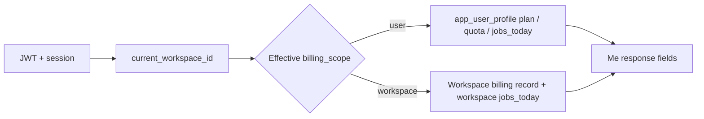

# Design Document: Workspace-scope Billing (W8.2–W8.4)

## Overview

This design moves **subscription and quota attribution** from **`app_user_profile`** to **workspace-level billing records**, while keeping **backward-compatible `/api/v1/me` v1** and introducing **versioned v2** for nested `user` + `current_workspace_billing`. **Personal** and **enterprise** workspaces share the same structural model; product rules differ by `workspace_type` and `billing_scope`.

**Related plans (not duplicated here):**

- Stub: [`docs/plans/workspace-billing-future-workspace-scope.md`](../../../docs/plans/workspace-billing-future-workspace-scope.md)
- Current decision (user-scope): [`docs/plans/workspace-billing-scope-decision.md`](../../../docs/plans/workspace-billing-scope-decision.md)
- Phase W8 index: [`docs/plans/workspace-team-full-plan.md`](../../../docs/plans/workspace-team-full-plan.md)

### Goals

1. **No half-migration**: additive schema first; user columns remain until validated cutover.
2. **Stable metering**: every billable job has a persisted **`workspace_id`** (or auditable equivalent).
3. **Compatible clients**: v1 default; v2 opt-in via query or `Accept`.
4. **Reversible read paths**: disable v2 + fall back to user-scope reads without destructive DB rollback in early phases.

### Non-goals (initial phases)

- Changing unrelated product surfaces unless **`scope`** confusion forces it (tracked as Requirement 6).
- Dropping Stripe customer mapping without finance sign-off.

### Technology stack

- **Backend**: Rust + Axum + SQLx + PostgreSQL
- **Billing provider**: Stripe webhooks (existing patterns extended)
- **Frontend**: Flutter + `rust_api`
- **Migrations**: `supabase/migrations/`

## Architecture

### High-level diagram

```mermaid
flowchart TB
  subgraph Clients["Flutter / API clients"]
    App[Shell / Settings]
    RustApi[rust_api me + quota]
  end

  subgraph Backend["Rust backend"]
    MeH[GET /api/v1/me v1|v2]
    Quota[Metering / quota layer]
    Jobs[Job enqueue + generation_job writes]
    Hook[Billing webhooks]
    Meter[Usage aggregates]
  end

  subgraph DB["PostgreSQL"]
    Prof[(app_user_profile<br/>legacy user billing)]
    Ws[(app_workspace or<br/>app_workspace_billing)]
    Gen[(app_generation_job<br/>+ workspace_id)]
  end

  App --> RustApi --> MeH
  App --> Quota
  Jobs --> Gen
  Hook --> Prof
  Hook --> Ws
  Quota --> Prof
  Quota --> Ws
  Quota --> Gen
  MeH --> Prof
  MeH --> Ws
  Meter --> Gen
```

### Billing scope resolution (conceptual)



The **policy** who sets `billing_scope` (global flag, per workspace type, per tenant) is a **product decision** captured in ADR; the code path must branch on an explicit enum, not implicit heuristics.

## Data model

### Option A — columns on `app_workspace`

| Column (example) | Type | Notes |
|------------------|------|-------|
| `plan_tier` | `TEXT` nullable | Effective tier for workspace when workspace-scope |
| `daily_job_quota` | `BIGINT` nullable | Override; null = plan default |
| `billing_provider` / `billing_customer_id` | optional | As needed for Stripe mapping |

### Option B — `app_workspace_billing`

- `workspace_id` PK/FK
- Same logical fields as Option A + room for history/versioning

**Constraint (from product stub):** do **not** drop `app_user_profile` billing fields until backfill + dual-write validation complete.

### `app_generation_job`

- Add or backfill **`workspace_id`** `UUID NOT NULL` (after backfill) — exact nullability during migration is a migration design detail; prefer nullable → backfill → set NOT NULL in a later migration.

## Key flows

### 1. Job creation

```
Enqueue request
  → resolve workspace_id (project.workspace_id or documented fallback)
  → INSERT app_generation_job (..., workspace_id)
  → quota check uses effective scope (user vs workspace)
```

### 2. Webhook (dual-write period)

```
Stripe event
  → idempotency check (existing)
  → UPDATE app_user_profile (legacy)
  → UPSERT workspace billing row / columns (new)
  → reconciliation metric if mismatch
```

### 3. GET /api/v1/me

**v1 (default):**

- Existing flat fields; optionally add **`billing_scope`** with default `"user"` during transition.

**v2:**

- Parse `?v=2` or negotiated `Accept`
- Load user profile + current workspace + workspace billing
- Emit nested JSON per OpenAPI schema

## Components and interfaces

### Backend modules (suggested layout)

| Module / file | Responsibility |
|---------------|----------------|
| `backend/src/app/handlers/me.rs` | v1/v2 branching, response structs |
| `backend/src/metering/quota.rs` | Effective quota + `jobs_today` by scope |
| Job creation paths | Persist `workspace_id` on `app_generation_job` |
| `backend/src/billing/` (or existing webhook module) | Dual-write, idempotency |
| OpenAPI / utoipa | New schemas: `MeV2Response`, `WorkspaceBillingSummary` |

### API shapes (illustrative — finalize in OpenAPI)

**v2 (illustrative JSON):**

```json
{
  "billing_scope": "workspace",
  "user": {
    "id": "...",
    "email": "...",
    "plan_tier": "pro",
    "jobs_today": 0
  },
  "current_workspace_billing": {
    "workspace_id": "...",
    "workspace_type": "enterprise",
    "plan_tier": "enterprise",
    "daily_job_quota": 1000,
    "jobs_today": 42
  }
}
```

Exact field parity with v1 and deprecation timeline are **contract decisions** documented in OpenAPI.

### Flutter

- Extend `rust_api` models for `/me` v2
- Settings / shell: show workspace quota when `billing_scope == workspace`
- Feature flag or minimum app version coordinated with [`workspace-migration-notice.md`](../../../docs/plans/workspace-migration-notice.md)

## Observability

- Metrics: `billing_webhook_dual_write_mismatch_total`, `quota_denied_total{scope=...}`, `me_v2_requests_total`
- Logs: structured fields `user_id`, `workspace_id`, `billing_scope` on deny paths (no PII beyond existing patterns)

## Security

- **Me v2** `current_workspace_billing`: only if user is member of `current_workspace_id`
- **manage_billing**: workspace role gate for any future “change payment method” APIs tied to workspace
- **Ops views**: internal-only tokens / RBAC

## Risks and mitigations

| Risk | Mitigation |
|------|------------|
| Jobs without `workspace_id` | Backfill + enforce at enqueue; block cutover until coverage threshold |
| Client bricking | v1 default + long deprecation window |
| Stripe mapping errors | Shadow period + reconciliation alerts |
| Semantic drift with usage APIs | Requirement 6 explicit follow-up phase |

## References

- W8.1 decision: [`workspace-billing-scope-decision.md`](../../../docs/plans/workspace-billing-scope-decision.md)
- Future stub sections §2–§4: [`workspace-billing-future-workspace-scope.md`](../../../docs/plans/workspace-billing-future-workspace-scope.md)
