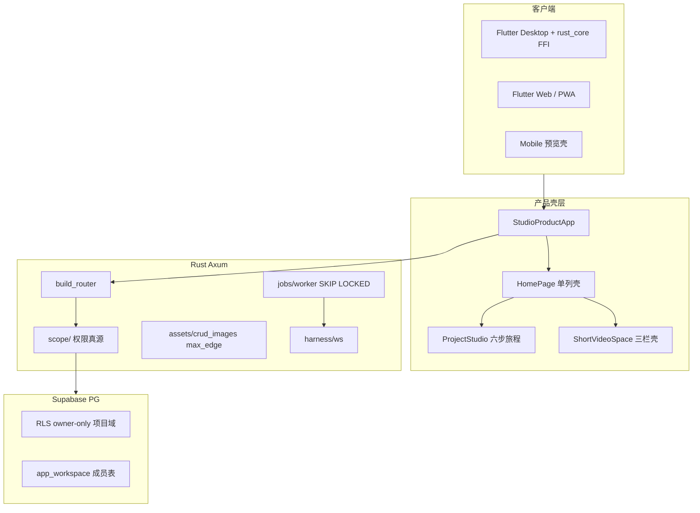
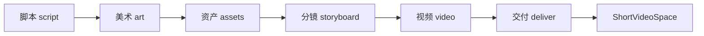
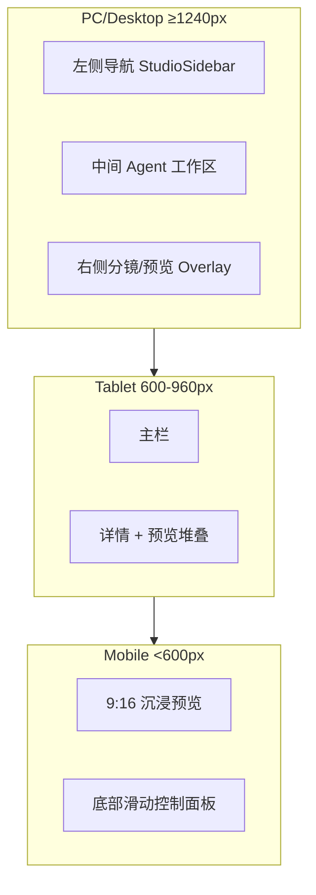

# OpenFlow 全栈重构实施计划书

> **版本**：2026-05-29  
> **基准**：《OpenFlow 全栈重构 24 阶段基准指南》  
> **关联文档**：[`docs/plans/flutter-ui-ux-refactor-18-phases.md`](docs/plans/flutter-ui-ux-refactor-18-phases.md)、[`frontend/lib/design_system/UI_REFACTOR_CONTEXT.md`](frontend/lib/design_system/UI_REFACTOR_CONTEXT.md)、[`docs/roadmaps/master-roadmap.md`](docs/roadmaps/master-roadmap.md)

---

## 一、项目现状评估

### 1.1 架构总览



### 1.2 与 24 阶段指南的冲突矩阵

| 阶段主题 | 指南要求 | 当前现状 | 冲突严重度 |
|---------|---------|---------|-----------|
| **1 设计系统** | 零硬编码色/字，8px 网格 | `design_system/` 成熟；`global_search/`、`quality_reviews/` 仍有局部 `TextStyle` 逃逸；`studio-visual-debt-check.sh` 已门禁 | 低 |
| **2 防误触** | 全量 `StudioDebouncedAction` | `StudioPrimaryButton` 已封装；`project_studio` 部分裸 `TextButton`；非 short_video 模块覆盖不全 | 中 |
| **3 异步三态** | 骨架屏 + Shimmer | `ASYNC_LOADING.md` 规范完备；`short_video_space` 仍有 ~12 处全屏 `CircularProgressIndicator`（导出/发布面板） | 中 |
| **4 Studio Shell** | PC 三栏；Mobile 沉浸预览壳 | **核心红线**：产品壳为单列 `Column`；[`studio_sidebar.dart`](frontend/lib/product_shell/studio_sidebar.dart) **零引用**；仅 `short_video_space` / `storyboard_studio` 实现三栏 | **极高** |
| **5 Hero 动画** | 剧本→分镜→视频全链路 | 项目卡→工作室 Hero 已有；跨 SOP 步骤 Hero **未串联** | 中 |
| **6 Desktop 交互** | Hover/Tab/右键 | `studio_pointer.dart`、焦点导航已大面积落地；分镜卡片 hover 操作按钮不完整 | 低 |
| **7 Mobile 物理** | 状态栏沉浸 + Haptic | `StudioSystemUiSurface` 已有；Haptic 仅主 CTA/通知刷新 | 低 |
| **8-9 主题/A11y** | 深色对比 + Semantics | 大部分 ✅；大字体 `minHeight` 持续治理 | 低 |
| **10 本地渲染锁** | 重度生成时锁 UI 防 OOM | `rust_core/` 存在但 **backend 未依赖**；无全局渲染锁；桌面导出/assembly 无互斥 | **极高** |
| **11 列表性能** | `ListView.builder` + `RepaintBoundary` | 通知/项目网格有 shrinkWrap 豁免；`home_page.dart`(1635行)、`build_product_shell.dart`(2104行) 臃肿 | 中 |
| **12 排印** | tabularFigures 等宽 | `StudioTypography` 已配置；任务 ID/金额未统一等宽 | 低 |
| **13 乐观 UI** | 脚本编辑/收藏 | 通知/任务/API keys 已有；脚本编辑 **无乐观写** | 中 |
| **14 dispose** | 播放器/渲染器注销 | 导出轮询已 cancel；短视频预览播放器审计不完整 | 中 |
| **15 资产隔离** | 禁止 Tiled Image；Block 独立高清图 | 前端 **无 Tiled 用法**；`app_asset_image` 单 `file_path`；无 Block 级索引 | **高** |
| **16 PWA** | 无地址栏沉浸 | manifest + 错误边界已 ✅ | 低 |
| **17 输入反馈** | Agent 提示词 Shake 校验 | Agent 工作区部分内联校验；无统一 Shake 动效 | 中 |
| **18 代码分片** | 单文件 ≤800 行 | **30+ 文件超标**：`home_page.dart`、`build_product_shell.dart`、`notifications/section.dart`(2311)、`short_video_space` 聚合 ~23k 行 | **高** |
| **19 Axum 三层** | Router/Service/Repository 分离 | **垂直切片架构**；SQL 内联 Handler；无 Repository 层（见 [`backend-domain-layer-review.md`](docs/architecture/backend-domain-layer-review.md)） | **高** |
| **20 资产分发索引** | Block 索引 + DPI 条件下载 | 仅 `?max_edge=` 实时缩放（[`file_resize.rs`](backend/src/assets/crud_images/file_resize.rs)）；无 Block 表、无 CDN 预热 | **极高** |
| **21 任务流** | SKIP LOCKED + WS 推送 | `jobs/worker/mod.rs` 已实现；Harness WS 协议成熟；`jobs/queue/pg.rs` 遗留废弃代码 | 低 |
| **22 RLS + 计费防抖** | Workspace 隔离 + 幂等扣点 | RLS 项目域 **owner-only**（[`rls-consistency-matrix.md`](docs/features/workspace/rls-consistency-matrix.md)）；协作仅 Rust API；workspace billing schema 就绪但未激活 | **极高** |
| **23 零拷贝下发** | `ReaderStream` 大文件流式 | 当前读入内存后 `downscale_image_bytes` 全量缓冲；无流式 | **高** |
| **24 全链路 Trace** | 消除 `unwrap()` + `X-Request-Id` | `ApiError` + `X-Request-Id` 成熟；`trace_request` 中间件 **未接入** `build_router`；`unwrap()` 主要在测试 | 中 |

### 1.3 创作旅程多端适配现状

六步 SOP（[`studio_step.dart`](frontend/lib/project_studio/studio_step.dart)）：`script → art → assets → storyboard → video → deliver`



| 步骤 | Desktop | Web | Mobile 预览壳 | 主要缺口 |
|------|---------|-----|--------------|---------|
| script | `script_step_panel` 全功能 | 同左 | 紧凑 journey bar | 无独立 mobile shell |
| art/assets | Agent 工作区 + brief sheet | 同左 | 图标-only 导航 | Agent 面板未针对 handset 优化 |
| storyboard | `storyboard_studio_page` 三栏(≥960) | 同左 | 二栏/堆叠 | 预览区窄屏体验弱 |
| video | `studio_video_step_panel` | 同左 | 滚动单列 | 本地渲染无锁 |
| deliver | 嵌入 `ShortVideoSpaceSection` | 同左 | `ShortVideoMobileShell` ✅ | **唯一有完整 mobile shell 的环节** |

**结论**：创作旅程的响应式能力 **严重不均衡**——`short_video_space` 是参考实现（[`short_video_responsive_shell.dart`](frontend/lib/short_video_space/layout/short_video_responsive_shell.dart)），`project_studio` 与产品壳仍沿用「紧凑堆叠」策略，未满足阶段 4「PC 三栏 + Mobile 沉浸预览」红线。

---

## 二、Studio 壳响应式专项

### 2.1 目标架构



### 2.2 PC 三栏式 Studio Shell 实施路径

**现状**：[`build_product_shell.dart`](frontend/lib/shell/build_product_shell.dart) 为 `Column(titleBar + pipelineStrip + content)`，[`studio_sidebar.dart`](frontend/lib/product_shell/studio_sidebar.dart) 已定义但未接入。

**改造方案**（阶段 4 核心）：

1. **激活 `StudioSidebar`**：在 `width ≥ kStudioThreePaneMinWidth`（复用 [`studio_responsive_layout.dart`](frontend/lib/design_system/studio_responsive_layout.dart) 的 960/1240 断点）时，将 `HomePage` 内容区改为 `Row(sidebar | expanded(center))`。
2. **中间 Agent 工作区**：`project_studio` overlay 与 `agent_workspaces` 占据 center pane；pipeline strip 移入 sidebar 或 top chrome。
3. **右侧 Overlay**：分镜预览 / 视频预览以 `StudioPaneScaffold` 的 trailing pane 或 `OverlayPortal` 呈现（对齐 `storyboard_studio_page` 三栏模式）。
4. **断点映射**：沿用 [`flutter-ui-ux-breakpoint-mapping.md`](docs/plans/flutter-ui-ux-breakpoint-mapping.md) 与 `layout_breakpoints.dart` 真源，禁止业务层硬编码宽度。

### 2.3 Mobile 沉浸预览壳

**参考实现**：[`ShortVideoMobileShell`](frontend/lib/short_video_space/layout/short_video_mobile_shell.dart) + [`immersive_preview_page.dart`](frontend/lib/short_video_space/routes/immersive_preview_page.dart)

**扩展至全旅程**：

1. 新建 `project_studio/layout/project_studio_responsive_shell.dart`，抽象 `handset | tablet | desktop` 三档（mirroring short_video 模式）。
2. Handset：顶部 9:16 预览槽 + 可滚动步骤体 + 底部 `StudioBottomSheet` 控制 dock。
3. **严禁**将 PC 三栏直接 `FittedBox` 缩放至手机——现有 `handsetShellLayout` 仅压缩 chrome，不满足指南。
4. `deliver` 步骤继续复用 `ShortVideoMobileShell`，其他五步逐步对齐。

---

## 三、全栈优先级矩阵（P0–P2）

基于代码健康度与业务风险，对 24 阶段重排执行顺序：

### P0 — 架构红线（第 1–2 迭代，约 4–6 周）

| 执行序 | 原阶段 | 名称 | 理由 |
|-------|-------|------|------|
| P0-1 | **4** | Studio Shell 自适应 | 产品壳与指南冲突最大；阻塞多端体验统一 |
| P0-2 | **22** | RLS + Workspace 计费防抖 | 协作依赖 Rust 单点；需固化 scope 审计 + 激活 workspace billing |
| P0-3 | **10** | 本地渲染锁 | `rust_core` 未集成；桌面重度导出 OOM 风险 |
| P0-4 | **15+20** | 资产隔离 + 分发索引 | 无 Block 索引/DPI 管线；影响全链路预览质量 |
| P0-5 | **19** | Axum 三层解耦（试点） | 从 `assets/` + `jobs/` 垂直切片提取 Service/Repo，降低后续改动成本 |

### P1 — 体验与性能（第 3–4 迭代）

| 执行序 | 原阶段 | 名称 | 理由 |
|-------|-------|------|------|
| P1-1 | **3** | 异步三态 + AI Shimmer | short_video CPI 债务；AI 生成等待体验 |
| P1-2 | **18** | 代码分片 | `home_page`/`build_product_shell`/`notifications` 超标阻碍维护 |
| P1-3 | **23** | 零拷贝资产下发 | 配合 P0-4 索引，解决高并发内存 |
| P1-4 | **5** | 跨模块 Hero 动画 | 提升创作旅程连贯感 |
| P1-5 | **2** | 防误触全覆盖 | 补齐 project_studio / global_search |
| P1-6 | **13+14** | 乐观 UI + dispose 审计 | 脚本编辑体验 + 播放器泄漏 |

### P2 — 抛光与治理（持续迭代）

| 原阶段 | 名称 | 理由 |
|-------|------|------|
| 1 | 设计系统 | 已基本 ✅，增量治理 |
| 6–9 | Desktop/Mobile/A11y | 18 阶段文档标记大部分完成 |
| 11–12 | 列表性能/排印 | 持续治理 |
| 16–17 | PWA/输入反馈 | 低优先级增强 |
| 21 | 任务流 | 已成熟，清理废弃 `queue/pg.rs` |
| 24 | 全链路 Trace | 接入 `trace_request`；审计生产 `unwrap()` |

---

## 四、P0 级切入点详解

### 4.1 Workspace 隔离（阶段 22）

**切入点**：

- **应用层**：扩展 [`backend/src/scope/mod.rs`](backend/src/scope/mod.rs) 审计矩阵，为每个 Handler 增加 contract test（已有 `pg_contract_tests/workspace_suite/` 模板）。
- **RLS 策略**：短期维持「项目域 API-only 协作」文档化（W9.2 已验证无漏洞）；中期将 `app_project`/`app_script`/`app_asset` RLS 迁移至 `app_workspace_member` join 模式（对齐 `app_project_timeline` 新表）。
- **计费**：激活 `app_workspace.plan_tier` + `billing_scope=workspace`；在 [`jobs/enqueue.rs`](backend/src/jobs/enqueue.rs) 配额检查引入 workspace 级幂等键。
- **前端**：[`team_workspaces/`](frontend/lib/team_workspaces/) 切换时强制刷新 project scope；所有 API 调用携带 `workspace_id` header。

### 4.2 客户端本地渲染（阶段 10）

**切入点**：

- **FFI 集成**：`frontend/lib/native_bridge/` → `rust_core/crates/openflow_core_bridge`；优先下沉 `media_timeline` assembly 规则。
- **渲染锁**：新建 `StudioRenderLockScope`（`design_system/` 层），在本地导出/视频合成期间禁用导航与并发生成；配合 `RepaintBoundary` + 内存水位监测。
- **dispose 审计**：对 `short_video_space/components/preview_player.dart`、`view_production_export_panel.dart` 做 StatefulWidget dispose checklist。

### 4.3 资产分发（阶段 15+20+23）

**切入点**：

- **Schema**：新增 `app_asset_block`（`asset_id`, `block_key`, `dpi_tier`, `storage_path`, `width`, `height`）迁移。
- **API**：`GET /api/v1/assets/{id}/blocks/{key}?dpi=2` 条件路由；废弃运行时全图 `max_edge` 作为主路径（保留降级）。
- **前端**：`Image` widget 根据 `MediaQuery.devicePixelRatio` 选择 `1x/2x/3x` URL；禁止 `DecorationImage` repeat（当前无违规，保持门禁）。
- **流式**：[`file.rs`](backend/src/assets/crud_images/file.rs) 改用 `tokio_util::io::ReaderStream` + `Body::from_stream`。

---

## 五、文件影响清单

### 5.1 Frontend 重点路径

| 优先级 | 路径 | 变更类型 |
|-------|------|---------|
| P0 | [`frontend/lib/shell/build_product_shell.dart`](frontend/lib/shell/build_product_shell.dart) | 三栏布局重构 |
| P0 | [`frontend/lib/home_page.dart`](frontend/lib/home_page.dart) | 拆分 + sidebar 接入 |
| P0 | [`frontend/lib/product_shell/studio_sidebar.dart`](frontend/lib/product_shell/studio_sidebar.dart) | 激活接线 |
| P0 | [`frontend/lib/project_studio/project_studio_page.dart`](frontend/lib/project_studio/project_studio_page.dart) | 响应式 shell 新建 |
| P0 | `frontend/lib/project_studio/layout/` (新建) | `project_studio_responsive_shell.dart` |
| P0 | [`frontend/lib/native_bridge/`](frontend/lib/native_bridge/) | rust_core 渲染锁桥接 |
| P1 | [`frontend/lib/short_video_space/`](frontend/lib/short_video_space/) | CPI→骨架屏；dispose 审计 |
| P1 | [`frontend/lib/global_search/`](frontend/lib/global_search/) | 排版/design_system 对齐 |
| P1 | [`frontend/lib/storyboard_studio/storyboard_studio_page.dart`](frontend/lib/storyboard_studio/storyboard_studio_page.dart) | 与产品壳三栏对齐 |
| P2 | [`frontend/lib/design_system/`](frontend/lib/design_system/) | `StudioRenderLockScope`、AI Shimmer |
| P2 | [`frontend/lib/notifications/section.dart`](frontend/lib/notifications/section.dart) | 拆分为 ≤800 行模块 |

### 5.2 Backend 重点路径

| 优先级 | 路径 | 变更类型 |
|-------|------|---------|
| P0 | [`backend/src/scope/mod.rs`](backend/src/scope/mod.rs) | workspace scope 加固 |
| P0 | [`backend/src/jobs/enqueue.rs`](backend/src/jobs/enqueue.rs) | workspace 计费幂等 |
| P0 | `backend/src/assets/blocks/` (新建) | Block 索引 CRUD + 分发 |
| P0 | [`backend/src/assets/crud_images/file.rs`](backend/src/assets/crud_images/file.rs) | ReaderStream 流式 |
| P1 | [`backend/src/assets/`](backend/src/assets/) | Service/Repository 试点拆分 |
| P1 | [`backend/src/jobs/handlers/`](backend/src/jobs/handlers/) | 同上 |
| P1 | [`backend/src/app/router/build.rs`](backend/src/app/router/build.rs) | 接入 `trace_request` |
| P2 | [`backend/src/jobs/queue/pg.rs`](backend/src/jobs/queue/pg.rs) | 删除废弃代码 |
| P2 | [`backend/src/harness/ws/`](backend/src/harness/ws/) | Agent 状态推送增强 |

### 5.3 Supabase / rust_core

| 优先级 | 路径 | 变更类型 |
|-------|------|---------|
| P0 | `supabase/migrations/YYYYMMDD_app_asset_block.sql` (新建) | Block 资产表 + RLS |
| P0 | `supabase/migrations/YYYYMMDD_workspace_rls_widen.sql` (新建) | 项目域 RLS 成员化（可选分期） |
| P0 | [`rust_core/crates/media_timeline/`](rust_core/crates/media_timeline/) | 下沉 assembly 规则 |
| P0 | [`rust_core/crates/openflow_core_bridge/`](rust_core/crates/openflow_core_bridge/) | 渲染锁 + 导出 API |
| P1 | [`backend/Cargo.toml`](backend/Cargo.toml) | 引入 `rust_core` path 依赖 |

### 5.4 文档与门禁

- 更新 [`docs/plans/flutter-ui-ux-refactor-18-phases.md`](docs/plans/flutter-ui-ux-refactor-18-phases.md) → 扩展为 24 阶段对照表
- 更新 [`frontend/lib/design_system/UI_REFACTOR_CONTEXT.md`](frontend/lib/design_system/UI_REFACTOR_CONTEXT.md) 规则 37+（三栏壳、渲染锁、Block 资产）
- 门禁：`yarn refactor:agent --full`（提交前）；`bash scripts/run-ui-ux-audit-e2e.sh`（Shell 变更后）

---

## 六、执行节奏与验收

### 迭代 1（P0 前半，2–3 周）

- Studio Shell 三栏 POC（sidebar 接入 + project_studio responsive shell 骨架）
- `app_asset_block` 迁移 + 基础 API
- scope 审计 contract test 全覆盖

### 迭代 2（P0 后半，2–3 周）

- rust_core 渲染锁 FFI + 本地导出互斥
- workspace billing 激活 + 幂等扣点
- ReaderStream 资产流式下发

### 迭代 3（P1，3–4 周）

- 代码分片（home_page / build_product_shell）
- 异步三态 short_video CPI 清零
- Axum Service/Repo 试点完成

### 每迭代验收

```bash
bash scripts/studio-visual-debt-check.sh
yarn refactor:agent --full
bash scripts/run-ui-ux-audit-e2e.sh
cd backend && cargo test pg_contract_tests
```

---

## 七、风险与依赖

| 风险 | 缓解 |
|------|------|
| 三栏改造影响面大 | 先 short_video / storyboard 对齐，再扩 product shell |
| RLS widening 破坏直连客户端 | 分期迁移 + W9.2 探针矩阵回归 |
| rust_core 集成周期 | 先 Flutter 侧渲染锁（纯 Dart），FFI 并行 |
| 24 阶段一次做完不可行 | 严格 P0→P1→P2 节奏；18 阶段已 ✅ 项不重复劳动 |
