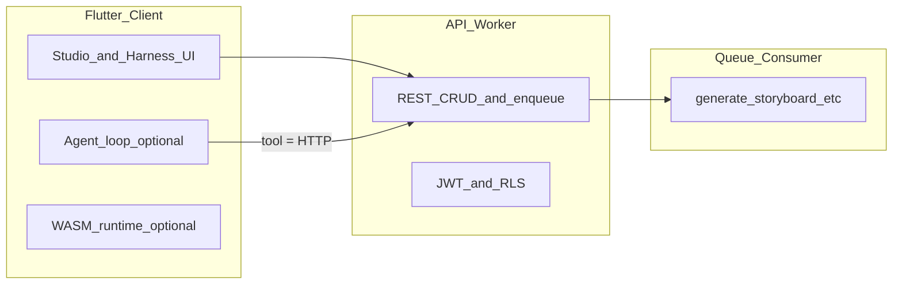

# ADR: Rust 后端部署（Cloudflare Workers + AWS EC2，分阶段）

| 字段 | 值 |
|------|-----|
| **Status** | Accepted（产品已确认；W0 / E0 落地前为 Proposed 实现态） |
| **Date** | 2026-05-18（2026-05-18 修订：双运行时） |
| **Decision makers** | 平台 / 后端 |

## 背景

Openflow 当前后端为 [`openflow-server`](../../backend/Cargo.toml)：**Axum + Tokio 常驻进程**，绑定 `DATABASE_URL`（Postgres），进程内 `tokio::spawn` 运行 job worker 循环，并包含 WebSocket、Harness isolate 子进程、S3/R2 artifact、长耗时生成任务等能力。

**产品决策（分阶段，双栈支持）**：

| 阶段 | 生产入口 | 说明 |
|------|----------|------|
| **前期（Phase A）** | **Cloudflare Worker**（WASM） | 先上边缘：REST、Queues、WS（Harness）、计费 webhook |
| **后期（Phase B）** | **AWS EC2**（原生 `openflow-server`） | 迁移主流量；完整 native 能力（进程内 job、isolate 等） |
| **长期** | **两套运行时并存于仓库**，**同一套 API/WS 契约** | 通过 `openflow-core` 共享逻辑；**不同时**让两套生产环境抢同一 job 队列（见迁移闸门） |

允许在 Cloudflare 账号内使用 **Queues、Hyperdrive、R2、Durable Objects**；允许在 AWS 使用 **EC2 + ALB + 同库 Postgres（Supabase/RDS）**。

## 决策

1. **共享业务层**：业务逻辑抽到 **`openflow-core`**；**`openflow-worker`**（WASM）与 **`openflow-server`**（native / EC2）均为薄入口，**禁止**在 Worker/EC2 各写一套分叉业务规则。
2. **契约单一真源**：**OpenAPI + `docs/websocket-events.md`** 由 native `export-openapi` 生成；Worker 与 EC2 **均须**通过同一套 contract / pg_contract 子集（可对 `STAGING_WORKER_URL` 与 `STAGING_EC2_URL` 各跑一遍）。
3. **Phase A（前期）— Worker**：HTTP/WS 以 **`worker-rs`** 为**首期生产**入口；异步任务以 **Cloudflare Queues**（入队 → Consumer）为主，与 `app_generation_job` 表语义对齐。
4. **Phase B（后期）— EC2**：主流量切至 **`openflow-server` release 二进制**；异步任务以 **进程内 PG worker**（`WORKER_ID` 多实例）为主；**可**启用 Harness isolate 等 Worker 生产剔除能力。
5. **Postgres**：两阶段共用 **同一 Supabase/Postgres**；Worker 用 **Hyperdrive**（或 W0 批准的替代）；EC2 用 **`DATABASE_URL` 直连**（同区域）。
6. **对象存储**：**R2 / S3 兼容**；Worker 绑定 R2；EC2 用相同 bucket 与 presigned 语义（环境变量区分 endpoint）。
7. **Harness 运行时（2026-05-18）**：**两阶段均在服务端**（`harness.tool.invoke`、`harness.agent.run`）；Flutter 仅壳。Worker **W3**、EC2 **开箱即用** Axum WS。
8. **客户端配置**：仅 **`OPENFLOW_API_BASE_URL`**（及 WSS）切换；**不**因运行时不同改 Flutter Agent 协议。
9. **迁移原则**：EC2 接管生产时，**关闭** Worker 侧 Queue Consumer 对 `app_generation_job` 的认领（或停用 Worker 生产环境），避免 **双 consumer**；DNS/ALB 切流 + contract smoke 绿灯后再下线 Worker 生产路由（Worker 可保留 staging / 只读边缘，另案）。

## 非目标

- 本 ADR **不**规定 Flutter/Web 前端必须部署在 Cloudflare Pages（可另案）。
- 本 ADR **不**要求在 Worker 内运行 Harness isolate **子进程**（见下文 dev-only native）。
- 本 ADR **不**采用「客户端全量 Harness 编排、生产后端仅 REST」作为主路径（BYOK 另案）。

## 现状 vs Worker 运行时

| 能力 | 现状（native） | Worker 策略 |
|------|----------------|-------------|
| HTTP | `TcpListener` + Axum | `worker-rs` `fetch` handler；共享 core，无 `bind` |
| Postgres | `sqlx` + tokio | Hyperdrive + 验证 wasm 驱动；或 HTTP 代理层 |
| Job | 进程内 worker 循环 | Queues producer/consumer；长任务分片或 Workflows |
| WebSocket | Axum WS | Workers WebSocket API + 适配层 |
| Harness isolate | `spawn` 子进程 | **WASM 构建剔除**；dev 保留 `openflow-server` native |
| 长耗时 | 请求内 await | **202 + job id**；Consumer 执行 |
| S3 | aws-sdk | R2 + 兼容 API |
| 观测 | OTLP gRPC | HTTP OTLP 或 Logpush |

## 目标架构（双运行时，共享 core）

```text
  Flutter / Desktop ── OPENFLOW_API_BASE_URL ── HTTPS / WSS
                           │
         Phase A (前期)     │      Phase B (后期，主流量)
              ┌─────────────▼─────────────┐   ┌──────────────────────────┐
              │ openflow-worker (WASM)     │   │ openflow-server (EC2)     │
              │ REST + WS + enqueue        │   │ REST + WS + PG job loop   │
              └──────┬──────────────┬──────┘   └──────────┬───────────────┘
                     │              │                       │
                     │         Queues Consumer              │ WORKER_ID × N
                     └──────────────┼───────────────────────┘
                                    ▼
                          ┌─────────────────┐
                          │  openflow-core   │
                          └────────┬────────┘
                                   ▼
                    Postgres (Supabase/RDS) + R2/S3 + LLM vendors

  本地 / CI: openflow-server :8666 — cargo test, pg_contract, dev Harness
```

**阶段切换（示意）**：Phase A 客户端 → `*.workers.dev`；Phase B 切 DNS → `api.example.com`（EC2/ALB）；契约与 JWT 不变。

### 推荐仓库结构（渐进引入）

```text
backend/
  Cargo.toml                 # workspace（引入时）
  src/                       # 现有 openflow-server（逐步瘦身）
  crates/
    openflow-core/           # 纯业务，无 TcpListener / spawn isolate
    openflow-worker/         # cdylib, worker-rs entry
  wrangler.toml
```

## 分阶段迁移

| Phase | 交付 | 验收 |
|-------|------|------|
| **W0** | `wrangler.toml` + health Worker + Hyperdrive 连通 | `GET /api/v1/health` 200 on staging URL |
| **W1** | 只读 API：health、me、projects list | contract_smoke → `STAGING_WORKER_URL` |
| **W2** | 写路径 + `POST` job 入队；Consumer 处理短 job | `flutter.probe` 类 job e2e |
| **W3** | **服务端 WS**：`harness.agent.run` / `harness.tool.invoke`、job 通知、billing webhook | Flutter/Harness staging 联调 |
| **W4** | 重 job（出图/视频）+ R2；下线 native job loop | pg_contract 关键路径绿 |
| **W5** | WASM 体积与 CPU 预算；isolate dev-only 文档化 | 无生产 Harness spawn |

**免费版风险**：若请求 CPU 或 wall time 不足，记录 P95 后升级 **Workers Paid / Unbound / Workflows**（预算项）。

### Phase B：EC2 迁移（后期，与 W 并行准备）

| Phase | 交付 | 验收 |
|-------|------|------|
| **E0** | EC2 镜像/systemd + `openflow-server` + 与 staging 同库；ALB + TLS | `STAGING_EC2_URL` health 200 |
| **E1** | contract_smoke + pg_contract 关键路径打 EC2 URL | 与 Worker staging 结果一致 |
| **E2** | 生产 EC2 旁路（小流量或 internal）；**Worker Consumer 仍处理 job 或显式只读** | 无双 consumer 事故 |
| **E3** | DNS 主切 EC2；停 Worker 生产 Consumer / 路由 | P95、Agent、job 绿 24h |
| **E4** | Worker 降为 staging-only 或下线生产 Worker | 运维 runbook 归档 |

EC2 机器/env 清单见下文 **「EC2 部署（Phase B）」**。

## CI/CD

### 每个 PR（不依赖 Cloudflare 部署成功）

| Job | 命令 / 说明 |
|-----|-------------|
| `openapi-contract` | 现有 |
| `backend-rust` | `cargo test` / clippy（native，逻辑真源） |
| `backend-worker-build` | 编译 `openflow-worker` WASM（`worker-build` 或 `wasm32-wasi`）；可 `--dry-run` |
| `frontend-flutter` | 现有 |
| `ui-smoke` | mock API，见 [UI review 计划](./ui-review-2026-05-18.md) |

### main / tag

| Job | 说明 |
|-----|------|
| `deploy-worker-staging` | `wrangler deploy --env staging` |
| `deploy-worker-prod` | 人工批准 + production env（Phase A；E3 后可停） |
| `deploy-ec2-staging` | Phase B：发布 `openflow-server` 到 staging EC2（systemd/AMI，E0 起） |

### nightly（可选）

| Job | 说明 |
|-----|------|
| `contract-smoke-worker` | 对 `STAGING_WORKER_URL` 跑 contract 子集 |
| `contract-smoke-ec2` | 对 `STAGING_EC2_URL`（E1 起，与 Worker 结果对照） |
| `ui-golden` | Flutter 像素回归（mock，不依赖任一运行时） |
| `e2e-staging-worker` / `e2e-staging-ec2` | 可选真后端 E2E（secrets） |

### Secrets（GitHub）

- `CLOUDFLARE_API_TOKEN`
- `CLOUDFLARE_ACCOUNT_ID`
- `STAGING_WORKER_URL`（smoke/E2E）
- `STAGING_EC2_URL`（E1 起）
- DB / LLM：wrangler secrets、EC2 env 或 SSM，**不进 Git**

## 与 Flutter / UI 自动化

- PR 门禁：**不**等待 Worker 部署；Flutter 使用 mock/fixture（[studio-ix-covenant](./studio-ix-covenant.md)）。
- Staging 联调：`config` / env `OPENFLOW_API_BASE_URL` 指向 Worker。
- nightly 可选对 Worker 跑 contract/E2E；失败不阻塞 UI mock PR。

## 开放问题

| ID | 问题 | 负责人 | 目标日期 |
|----|------|--------|----------|
| OQ-1 | `sqlx` 在 `wasm32` + Hyperdrive 是否可行？备选：HTTP SQL、PostgREST 只读边车 | 后端 W0 | W0 结束 |
| OQ-2 | 单 job 超过 Worker CPU 上限：Queues 多段 vs Workflows | 后端 W2 | W2 开始 |
| OQ-3 | Harness isolate：仅 `native` dev binary 的文档与 CI 矩阵 | 平台 W5 | W5 |
| ~~OQ-4~~ | ~~Harness 运行时放客户端还是服务端？~~ | — | **已关闭**：**服务端**（见决策 §7） |
| OQ-5 | Phase A→B 切换窗口：Worker Queue 与 EC2 PG worker **互斥** 的运维开关（env/feature flag） | 平台 E2 | E2 开始 |
| OQ-6 | 切流后 Worker 保留 **staging** 还是 **只读边缘** | 产品 E3 | E3 前 |

## FAQ：「前端只跑 Harness，后端是不是只要 REST 就能上 Worker？」

**不能这么推导。** 常见误解与事实如下：

| 误解 | 事实 |
|------|------|
| Harness 壳 = 只调 REST | Harness 页 **大量用 WebSocket**：`harness.tool.invoke`、`harness.agent.run`、skills 探针等（见 `frontend/lib/skills_harness/websocket.dart`）。产品 Studio 同样依赖 WS（通知、任务、Agent）。 |
| REST 就能原样 `cargo run` 部署到 Worker | 生产仍是 **WASM + worker-rs**，不是把 Linux 上的 `openflow-server` 二进制丢上 Worker。 |
| 只提供 REST 就不需要 job worker | 许多「REST」是 **入队**（`POST /api/v1/jobs`），真正出图/配音在 **后台 job**；Worker 上要用 **Queues Consumer**，不能省略。 |
| 文档里的 `novels_rest_api` = 轻量部署包 | 那是 Flutter **客户端模块名**（小说 UUID REST），不是单独的后端部署形态。 |

**可以上的 Worker（分阶段，ADR W0–W1）**：无状态、短耗时的 **REST 子集**（如 `health`、`me`、部分只读列表）+ Hyperdrive 连 PG。

**不能仅靠「REST 子集」覆盖的能力**（需 Queues / WS / native dev）：

- WebSocket 全协议（Harness + 产品）
- `isolated.echo` 子进程、长耗时同步 handler
- Job 执行体（Consumer，可与 API 同仓库不同 Worker 脚本）

**本地开发对照**：`cargo run`（native，8666）= 全功能；`flutter run -t lib/main_harness.dart` = 测 **全栈**（REST+WS+job），不是「轻后端」。

## FAQ：Harness 能不能全在前端客户端跑，后端只提供接口？

**可以部分这样设计，但本仓库当前不是「纯客户端 Harness」。** 先分清三个名字：

| 名称 | 在哪跑 | 作用 |
|------|--------|------|
| **Harness 壳（Flutter）** | 客户端 | `main_harness.dart`、探针按钮、日志区；**已是客户端** |
| **Harness 运行时（工具 + Agent 循环）** | **服务端**（`backend/src/harness/` + `llm/agent_loop`） | `harness.tool.invoke`、`harness.agent.run`、权限、`get_planData` 等 |
| **UI 自动化 harness**（测试） | 客户端 `flutter test` | golden/smoke；**与产品 Harness 无关** |

### 你说的「最优」：客户端编排 + 后端能力 API

这在架构上是 **合理目标形态**，尤其适合 **边缘部署（Worker）**：



| 适合放在 **客户端** | 仍须 **服务端**（不能仅靠「接口」省略） |
|---------------------|----------------------------------------|
| Agent **UI**、多轮对话展示、本地 WASM 探针（桌面） | **LLM 密钥**（SaaS 不能把 provider key 打进 App） |
| 可选：客户端自己跑 **编排循环**，每步 `POST` 调工具 REST | **Postgres / RLS**、`get_planData`、`generate_*` 写库 |
| 开发期 echo / 纯本地 mock | **计费、审计、webhook、vendor 凭证** |
| | **长耗时生成** → 入队 + Consumer（Worker CPU 不够同步干完） |
| | **不可信用户 WASM** → 须服务端沙箱 + `app_harness_user_wasm_audit` |

### 本仓库 **当前** 为何把 Harness 运行时放在后端？

[`harness-rust-flutter.md`](../../roadmaps/harness-rust-flutter.md) 的 Harness Engineering 主轴是：**单一可信执行面**——密钥、权限、观测、工具目录与旧 Node vm2 替代（`isolated.echo` / wasmi）都在 Rust 进程（未来 Worker）内闭环。Flutter 通过 **WS** 发 `harness.agent.run`，服务端跑 LLM + 多轮 `harness.tool.invoke`，避免：

- 在客户端复制一套工具权限与审计；
- 把 `OPENAI_API_KEY` / 厂商密钥暴露给桌面/Web 二进制；
- 每个工具一次 REST 往返（WS 可流式 `chat.message.*` / `harness.tool.result`）。

### 与 Cloudflare Worker 的关系（已确认：服务端 Harness 不变）

| 阶段 | 形态 |
|------|------|
| **现在** | 客户端 UI + **服务端** Harness（native 8666，WS） |
| **W1–W2** | Worker：**REST 能力 API** + Queues 入队/消费 |
| **W3** | Worker：**服务端** WS（`harness.tool.invoke`、`harness.agent.run`、job 通知、billing webhook） |
| **W4–W5** | 重 job Consumer + R2；**isolate 仅 native dev**（不进 WASM 生产构建） |

**注意**：即使不采用客户端 Agent 循环，Worker 上仍是 **REST + WS + Queues** 三件套，不是「只剩 REST」。

### 已确认：Harness 运行时（产品 2026-05-18）

在「服务端 Harness」与「客户端编排 + 后端纯 API」之间，**产品选择服务端**（与决策 §7 一致）：

| 维度 | 决策 |
|------|------|
| **SaaS 生产 Agent** | **服务端** `harness.agent.run` + `harness.tool.invoke`；迁 Worker 时 **W3** 保留同语义 WS（或经 DO 会话） |
| **能力暴露** | **REST 与 WS 并存**：REST 为 CRUD/入队/契约测试真源；WS 为 Agent 编排与流式 |
| **Flutter** | **Harness 壳**在客户端（`main_harness.dart`）；**不**实现生产级客户端 Agent 循环 |
| **长任务** | **REST 入队 + Queues Consumer** |
| **客户端全量 Agent 循环** | **不在路线图**；BYOK 另开 ADR |
| **Worker 顺序** | W0–W2 REST+Queues → **W3 服务端 WS Harness** → W4–W5 job/R2/isolate dev-only |

**不做的项**：为 Worker 部署把 Agent 循环重写进 Flutter；以「后端只剩 REST」作为生产目标。

## EC2 部署（Phase B，原生 `openflow-server`）

> **产品路线**：**前期 Worker、后期迁 EC2**；两阶段 **均支持**，共享 `openflow-core` 与契约。EC2 **无需** WASM/Queues 即可跑全量 native 能力；需自建 ALB/TLS/扩缩与 **E2–E3 切流 runbook**。

### 为何 EC2 与 Agent/Harness 更「省事」

| 能力 | Worker（ADR 主路径） | EC2（原生） |
|------|----------------------|-------------|
| `openflow-server` 二进制 | 需 `openflow-worker` WASM + 拆分 | **`cargo build --release` 直接跑** |
| WebSocket + `harness.agent.run` | Workers WS API 适配 | **Axum WS 现成** |
| Job worker | Cloudflare Queues Consumer | **进程内 PG 队列**（可多实例 `WORKER_ID`） |
| `isolated.echo` 子进程 | 生产剔除，仅 dev native | **可在同机启用**（注意 CPU/FD） |
| Postgres | Hyperdrive / WASM 驱动验证 | **`DATABASE_URL` 直连**（Supabase/RDS） |
| 长耗时生成 | 必须异步化、CPU 上限 | **与现网一致**（仍建议 job 异步，避免 HTTP 超时） |

### EC2 最低要求（单实例起步）

**计算与系统**

- **OS**：Linux x86_64 或 arm64（与编译 target 一致），建议 **Ubuntu 22.04+** 或 Amazon Linux 2023。
- **规格（起步参考，按负载调）**：
  - **API + 单 job worker**：2 vCPU / 4 GiB 起；有并发 Agent + isolate 探针时建议 **4 vCPU / 8 GiB+**。
  - 磁盘：系统盘 + **日志/本地图**（若用 `OPENFLOW_LOCAL_ASSET_IMAGE_DIR`）预留数十 GB。
- **进程**：systemd（或容器内单进程）常驻 `openflow-server`；`Restart=always`。
- **端口**：进程监听 `PORT`（默认 **8666**）；对外由 **ALB/Nginx/Caddy** 反代 **443**，终端 TLS。

**网络与安全组**

- **入站**：443（HTTPS/WSS）来自 ALB 或公网；**不要**把 8666 裸奔公网（除非临时调试）。
- **出站**：Supabase/Postgres **5432**（或 pooler 端口）、LLM HTTPS、S3/R2、OTel collector、计费 webhook 回调所需域名。
- **WebSocket**：ALB 需 **idle timeout ≥ Agent 长连接**（常见 60s 不够，调到 **300s+** 或改用 NLB）；多实例时 **sticky session** 或保证单实例（WS 有状态）。

**环境变量（与 [`backend/.env.example`](../../backend/.env.example) 对齐）**

| 类别 | 必需 / 强烈建议 |
|------|-----------------|
| 核心 | `DATABASE_URL`、`SUPABASE_JWT_SECRET`、`PORT` |
| Agent | `OPENAI_API_KEY` 或 `LLM_API_KEY`；可选 `OPENAI_BASE_URL`、`LLM_MODEL` |
| 多实例 job | 每实例不同 **`WORKER_ID`**；仍靠 PG `SKIP LOCKED` |
| 反向代理后 | `RATE_LIMIT_TRUST_FORWARDED_HEADERS=1`（仅受信代理后） |
| 计费 | `BILLING_WEBHOOK_SECRET`；生产关闭 `BILLING_WEBHOOK_EVENTS_LIST_ENABLED` 或设 0 |
| 运维 | `OPENFLOW_INTERNAL_OPS_TOKEN`（队列 stats）；可选 OTel：`OPENFLOW_OTEL_EXPORT_ENABLED=1` + collector |
| Harness | 可选 `HARNESS_WS_CHANNELS`、`HARNESS_ISOLATE_*`、`HARNESS_AGENT_STREAMING_TOOLS` |
| 对象存储 | S3/R2 凭证（与代码中 artifact 路径一致）；或本地目录 + CDN |

**数据与迁移**

- Postgres：**Supabase 托管**或 **RDS**；EC2 与 DB **同区域**降延迟；安全组仅放行 EC2/ALB 来源。
- 迁移由 **Supabase CLI / CI** 应用，**不在** `openflow-server` 启动时自动跑（见 `backend/README.md`）。

**高可用（可选后期）**

- **API**：多台 EC2 + ALB；注意 **WS 粘性** 或拆「仅 API」与「仅 worker」角色（worker 可无 ALB）。
- **Job**：多台同 `DATABASE_URL`、不同 `WORKER_ID` 抢 `app_generation_job`（已支持）。
- **Agent 引擎**：仍在每台 API 实例的 **服务端** 跑；扩 API 即扩 Agent 并发，需同步调 LLM 配额与 DB 连接池上限。

**与 Flutter 客户端**

- `OPENFLOW_API_BASE_URL=https://api.yourdomain.com`（WSS 同域 `/api/v1/ws`）。
- Web 需 **CORS** 允许前端源；Cookie 若不用则继续 **Bearer**。

**与 Worker 并存注意**：Phase B 生产切到 EC2 后，**勿**让 Worker Queue Consumer 与 EC2 `WORKER_ID` 实例 **同时** claim 同一 `app_generation_job` 行（见决策 §9、OQ-5）。Harness **仍保持服务端**（决策 §7）；EC2 上可开 isolate，Worker 生产构建仍剔除。

## 参考

- [Cloudflare Workers Rust](https://developers.cloudflare.com/workers/languages/rust/)
- [Queues](https://developers.cloudflare.com/queues/)
- [Hyperdrive](https://developers.cloudflare.com/hyperdrive/)
- 仓库 [backend/README.md](../../backend/README.md)、[jobs-pg-queue-runbook.md](./jobs-pg-queue-runbook.md)
