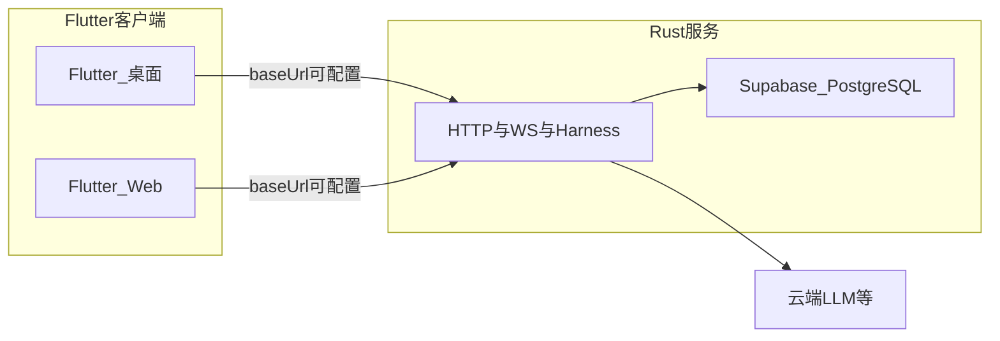

# Toonflow-app 技术 review 与 Rust / Harness Engineering 路线评估

**建议阅读顺序**：**§0–§6**（目标与取舍）→ **§11**（单仓与 API/WS/CI 默认）→ **§7–§9**（已确认前提、仍待拍板、速查索引）→ **§8**（分支）→ **§12–§13**（SaaS/计费与工程加深项）。**§4.x** 在涉及库与 Auth 时细读。

## 0. 目标架构（已确认）

你希望最终形态为：

- **后端**：以 **Harness Engineering** 为设计主轴，用 **Rust** 重写（本地服务：HTTP + 实时通道，承载 Agent 循环、工具执行、权限与观测）。
- **前端**：用 **Flutter** 重写，**范围已定为：桌面 + Web**（**不包含** iOS/Android 原生移动端）。
- **隐含结果**：**Electron 与现有 Node/Express 服务端不再是长期主栈**；这是一次 **跨语言、跨 UI 技术栈的产品级重构**，需按契约与里程碑推进，而不是单次大提交。
- **仓库（已确认）**：**单仓**，顶层 `**backend/`**（Rust）、`**frontend/`**（Flutter）；工程默认见 **§11**。

**连接模型（已确认）：统一「客户端 → Rust 服务器」**

- **桌面与 Web 均不绑定「必须本机进程」**：Flutter 通过 **可配置的 API 基址**（如环境变量 / 设置页）连接 **同一套 Rust HTTP + WebSocket 服务**。
- **端口（已确认）**：Rust 服务默认监听 **8666**（可通过配置覆盖）。**dev / prod** 用 **环境或配置区分 `baseUrl`**，而非两套端口硬编码；开发典型为 `http://127.0.0.1:8666`，生产为 `https://你的域名`（若经 Nginx/Caddy 反代到本机 8666，浏览器侧常为 **443、无显式端口**）。
- **开发环境**：后端跑在本地，客户端指向 `**127.0.0.1:8666`**（与常见前后端分离一致）。
- **生产 / 其他环境**：客户端指向 **已部署服务的 `baseUrl`**；与开发共用 **同一套 API 契约**，仅主机与协议不同。
- **仍需在实现中单列**：**CORS**（尤其 Web）、**Cookie/Token 与跨域**、**WebSocket** 在 HTTPS 与反向代理下的路径、**大文件上传下载**；Rust 侧数据与文件仍落在 **服务器进程可见的存储**（部署机磁盘或挂载卷），与「纯浏览器本地路径」无关。

**与 Harness 的对应**：Rust 侧适合显式实现 **Tools（原子能力）**、**Permissions（策略与沙箱）**、**Observation（结构化日志/追踪/任务状态）**、**Action 边界（统一请求/响应）**；模型调用只是 Harness 内的一环，而不是和业务代码搅在一起。

**Rust 并发（与本服选型相关，摘要）**

- **语言级**：无数据竞争的线程安全由类型系统约束（`Send` / `Sync`），适合高并发连接与后台任务管线。
- **异步 I/O**：生态普遍用 **async/await + 运行时（多为 Tokio）**，适合 **大量 HTTP/WebSocket 连接、LLM 流式响应、对外 HTTP 调用** 等 **I/O 密集** 场景，与本项目后端形态匹配。
- **CPU 密集**（图像编解码、部分模型推理）：用 **线程池或 `spawn_blocking`**，避免阻塞异步运行时。
- **与 Node 对比**：Node 单线程事件循环在 I/O 上也很强；Rust 的优势更体现在 **可控内存、尾部延迟、多核 CPU 任务与系统级并发原语**，需团队按异步模型正确拆分阻塞与非阻塞工作。

---

## 1. 项目现状（简要 review）

**定位与形态**

- 桌面端：[Electron](https://www.electronjs.org/)（`[scripts/main.ts](scripts/main.ts)`）嵌入本地 HTTP 服务与静态前端（`data/web` 或 Vite 开发模式）。
- 服务端核心：Express 5 + HTTP + [Socket.io](https://socket.io/) + `[express-ws](https://github.com/HenningM/express-ws)`（`[src/app.ts](src/app.ts)`），路由由 `[src/router.ts](src/router.ts)` 集中注册（大量 `/api/`* 业务）。
- 规模：`src` 下约 **14.4k 行 / 178 个 `.ts` 文件**（粗略统计），属于**中等偏大的单体 Node 服务**，域覆盖小说、剧本、分镜、素材、任务、设置等。

**技术栈亮点**

- **AI 集成深**：Vercel AI SDK（`ai`、`@ai-sdk/`*）、多厂商 Provider、本地 embedding（`@huggingface/transformers` + 自带模型数据）。
- **数据与存储**：Knex + SQLite（`better-sqlite3` / `sqlite3`）、大量本地文件与静态资源（`data/skills` 等）。
- **媒体**：`sharp` 等图像处理。

**与 Harness Engineering 的已有对应点（概念层）**

Harness 的常见表述是 **Agent = Model + Harness**：Harness 负责工具、知识、观测、动作边界与权限。本仓库里已有雏形，例如：

- **工具与 schema**：`[src/utils/agent/skillsTools.ts](src/utils/agent/skillsTools.ts)` 使用 `ai` 的 `tool()` + `zod`，并对工作区路径做约束（`is-path-inside`），接近「Tools + Permissions」。
- **可执行沙箱**：`[src/utils/vm.ts](src/utils/vm.ts)` 用 `vm2` 在受限环境里注入 AI Provider、网络与部分工具——这是典型的「Harness 运行时」的一部分（需注意 `**vm2` 已停止维护**，长期有安全与维护风险；**在 Rust 目标架构中应替换为明确隔离模型**，而非平移 vm2 思路）。

**主要工程风险（与语言无关）**

- 单体路由面大、业务耦合：全面重写或全面「Harness 化」都需要**分模块边界**与**契约（API / 事件）**先行。
- 原生依赖（图像、可能的 ONNX/embedding）在 **Rust + Flutter** 两条线上都要规划 **跨平台构建与打包**（CI 矩阵、体积、签名与更新）。

---

## 2. 「Rust 后端 + Flutter 前端」相对现状意味着什么

| 层次             | 现状                        | 目标                                    | 备注                                                                    |
| -------------- | ------------------------- | ------------------------------------- | --------------------------------------------------------------------- |
| **UI 壳**       | Electron + Web 资源         | Flutter（**桌面 + Web**）                 | **不做移动端**；**统一连可配置 Rust 服务**；开发 `127.0.0.1`，生产部署地址；仅本地能力（若保留）在桌面分支实现。 |
| **本地 API**     | Express + 大量路由            | Rust（如 Axum / Actix 等）                | `**/api/v1`** 前缀 + OpenAPI；见 §11。                                     |
| **实时**         | Socket.io / express-ws    | Rust WebSocket `**/api/v1/ws`**       | 事件名与 payload 文档化（§11.3）。                                              |
| **Agent / AI** | Vercel AI SDK（TS）         | Rust 中自建流式客户端 + Harness 编排            | 不是「翻译 SDK」，而是 **Provider 适配层 + 统一 Harness 接口**。                       |
| **媒体与 ML**     | sharp、HF transformers（JS） | Rust：`image`/ffmpeg 绑定、ONNX Runtime 等 | 需验证效果与包体，可能与现网行为略有差异，应用测试兜住。                                          |
| **持久化**        | SQLite（Knex）              | **PostgreSQL @ Supabase**             | **生产** 托管；**开发** 本地 CLI（非托管）；见 §4.1。                                  |
| **鉴权**         | 应用内 JWT 等                 | **Supabase Auth**                     | dev/prod 经 **CLI 与配置** 切换；见 §4.2。                                     |

**现实结论**：这是 **新产品级重写**，但方向清晰：**Flutter 为客户端（UI + 调用 API）；Rust 服务负责业务、Agent 可靠性、持久化与对外调用**。成功关键在 **契约先行 + 竖切交付**，而不是按文件目录逐行翻译。

---

## 3. 迁 Rust 后端的潜在收益（在 Harness 目标下更突出）

- **硬约束与可审计**：权限、工具白名单、配额、结构化观测，适合落在 Rust 服务内统一实现。
- **性能与常驻**：长连接、并发任务、图像与流水线，Rust 通常更易控制内存与延迟尾部。
- **沙箱升级**：用 **进程隔离 / WASM / 受限执行** 替代 `vm2`，与 Harness 的 Permissions 一致。

---

## 4. 主要缺点与成本（针对 Rust + Flutter）

- **两套新栈**：团队需同时掌握 Rust（异步、错误处理、FFI）与 Flutter（状态管理、`kIsWeb` 与桌面分支、桌面打包与 Web 部署）。
- **AI 生态**：TS 侧 Vercel AI SDK 的「开箱度」在 Rust 没有同等物；需 **自建 Provider 层与流式协议**，工期要单独估算。
- **回归范围**：原 `src/routes/`* 与 Socket 行为需 **可自动化对比**（契约测试、录制回放或 golden），否则迁移周期不可控。

---

## 4.1 持久化：PostgreSQL — **生产 Supabase 托管；开发本地（非托管）**

**产品定位（已确认）**：**偏 SaaS、多用户同时干活**，**主库为 PostgreSQL**；**生产环境**使用 **Supabase 云端托管**；**开发环境不使用托管库**，改为 **本机 Supabase CLI 本地栈**。

**为何不是 SQLite 主库**

- SQLite **写串行**、多租户高并发写入时易成为瓶颈；SaaS 场景下 **PostgreSQL 更合适**。

**开发（已确认）：本地，不是云端托管**

- 使用 `**supabase start`**（Supabase CLI + 本地 Docker）在本机拉起 **Postgres 及配套服务**，`DATABASE_URL` 指向 **localhost**（具体端口以 CLI 输出为准）。
- **目的**：零依赖线上项目即可开发、数据不出本机、与 **生产同为 Postgres + Supabase 栈形态**，但 **不占用托管配额、不依赖外网连库**。

**生产：Supabase 托管**

- 创建 **Supabase 云端项目**，Rust 使用托管 `**DATABASE_URL`**（注意 **直连** 与 **连接池 / PgBouncer（transaction 模式）** URL 的差异；迁移类操作建议用直连或 session 模式，见官方文档）。
- **成本与合规**：随用户量评估 **套餐与配额**；确认 **数据区域** 与合同要求。

**业务层**：Rust **自建 HTTP API**，数据库访问走 **标准 SQL / ORM**；**鉴权见 §4.2**；**可选** Storage / Realtime；核心业务逻辑仍放在自有 API 中，避免过度绑定难以替换的专有调用。

### 4.2 鉴权：**Supabase Auth**（已确认）

- **第一版范围（已确认）**：**不上 BFF**；Flutter（含 Web）使用 `**supabase_flutter` + 会话由 SDK 管理**，调用 Rust API 时 `**Authorization: Bearer <access_token>`**；**不**在第一里程碑引入独立 BFF 或 HttpOnly Cookie 会话层。若日后合规或产品要求，**Cookie + BFF** 作为 **独立迭代** 另行立项（见下文「为何不第一版就 Cookie + BFF」）。
- **选型**：**采用 Supabase Auth**（与托管 PG 同一生态）；用户、会话与 **JWT** 由 Supabase 签发，Rust 服务 **校验 JWT** 后处理业务；Flutter 使用 **Supabase 客户端** 或 REST 完成登录/刷新 token。
- **开发环境**：与 §4.1 一致，使用 `**supabase start`** 起的 **本地栈**，其中包含 **Auth（GoTrue）**；通过 `**supabase status`** 获取本地 **API URL、anon key** 等，**不依赖**云端 Auth。
- **生产环境**：使用 **Supabase 云端项目** 的 Auth 与密钥；与开发 **同一套集成方式**，仅 **配置项**（URL、密钥、重定向 URL）随环境切换，建议用 **环境变量 / 配置文件** 管理，避免硬编码。
- **切换方式**：**Supabase CLI**（`config.toml`、link 项目）与 **应用侧 env**（如 `SUPABASE_URL`、`SUPABASE_ANON_KEY`）在 dev/prod 间切换；文档化「本地起栈 → 联调 → 对接生产项目」的步骤。
- **Rust**：除校验 JWT 外，**业务租户/角色** 仍可落在自有表或 JWT claims 扩展，与 Harness **Permissions** 衔接。

**推荐实现（默认方案；工程上称「在约束下的好默认」而非数学最优）**

- **Flutter**：统一使用官方 `**supabase_flutter`**（或当前官方推荐的 Dart 集成方式），由 SDK 负责 **登录、刷新 session、持久化会话**；**不要**自研一套 token 存取逻辑，除非有特殊合规要求。
- **桌面（Windows/macOS/Linux）**：在 **supabase_flutter** 支持的平台上使用其 **内置会话持久化**；若需更强隔离，可配合 `**flutter_secure_storage`** 存敏感补充信息（**勿**重复造轮子存完整 JWT，除非官方文档明确建议）。
- **Web**：使用 **HTTPS**；OAuth/第三方登录启用 **PKCE**（Supabase 侧按官方配置）；接受 SPA 常见模式：**access/refresh token 由 SDK 管理**（默认可能落在 `localStorage`），通过 **CSP、XSS 防护、依赖最小化** 降低风险；若将来有更高合规等级，再评估 **BFF + HttpOnly Cookie** 等架构，**不列为第一版必做**。
- **调用自有 Rust API**：在 Flutter 侧通过 `supabase.auth.currentSession` 取 **access_token**，请求头 `Authorization: Bearer <jwt>`；Rust 端用 **项目 JWT secret / JWKS**（按 Supabase 文档）校验 **签名、exp、aud、iss**，与 **用户 id（sub）** 绑定业务数据。
- **小结**：在 **已选 Supabase + Flutter + 自建 Rust API** 的前提下，**官方 SDK + JWT 校验** 是 **集成成本、可维护性、安全基线** 上较均衡的 **默认**；更「硬」的安全往往伴随 **更多服务与运维**（见下）。

**Web「不是极致」具体指什么（技术原因）**

- **核心矛盾**：典型 **SPA + Supabase 客户端** 会把 **需刷新的会话** 放在浏览器里 **JavaScript 能读到的存储**（常见为 `localStorage` / `sessionStorage` 等，以 SDK 实际行为为准）。一旦出现 **XSS**（恶意脚本注入页面），脚本 **可以读走这些 token**，相当于会话被盗用——**HTTPS、PKCE** 解决的是 **传输与 OAuth 授权流程** 被窃听/劫持的问题，**不能**消除「页面内恶意 JS 读存储」这一类问题。
- **所谓更「极致」的常见做法**：会话用 **HttpOnly + Secure + SameSite** 的 **Cookie** 交给浏览器管理，**JS 默认读不到**，XSS **不能直接**用 `document.cookie` 偷走 HttpOnly 内容（仍需防 CSRF、固定依赖供应链等）。但这通常要 **同站 BFF / 服务端换票**，或 **与 IdP 的 Cookie 流深度集成**，架构与工作量明显上升。
- **本方案的定位**：用 **CSP、输入输出编码、依赖审计、最小权限** 把 **XSS 概率压下去**，在多数 SaaS 场景下 **足够好**；若产品明确对标 **金融级/强监管**，再立项 **Cookie 会话 + BFF** 或专用 IdP，而不是与第一版 Flutter Web 强行绑死。

**为何不第一版就「Cookie + BFF」一步到位**

- **工程量**：BFF 不是多一个路由，而是 **浏览器只信你的域下的 Cookie**，登录/刷新/登出往往要在 **BFF 与 Supabase Auth 之间换票、对齐 Cookie 属性、处理跨域与 CSRF**，Rust 侧还要区分 **「只给 BFF 用的服务端密钥」** 与 **「给前端的 anon」**；**Flutter Web + Supabase 官方路径**对 **客户端 JWT** 文档与示例最多，**Cookie 会话**多出现在 **Next 等 SSR** 范式里，**Dart/Flutter 侧要自己拼一套** 的坑更多、排障更慢。
- **职责切分**：要么 **Rust 单体既当 API 又当 BFF**（同进程里兼管会话 Cookie + 业务 API），要么 **再加一层**（如独立 BFF），**部署、域名、HTTPS、SameSite** 都要一次设计对，否则 Cookie 不生效或反复跨站问题。
- **与「先交付」的冲突**：第一版目标通常是 **打通 Flutter ↔ Rust ↔ Supabase PG + Auth**；先走 **官方 SDK + Bearer JWT**，**安全基线 + 上线速度**更可控；Cookie+BFF 适合作为 **明确合规需求或上线后硬指标** 驱动的二期，而不是默认绑在第一里程碑上。
- **若仍坚持 v1 就上 Cookie+BFF**：计划上应 **单独立项**：会话模型、CSRF 策略、Flutter Web 是否只用 **同源 BFF** 页面、以及 **Supabase 侧用 Admin/服务端流程换 session** 的详细设计——可行，但 **周期与风险** 需单独评估，而非在现有里程碑里悄悄等价替换。

**适用边界与权衡（不存在单一「全局最优」）**

- **为何不是「绝对最优」**：安全与架构没有唯一排名——例如 **Web 侧 HttpOnly Cookie + BFF** 在 XSS 面下常更保守，但要多一层服务与会话桥接；**完全自建 OIDC** 控制面最大，但工期与运维成本显著更高。
- **本方案何时特别合适**：希望 **快速上线**、团队希望 **少造 Auth 轮子**、已用 **Supabase PG**、接受 **标准 JWT + 官方客户端** 的集成路径。
- **何时应重新评估**：强制 **纯内网 IdP**、**仅 SAML/LDAP 不接云**、**特定区域数据不可出云**、或 **监管明确要求 Cookie 会话形态**——需单独选型（Keycloak、自建 BFF、云厂商 IdP 等）。
- **供应商绑定**：Auth 与 DB 同栈 **降低胶水代码**，但迁移时需 **Auth + 数据** 一并规划；JWT 与 Postgres 均为 **通用技术**，风险可控、非黑盒。

**备选：私有化 / 强自控**

- 若客户必须 **自有机房、不出公网**：可回落为 **自管 Docker Compose PostgreSQL** 或云 RDS，**迁移脚本与 schema 与 Supabase 路径保持一致**，减少分叉。

**工程要求**：迁移工具（sqlx / SeaORM 等）、连接池配置与 Supabase **池化规则**一致。

**与旧 Toonflow 数据**：旧版 **SQLite + `data/`** → 导入 **生产 Supabase PG**（及必要时本地验证库），非长期双写。

---

## 5. Harness Engineering 在目标架构中的位置

**完全可行，且应作为 Rust 后端的「组织原则」**：先划分 **Harness 核心**（调度、工具注册、策略、观测）与 **领域模块**（小说/剧本/分镜等），避免把模型调用散落在各路由里。

**与 SaaS 多用户并发（可支持，需在实现中落实）**

- **架构上**：**Rust 异步服务 + PostgreSQL（Supabase）** 适合 **多连接、多租户数据隔离**；Harness 层负责 **按租户/用户施加权限、工具白名单与配额**，与「多用户同时干活」一致。
- **必须显式设计**：**租户/用户维度**（如 `tenant_id`、`user_id`、RLS 或应用层校验）、**会话与任务隔离**，否则仅靠换语言不会自动安全。
- **结论**：**可以**支持 SaaS 多用户并发；**不是** Harness 或 Rust 自动完成，而是 **栈 + 数据模型 + Harness 策略** 一起到位。

**与「短剧生成质量」（产品语境下的「准确率」）**

- **团队所指**：**短剧生成质量**——包括剧本/分镜/对白/节奏、与原著或设定的一致性、多轮修改后的连贯性、画面与叙事衔接等 **内容侧** 体验，而非仅系统是否报错。
- **Rust 换栈本身**：**不会**自动把 LLM 写得更好；**模型选型、提示词与技能（skills）、知识注入、人工审核与迭代** 仍是质量主杠杆。
- **Harness + Rust 如何仍「有助于质量」**（间接、但真实）：
  - **稳定管线**：少崩溃、少中间状态损坏，减少「生成到一半废了」导致的劣质交付。
  - **工具与步骤可控**：分阶段生成、校验、重试、护栏，让 **流程设计** 能 enforced（例如先大纲再分镜再对白），利于 **结构化优质输出**。
  - **观测与评测挂钩**：结构化日志、任务 trace、按版本对比技能，便于 **A/B、回归 bad case**，持续抬质量。
  - **多租户隔离**：避免串项目、串数据，减少 **交叉污染** 导致的「质量事故」。
- **小结**：**短剧质量**要 **产品与模型侧持续投入**；**Harness 后端**负责把 **生成管线做可靠、可迭代、可度量**，为抬质量提供 **工程基础**，而非替代创意与模型能力。

**与工程可靠性（与「内容质量」并列，勿混）**

| 层面                      | 与 Rust + Harness 的关系                             |
| ----------------------- | ------------------------------------------------ |
| **短剧内容质量**（上文）          | 主因 **模型 + 技能 + 数据**；Harness 提供 **流程与观测** 支撑持续优化。 |
| **任务/管线成功率**（工具调对、状态一致） | **可明显改善**（约束、校验、重试、护栏）。                          |
| **多租户业务正确性**            | **可更强**（PG 隔离 + Harness 权限）。                     |

**推荐顺序（避免 double rewrite）**

1. **用 OpenAPI/Proto + 事件表** 把「Flutter 需要什么」定下来（即使第一期仍由 Node 实现，也可先.mock）。
2. **Rust 后端先实现 Harness 骨架 + 一条端到端竖切**（例如：登录/设置 + 一个 Agent 流程），验证 Provider 与沙箱。
3. **Flutter 只做壳 + 主流程**，再按模块迁移页面。
4. **数据兼容**：以 **PostgreSQL** 为唯一主库 schema；从旧版 `data/` 与 SQLite 的 **迁移/导入路径**；避免双写长期存在。

原先计划中「先在 TS 里理清 Harness 边界」仍可作为 **缩短 Rust 设计弯路** 的选项；若你直接上 Rust，则把 TS 仅作**行为参考与测试对照**，不必在 TS 里完整实现两遍。

---

## 6. 综合建议（面向 Rust + Flutter 目标）

- **契约第一**：没有稳定 API/实时协议，Flutter 与 Rust 并行会反复返工。
- **竖切交付**：每一里程碑都应是「Flutter 可用 + Rust 可测」的切片，而不是「Rust 写完再一次性接 Flutter」。
- **明确非目标**：不做 **iOS/Android**；第一期若范围过大，可优先 **桌面竖切**，Web 后上或功能子集先行。

### 短剧生成质量：验收与可量化指标（已纳入路线图）

与 §5 中「内容质量主因模型与技能」一致，**里程碑中单独设「质量门槛」**，避免只测通 API、不测剧：

- **人工抽检**：固定 **评分表维度**（如剧情连贯、人设一致、对白自然、节奏、与原著/设定符合度等），抽样批次与通过阈值由产品定。
- **Bad case 集**：沉淀 **典型失败样本**（分类：跑题、人设崩、分镜衔接错等），发版前 **回归**「不得复现」或比例上限。
- **分环节通过率**：按管线阶段（如大纲 → 分镜 → 对白/画面提示）统计 **成功/需重试/人工介入** 比例，与 Harness **步骤化** 设计对齐。
- **与工程挂钩**：利用 Harness **结构化日志与 trace**（任务 id、技能版本、模型与参数），使质量回退 **可定位到版本**；技能/模型变更走 **对比评测** 再推广。

---

## 7. 实施前提：**已确认项** 与 **仍待拍板**（合并原 §7 + 原「§9 拍板索引」）

### 7.1 已确认（摘要）

- **Flutter 范围**：**仅桌面 + Web**，不做移动端原生 App（非目标见 §0）。
- **客户端 ↔ Rust**：**统一连接 Rust 服务**；默认 **端口 8666**；**dev** 典型 `http://127.0.0.1:8666`；**prod** 为部署 URL（HTTPS + 反代）；Flutter **`baseUrl` 可配置**（dev/prod）。
- **数据与环境**：**生产** = **Supabase 托管 PG**；**开发** = **本地 `supabase start`**（§4.1）；**对象存储** dev/prod 区分（§4.1、§11.6）；**私有化** 可回落 **自管 PG**（§4.1）。
- **鉴权**：**Supabase Auth**；dev/prod 经 CLI / 环境配置切换（§4.2）；**第一版无 BFF**，**Bearer JWT** 直连 Rust。

### 7.2 仍待拍板（**索引表**：不重述 §11 / §12 / §13）

| 主题 | 已定锚点 | 仍待产品/运维拍板 |
| ---- | -------- | ---------------- |
| 目录与 Monorepo | §11.1、§11.8 | 实验路径（如 `toonflow-server/`）在重构分支 **迁入 `backend/` 或删除** |
| 鉴权 / 密钥 / 限流 | §4.2、§11.5 | （无额外条；配额与计费档见 §12） |
| API / WS / 契约 | §11.2、§11.3 | 从旧 Socket **对照填实** `docs/websocket-events.md`（或 AsyncAPI） |
| 存储与成本 | §11.6 | 用户上传与生成物 **保留期、成本上限** |
| 迁移与并行 | §11.9 | 旧栈与新栈 **并存多久**、老用户 **迁移窗口与回退** |
| 发布拓扑 | §11.2、§13.5 | Rust 与 Flutter Web **同域或分域**、健康检查与回滚（细节 §11.4） |
| 国际化 | — | Flutter `l10n` **范围与优先级** |
| 桌面分发形态 | §0、§13.5 | **非阻塞**：是否「安装包 **一键拉起本机 Rust**」vs **仅连远程 API**（与纯 Web 策略可并存） |
| 实施顺序 | §8、YAML | **`git-branch`** → 余见 **`implementation-order`** todo |
| **计划文档入仓** | §11.1 | **避免漂移**：在 Cursor 中迭代的 `.cursor/plans/*.plan.md` 易与仓库脱节；**约定**将 **当前审定版**（可去 YAML 前置元数据或整份保留）复制到 **`docs/plans/`**（如 `harness-rust-flutter.md`）并 **随里程碑或 PR 提交**。**合并主分支前** 至少更新一次，使 **评审/CI/后人** 与 **单仓真源** 对齐。根 `README` 可一行指向该路径。 |

## 8. Git 分支策略（已确认）

- **整次重构**（Rust 后端、Flutter 客户端、与旧 Electron/Node 的切换）在 **单独新分支** 上推进，**不直接在默认分支上长期堆提交**，便于 Code Review、回滚与并行修线上。
- **进入实施阶段时（含由 Agent/开发者开始写仓库内代码）**：**第一步**即从当前 `main`/`master` `**git checkout -b <分支名>`**（名称可如 `refactor/harness-rust-flutter`，以团队规范为准），**然后再**进行契约落地、Rust/Flutter 目录与提交；避免先在默认分支上堆重构再整体搬迁。
- **契约冻结**可与拉分支同一迭代内完成，但 **物理分支应先存在**，使后续提交均有明确归属。
- **主分支**在合并前仍保持现有产品可发布；重构分支可频繁 `rebase`/`merge` 主分支以减少最终冲突（策略由团队定）；合并回主分支以 **PR + 评审 + CI 通过** 为前提。

以上确定后，可将路线图拆成 **可验收的里程碑**（**实施伊始拉分支** → 契约冻结 → Rust Harness MVP → Flutter 主壳 → 模块迁移 → **短剧质量门槛与 bad case 回归** → 下线旧栈 → **合并主分支**）。**与 YAML 中 `git-branch`、`implementation-order` 对齐。**

---

## 9. 开工前速查（**P0–P2 → 章节索引**）

| 优先级 | 含义 | 去看 |
| ------ | ---- | ---- |
| **P0** | 分支、前提摘要、Auth、PG、目录、REST **`/api/v1`**、WS **`/api/v1/ws`**、OpenAPI | §8、§7.1、§4.1–§4.2、§11.1–§11.3 |
| **P1** | CI、限流、LLM Key、Storage、embedding 首段 | §11.4–§11.7 |
| **P2** | 并行期、可观测、法务/ToS、技能 v2 入库、SaaS 合规清单 | §11.9、§7.2 表、§12.2 |
| **管线加深** | 长任务、幂等、计费 webhook、RLS 节奏 | §13 |
| **非 v1 目标** | BFF+HttpOnly Cookie、iOS/Android | §4.2、§0 |

**契约冻结时必做一件事**：**WS 事件表** 与旧代码 **逐条对照**（§11.3），避免 Flutter 与 Rust **事件名漂移**。

---

## 11. 单仓布局与工程默认（已确认 + 推荐）

### 11.1 目录结构（已确认）

- **单仓库（Monorepo）**，顶层：
  - `**backend/`**：Rust HTTP/WebSocket 服务（Harness、领域 API、与 Supabase/LLM 集成）；`Cargo.toml` 放于此目录或 `backend/crates/*`（按团队习惯二选一，**保持单可执行入口清晰**）。
  - `**frontend/`**：Flutter 工程（`pubspec.yaml` 根在此）；桌面 + Web **同一套代码**，`baseUrl` 配置化。
- **技能与后端数据（已确认）**：`**backend/data/skills/`** 存放 Markdown 技能（Harness 只读此处，职责在 backend）；其它运行时数据由 backend 配置约定，**不**放入 `frontend/`。
- **可选**：根目录 `**docs/`**（OpenAPI、WS 事件表、架构图）；**`docs/plans/`**（**路线图/架构计划** 的 Git 快照，与 §7.2「计划入仓」约定一致）；`**supabase/`**（CLI 的 `config.toml`、migrations）；`**.github/workflows/**` CI。
- **与旧代码**：历史 `**src/`（Node）** 在过渡期可保留于 **根目录** 或子目录，直至下线；**新实现仅进 `backend/`、`frontend/`**，避免混放。

### 11.2 HTTP / API（推荐默认）

- **版本化 REST**：统一前缀 `**/api/v1/`**；破坏性变更用 `**v2`** 新前缀，**不** silent 改 `v1`。
- **契约**：**OpenAPI 3.x** 为单一事实来源（`docs/openapi.yaml` 或由 Rust 生成）；错误体 **稳定结构**（如 `code` + `message` + `request_id`）。
- **健康检查**：`**GET /health`**（或 `/api/v1/health`），供负载均衡与 K8s probe。

### 11.3 WebSocket 与实时事件（已确认路径 + 推荐默认）

- **WebSocket 路径（已确认）**：`**/api/v1/ws`** — 与 REST `**/api/v1/*`** **同一版本前缀**，反代可 **一条 `location /api/v1/`** 覆盖 HTTP 与 `Upgrade`；客户端 `**baseUrl` + `ws(s)://…/api/v1/ws**`（或由 `http` URL 推导 `ws`），**不**再使用 `/ws/v1` 等第二入口，避免双轨与文档分叉。
- **事件命名**：`**域.动作`** 小写点分，如 `script.progress`、`production.status`；payload **JSON**，内含 `**schema_version`** 字段便于演进。
- **文档**：在 `**docs/websocket-events.md`** 或 **AsyncAPI** 中维护 **事件名、方向、payload 示例**；迁移时与原 Socket.io 事件 **做对照表**。

### 11.4 CI（推荐默认）

- **本地一键（与 PR 门禁对齐）**：仓库根 **`yarn refactor:check`**（[`scripts/refactor-check.sh`](../../scripts/refactor-check.sh)）— OpenAPI 解析 + backend fmt/clippy/test + frontend analyze/test；见 **[`AGENTS.md`](../../AGENTS.md)**。
- **PR 门禁**：GitHub Actions 任务 **`refactor-monorepo`** 运行 [`scripts/refactor-check.sh`](../../scripts/refactor-check.sh)（与 **`yarn refactor:check`** 一致）；另含 **Supabase 迁移**、旧栈 **`yarn lint`**。
- **数据库**：合并到主分支前或部署流水线中执行 **Supabase CLI**（`supabase db push` / 托管 Dashboard 迁移），真源为 `supabase/migrations/*.sql`；**不在**无审查情况下对生产库执行。
- **可选**：容器镜像构建 job，与部署环境一致。

### 11.5 限流与密钥（推荐默认）

- **限流**：Rust 侧 **按 `sub`（用户 id）+ 路由** 限流（如 `tower_governor` 或同类）；**登录、生成类接口** 更严；配额可落 **PG 表**。
- **LLM Key**：**仅 `backend` 进程可读**；租户级 key **加密存 PG** 或 **外部 KMS**；**永不**进 `frontend/` 构建产物。

### 11.6 对象存储与生成物（推荐默认）

- **生产**：与用户、项目强绑定的生成物优先 **Supabase Storage**（与 Auth/PG 同栈，RLS 可配合）；大文件 **签名 URL** 或经 Rust 代理下载。
- **开发**：本地磁盘路径或 **本地 MinIO**（可选）；与生产 **抽象同一接口**（trait / 端口）。

### 11.7 Embedding / 本地模型（推荐默认）

- **第一版**：优先 **HTTP 调用云端 embedding API**（或与现网一致的供应商），**避免**在 MVP 同时攻坚 **ONNX/本地推理**。
- **后续**：再评估 **Rust 内嵌 ONNX**、**独立 Python 侧车** 或 **GPU 节点**，以 **延迟与成本** 数据驱动。

### 11.8 技能与资产（已确认路径）

- **v1（已确认）**：技能 Markdown + frontmatter **统一放在 `backend/data/skills/`**（与 **Harness 与文件读取职责** 均在 **backend**，与 `frontend/` 分界清晰）。从旧仓库迁移时，将原根目录 `**data/skills`** **整体迁入** 该路径（或同步脚本复制），**不在**仓库根再保留一套 `data/skills`，避免双源。
- **v2**：可选 **入库 + 版本表**，支持运营热更新，**不阻塞**第一版竖切。

### 11.9 可观测与并行期（推荐默认）

- **日志**：`**tracing`** + 请求 `**request_id`** / `**traceparent`**；生产 JSON 行日志。
- **错误监控**：Flutter **可选 Sentry**；Rust **可选** OpenTelemetry 导出，**按需**接。
- **并行期**：推荐 **按模块切换**（新 API 就绪再切流量），或 **只读旧数据 + 新写入走新库**；**全量双写** 成本高，**非默认**。

---

## 12. SaaS 产品层：计划覆盖度 Review（技术 vs 商业/合规）

### 12.0 套餐模型（已确认）：**Free 可用 + 可选付费**

- **产品原则**：**不是「只有付费才能用」**；提供 **Free 套餐**，用户 **无需绑卡即可使用核心能力**（具体功能边界由产品 PRD 定：如每日生成次数、并发、存储上限等）。
- **付费档**：在 Free 之上提供 **Pro / Team 等** 更高配额或功能；**计费集成** 服务于 **升级路径**，而非作为 **登录门槛**。
- **人民币主卖，后期支持 USD（已确认）**：**首期** 仅落地 **CNY**（国内收单 + webhook）。**USD**（Stripe/Paddle 等）为 **后续里程碑**，与同一 **`plan_tier`** 映射；Schema 预留 **`billing_currency`（`CNY` | `USD`）**、`provider`、外部订阅 ID。定价表 **USD 列** 在 USD 未上线前 **仅作海外竞品对照**。
- **技术含义**：`plan_tier` **默认 `free`**；**用量与限流** 分档执行；**未订阅用户** 仍为合法 Free 用户。

#### Free 档「初版占位配额」（工程默认值，**PRD 上线前可改**）

| 维度 | 占位值 | 说明 |
| ---- | ------ | ---- |
| **生成任务** | **20 次 / 自然日 / 用户** | 「一次」= 一次主线任务（如整段短剧流水线一次提交）；子步骤是否合并计数由 PRD 定 |
| **并发** | **1 路** 在跑生成 | 第二路排队或 429 |
| **HTTP / WS** | **60 req/min / 用户**（可加 IP 辅限） | 生成类接口可更严 |
| **用户资产存储** | **1 GB / 用户** | **保留期** 另见 §11.6、§7.2 |
| **导出 / 成片** | **允许**，细节 **PRD 定** | 可不默认「不付费不能导出」 |

#### 行业对标与付费档草案（**PRD 参考，非对外售价**）

**主卖**：**首期 CNY**；**USD 后期**。对标：[Runway 定价](https://runwayml.com/pricing)、[Pika 定价](https://pika.art/home/pricing)、可灵类 **日/月积分 + 会员档**（以官网为准）。

**建议 `plan_tier` 枚举**

| `plan_tier` | 对外名（示例） | 参考 **CNY/月（量级）** | 海外对标 **USD/月（量级）** | 配额思路 | 并发（示例） | 存储（示例） |
| ----------- | ------------- | ---------------------- | ------------------------- | -------- | ---------- | ---------- |
| `free` | Free | **¥0** | $0 | 按日 20 次或按日积分（PRD 二选一） | 1 | 1 GB |
| `creator` | 创作者 | **¥约 58–99** | ~$10–15 | ~600–800 积分/月 量级 | 2 | ~20 GB |
| `pro` | Pro | **¥约 199–299** | ~$28–40 | ~2000–2500 积分/月 量级 | 4 | ~100 GB |
| `studio` | 工作室 | **¥约 549–799** | ~$76–95 | ~6000–8000 积分/月 量级 | 8 | ~500 GB |
| `enterprise` | 企业版 | **合同约定** | Custom | 合同 + 公平使用 | 协商 | 协商 |

**计费实现**：**首期** CNY + 国内收单 + webhook ↔ `plan_tier`；**后期** USD + Stripe/Paddle ↔ 同 tier，**CNY/USD 价目分表配置**。**`usage_events` + 积分扣减**；超额 **加购包** 或 **硬封顶**（PRD 定）。

**付费档小结**：**首期只定 CNY 标价**；**USD 价目在 USD 里程碑** 再定。

**结论（作为 SaaS 产品是否已完善）**

- **技术侧**：**已较完善**——多租户（§5）、Auth、PG、限流与配额、审计、存储、API/WS、可观测、质量门槛（§6），**足以支撑「多用户 + Free + 可选付费（CNY→USD）」**。
- **产品/商业/合规侧**：仍需 **单独 PRD/法务/运营**；**计费非准入**。

以下为 **Checklist**，便于你判断下一版要补哪些 **产品文档** 或 **里程碑**。

### 12.1 当前计划已覆盖的 SaaS 相关能力

| 领域         | 计划中位置      | 说明                                |
| ---------- | ---------- | --------------------------------- |
| 多租户数据隔离    | §5、§11.5   | `tenant_id` / RLS 或应用层、配额落 PG     |
| 身份与访问      | §4.2       | Supabase Auth、JWT、v1 无 BFF        |
| 滥用与公平使用    | §11.5、§12   | 限流、登录/生成类更严；配额见 §12.0            |
| 密钥与供应商 Key | §11.5       | 仅服务端、加密/KMS                       |
| 审计线索       | §12.3       | 「谁调了哪类任务」— 需在 schema 落地           |
| 存储与成本相关    | §11.6、§7.2 | Supabase Storage；**保留策略** 见 §7.2 表    |
| 可观测与事故追溯   | §11.9      | trace / request_id、可选 Sentry/OTel |
| 质量与体验底线    | §6、质量 todo | 短剧生成质量门槛                          |

### 12.2 典型 SaaS 仍缺、建议单独规格或阶段引入（未写入技术细节）

| 领域                | 为何重要         | 建议                                                                                                                       |
| ----------------- | ------------ | ------------------------------------------------------------------------------------------------------------------------ |
| **计费与套餐**         | Free、**CNY→后期 USD** | **默认 Free**（§12.0）；**首期 CNY** 收银 + webhook；**后期** Stripe/Paddle **USD**；与 **用量计量** 挂钩；未付费仍为 Free |
| **组织 / 工作区 / 成员** | B2B SaaS 标配  | 明确 **个人版 vs 团队版**：`org`、`membership`、`role`；Supabase Auth **用户** 与 **业务 org** 两张皮要设计清                                    |
| **用量计量**          | 对账、限流、降本     | **按用户/租户** 记 **token、生成次数、存储 GB**；供 **账单与告警**                                                                            |
| **隐私与合规**         | GDPR、出海、ToS  | **导出、删除账号、保留期限**；隐私政策与用户协议；**数据处理协议（DPA）** 若对企业客户                                                                        |
| **内容与合规（AIGC）**   | 地区政策、平台风险    | **用户内容政策、举报、可选审核队列**；与技术上的 **权限/隔离** 不同                                                                                  |
| **运营与客服**         | 规模化必备        | **管理后台**（封禁、退款、查单）、**状态页**、工单/邮件渠道                                                                                       |
| **通知**            | 留存与转化        | 事务邮件（Supabase/第三方）；站内通知与 WebSocket **事件** 可统一规划                                                                          |

### 12.3 建议的「SaaS v1 最低配套」（在不大改范围前提下）

在 **Free 默认可用、付费非门槛** 的前提下，仍建议技术方案 **预留**：

1. **所有业务表** 带 `**tenant_id`（或 `org_id`）+ `created_by`**，与 JWT `sub` 可关联。
2. **用户/租户套餐字段**：`**plan_tier**`（建议 **`free` | `creator` | `pro` | `studio` | `enterprise`**，见 **§12.0 表**；首版可只实现 `free`）；**限流与配额** 按 tier 读配置表；**Free 数字** 以 **§12.0 占位表** 为默认。
3. `**usage_events` 或等价窄表**（异步写入）：记录 **生成任务类型、近似 token、成功/失败**，供 **Free 公平使用、日后对账**。
4. **审计表**（或追加字段）：关键操作 **谁、何时、对哪条资源**。
5. **产品决策一次**：首版 **B2C 单用户** vs **团队/工作区** — 影响 **是否 v1 就上 org 表**。

### 12.4 与本文档关系的界定

- **本文档**：**架构迁移 + 工程默认 + Harness + 质量门槛**，目标是把 **技术底座** 做到 **可承载 SaaS**。  
- **「完善的 SaaS 产品」**：还需 **商业模型、合规、运营** 三条线的 **产品 PRD / 法务 / 财务** 输入；**不要求** 全部塞进同一份技术计划，但 **§12.2 应在路线图中有意识排期**，避免上线后补洞成本过高。

**付费集成**：**非 v1 准入**；**先** **CNY 订阅 + webhook**；**USD** 为独立后续里程碑。**v1 必做**：**Free 档配额与限流可配置**（§12.0、§12.3）。

---

## 13. 复盘：仍可加强的要点（工程向，**不阻塞**契约冻结）

与 **§7.2（仍待拍板表）**、**§9（开工前速查）** 互补——§7.2/§9 偏 **前提与导航**，本节偏 **管线深度与上线后运维**。

### 13.1 长时任务与状态真源

- **生成类请求常分钟级**：**任务表**（`job_id`、状态机、进度）、**可取消**、**超时与重试**。
- **队列**：可先 **PG**（`FOR UPDATE SKIP LOCKED`），再 **Redis / 云队列**；与 §11.5、§12 **同一用户维度** 扣减。
- **WebSocket** 仅 **推送**；**状态以 DB 为准**，重连后 **REST 拉 job 状态**。

### 13.2 API 契约与客户端体验

- **429**：建议 **`Retry-After`** 或 **`retry_after_ms`**（与 §11.2 错误体一致）。
- **幂等**：支付 webhook、高成本生成提交用 **`Idempotency-Key`** 或业务去重。
- **大文件**：分片 / 预签名 URL（§11.6），**最大体积** 写入 OpenAPI。

### 13.3 计费与安全（接 §12）

- **Webhook**：**签名校验**、**事件 ID 去重**；与 `billing_currency` / `provider` 记录处理状态。
- **订阅状态机**：退款/争议时 **`plan_tier` 生效规则** 写进 PRD。

### 13.4 数据、灾备与迁移验收

- **Supabase**：**备份 / PITR**、恢复演练（可并入 `postgres-ops`）。
- **SQLite → PG**：**抽样对账** + **回滚或只读并行**（§11.9）。

### 13.5 发布与客户端（Flutter）

- **Web**：**同源或 CORS** 白名单（Bearer 仍防误配）。
- **桌面**：**签名**、**更新通道**、版本与 **技能/契约** 可追溯（§6）。

### 13.6 多租户与 RLS

- **v1 默认**：应用层 **`tenant_id` + 测试**；**RLS** 作 **加强里程碑** 单独排期。

### 13.7 供应链

- CI 可选 **`cargo audit` / deny**、Flutter **依赖审查**（§11.4 可增一行 job）。

### 13.8 产品 pacing

- **付费 SKU**：v1 收银可只开 **`free` + 一档付费**（如 `pro`），其余 tier **配置关闭**；五档枚举仍预留。

**小结**：**13.1–13.3** 建议「第二条竖切前」评审；其余 **上线前 checklist** 勾掉。