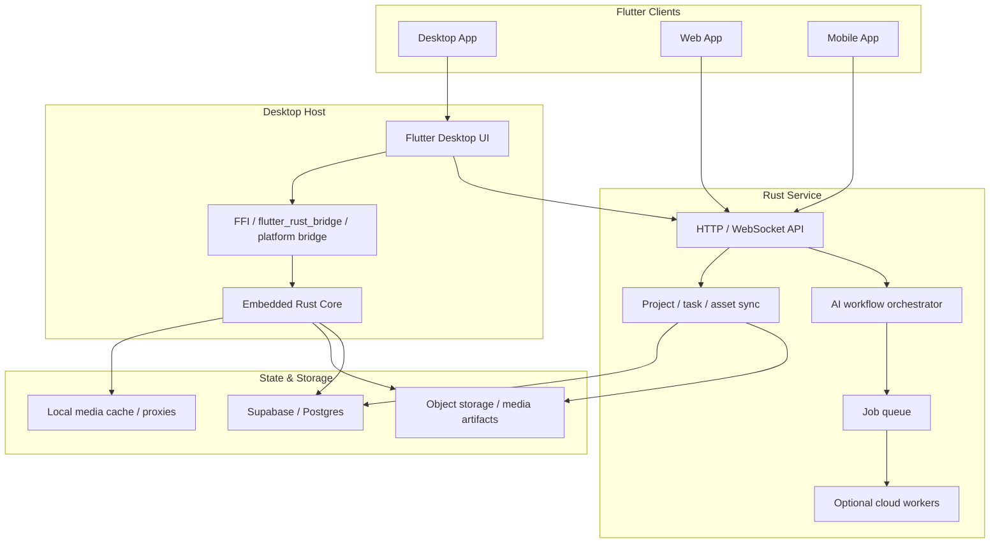
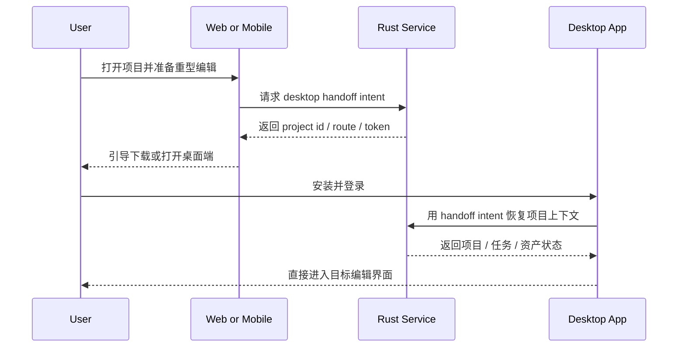

# 架构文档：AI Media Workspace

## 概述

AI Media Workspace 采用 **Flutter 多端 UI + Rust Core 双宿主** 的架构。

关键原则：

1. **桌面端优先承担重媒体编辑**
2. **Web / 手机端优先承担协作与任务入口**
3. **Rust Core 统一时间线、图层、工作流与导出语义**
4. **Rust Service 提供同步、协作、任务与可选云端执行**

当前实现层约定：

- `frontend/`：Flutter UI
- `backend/`：Rust HTTP / WebSocket / jobs 服务
- [`../../rust_core/`](../../rust_core/README.md)：独立 Rust workspace，承载媒体编辑与工作流核心模型

## 总体架构

## 运行模式

| 模式 | 宿主 | 主要职责 |
|------|------|----------|
| `desktop_embedded` | Flutter Desktop + Rust Core | 重型视频 / 图片编辑、代理生成、本地预览、本地导出 |
| `web_collab` | Flutter Web + Rust Service | 项目查看、协作、任务入口、结果回看、桌面接力 |
| `mobile_collab` | Flutter Mobile + Rust Service | 审核、评论、轻量配置、任务与通知 |
| `cloud_worker_optional` | Rust Worker | 可选批量渲染、夜间任务、云端 AI 流程 |

## 模块分层

### 1. Flutter UI Layer

Flutter 负责：

- 时间线与图层面板
- 任务面板
- 工作流画布
- 素材浏览
- 评论与审核 UI
- 下载桌面端与接力提示

这层不直接承载重媒体算法，只负责状态展示和交互。

### 2. Rust Core

Rust Core 负责：

- `timeline domain`
- `image document domain`
- `asset derivative domain`
- `workflow graph domain`
- `preview / export orchestration`
- `job execution contracts`

它应该尽量不依赖单一宿主，保证同一套核心模型既能给桌面端用，也能在服务端复用。

目录上采用仓库根同级 `rust_core/`，初始按 crate 拆分为：

- `media_timeline`
- `media_image_doc`
- `media_workflow`

### 3. Rust Service

Rust Service 负责：

- 鉴权与权限
- 项目同步
- 任务编排
- WebSocket 事件
- 结果回写
- 平台接力
- 可选云端任务

Rust Service 不应默认充当“所有重剪辑都在这里跑”的中心渲染器。

## 编辑域设计

### 图片编辑域

图片编辑文档建议由以下部分组成：

- 图层树
- 变换矩阵
- 蒙版
- 文字与标注
- 滤镜参数
- AI 操作节点
- 导出预设

这是一套 **Openflow 自定义编辑模型**，不以 PSD 兼容为第一目标。

### 视频编辑域

视频编辑文档建议由以下部分组成：

- 镜头片段
- 轨道
- 转场
- 字幕
- 旁白
- BGM
- 导出配置
- 代理与预览状态

第一阶段优先支撑 **粗剪与批量出片**，而不是无上限 NLE 自由度。

### AI 工作流域

工作流建议统一表达：

- 节点
- 输入 / 输出
- 依赖关系
- 运行状态
- 重试策略
- 回写策略

这样视频、图片、字幕、旁白都能接入同一编排框架。

## 数据边界

### 云端保存

云端优先保存：

- 项目元数据
- 工作流定义
- 评论与审核记录
- 任务状态
- 结果引用
- 需要跨端访问的导出物

### 本地保存

桌面端本地优先保存：

- 大体积原始素材缓存
- 代理视频
- 预览波形
- 编辑中间缓存
- 临时导出结果

### 同步策略

同步层要区分：

1. **项目真源状态**
2. **本地性能缓存**
3. **可回传的衍生物**

避免把本地缓存误当成团队共享真源。

## 重型操作接力路径

这个接力路径是产品必需项，不是锦上添花。

## 与现有 spec 的衔接

### 与 `short-video` Space 的关系

`short-video` 更偏短视频生产链路；AI Media Workspace 是更上层的编辑与协作空间，可把 `short-video` 视为其中一条重点垂直工作流。

### 与 `short-video-light-editing-spec` 的关系

该 spec 定义了“先装配、后深入编辑”的产品边界；这里延续这个结论，并把桌面端重剪辑与 Web 协作进一步切开。

### 与 `harness-rust-flutter` 的关系

该路线图已经确认 Rust + Flutter 是主方向；这里补的是媒体编辑与多端承载方式，而不是推翻主栈。

## 观测与质量

系统至少应观测：

- 项目接力成功率
- 桌面下载转化率
- 代理生成耗时
- 导出耗时
- 任务失败原因
- 本地 / 云端执行比例

这几项会直接决定这套架构是否真的健康。
